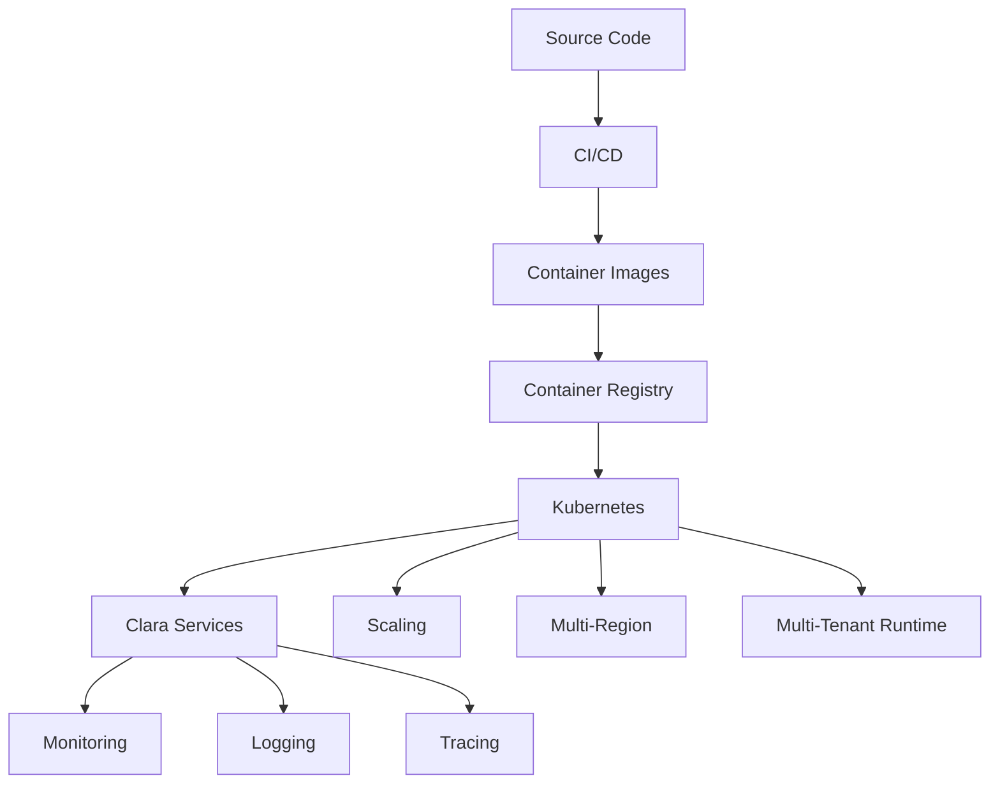

# PART-09 — Infrastructure

> *"Infrastructure is the operating foundation that allows Clara to run securely, reliably, and at scale."*

---

# Purpose

Part IX defines Clara's Infrastructure layer.

Infrastructure provides the foundation for deployment, Kubernetes, containers, CI/CD, scaling, monitoring, logging, tracing, multi-region operation, and multi-tenant runtime considerations.

This Part does not define vendor-specific implementation. It defines the blueprint-level infrastructure principles Clara should follow.

---

# Goals

- Define Clara's infrastructure foundation.
- Establish deployment and release principles.
- Support reliable service operation.
- Enable horizontal scaling and platform growth.
- Support observability across services.
- Support multi-region and multi-tenant execution.
- Preserve security, maintainability, and operational resilience.

---

# Scope

## In Scope

- Deployment.
- Kubernetes.
- Containers.
- CI/CD.
- Scaling.
- Monitoring.
- Logging.
- Tracing.
- Multi-region.
- Multi-tenant infrastructure.

## Out of Scope

- Final cloud provider selection.
- Exact cluster configuration.
- Final Terraform modules.
- Final CI/CD vendor setup.
- Production runbook details.
- Cost optimization implementation.

---

# Chapter Map

| Chapter | Title | Purpose |
|---|---|---|
| 101 | Deployment | Deployment strategy |
| 102 | Kubernetes | Workload orchestration |
| 103 | Containers | Service packaging and runtime consistency |
| 104 | CI/CD | Safe build, test, and release automation |
| 105 | Scaling | Platform growth strategy |
| 106 | Monitoring | Health and performance visibility |
| 107 | Logging | Structured operational records |
| 108 | Tracing | Cross-service request visibility |
| 109 | Multi-Region | Geographic resilience and availability |
| 110 | Multi-Tenant | Runtime isolation and tenant-aware infrastructure |

---

# Infrastructure Map

---

# Key Principles

- Infrastructure must be repeatable.
- Deployment must be automated.
- Services must be observable.
- Runtime environments must be secure by default.
- Scaling must be planned before platform pressure appears.
- Multi-tenant infrastructure must preserve isolation.
- Infrastructure choices should support long-term maintainability.

---

# Related Documents

- ../PART-05-Platform-Services/README.md
- ../PART-06-Data-Platform/README.md
- ../PART-07-Security-Platform/README.md
- ../../templates/runbook-template.md
- ../../standards/SECURITY-DOCS-STANDARD.md

---

# Navigation

**Previous:** ../PART-08-Integration-Platform/100-External-Connectors.md

**Next:** 101-Deployment.md
