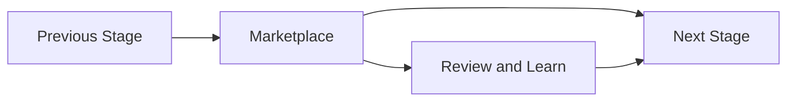

# Marketplace

> *"Defines the marketplace phase for distributing plugins, connectors, extensions, templates, and ecosystem capabilities."*

---

# Purpose

Defines the marketplace phase for distributing plugins, connectors, extensions, templates, and ecosystem capabilities.

This chapter defines the blueprint-level role of **Marketplace** in Athena's roadmap.

---

# Overview

The **Marketplace** stage describes a specific maturity point in Athena's evolution.

It helps the project decide what should be built now, what should wait, and which foundations must exist before moving forward.

The roadmap is not only a timeline. It is a sequencing strategy.

---

# Primary Objectives

The **Marketplace** stage should focus on:

- Clear scope.
- Strong foundation.
- Reduced ambiguity.
- Measurable progress.
- Security-aware execution.
- Documentation alignment.
- Product and engineering consistency.

---

# Expected Deliverables

Possible deliverables for this stage include:

- Updated documentation.
- Approved architecture direction.
- Product or platform milestones.
- Security and governance checkpoints.
- Implementation-ready specifications.
- Operational readiness improvements.
- AI and platform maturity improvements where relevant.

---

# Roadmap Flow

---

# Readiness Criteria

Before this stage is considered complete, Athena should have:

- Clear ownership.
- Documented scope.
- Security considerations reviewed.
- Key risks identified.
- Dependencies understood.
- Related documentation updated.
- Next-stage requirements identified.

---

# Risks

Common risks for this stage may include:

- Building too much too early.
- Skipping documentation.
- Weak security assumptions.
- Unclear ownership.
- Hidden technical debt.
- Over-reliance on manual processes.
- Missing operational readiness.

---

# Security Considerations

This stage must preserve:

- Authentication.
- Authorization.
- Organization isolation.
- Workspace isolation.
- Auditability.
- Secret protection.
- Secure configuration.
- Safe AI and integration behavior where relevant.

Roadmap progress should not compromise platform security.

---

# Success Indicators

Success may be indicated by:

- Scope completed.
- Risks reduced.
- Documentation updated.
- Stakeholders aligned.
- Technical direction clarified.
- Security concerns addressed.
- Next stage can begin with less uncertainty.

---

# Future Evolution

The **Marketplace** stage should create a stronger foundation for later stages.

Each roadmap phase should make Athena more reliable, understandable, secure, and extensible.

---

# Key Takeaways

- Defines the marketplace phase for distributing plugins, connectors, extensions, templates, and ecosystem capabilities.
- It represents a maturity stage in Athena's roadmap.
- It should reduce uncertainty and prepare the next stage.
- Roadmap stages should be sequenced, not rushed.

---

# Related Documents

- ../../templates/roadmap-template.md
- ../../standards/DOCUMENT-LIFECYCLE.md
- ../../standards/QUALITY-STANDARD.md
- ../PART-01-Platform-Vision/README.md
- ../PART-09-Infrastructure/README.md

---

# Navigation

**Previous:** ./116-Enterprise.md

**Next:** ./118-Ecosystem.md
