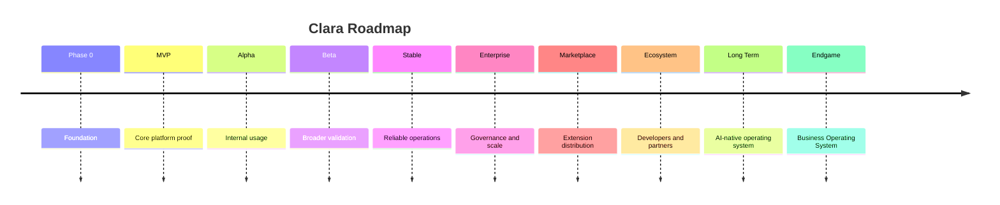

# PART-10 — Roadmap

> *"A roadmap turns vision into sequence, focus, and execution."*

---

# Purpose

Part X defines Clara's roadmap.

The roadmap explains how Clara should evolve from foundation work into MVP, Alpha, Beta, Stable, Enterprise, Marketplace, Ecosystem, long-term evolution, and endgame.

This Part does not lock Clara into fixed dates. Instead, it defines the intended maturity path and strategic sequence.

---

# Goals

- Define the staged evolution of Clara.
- Connect platform vision with execution.
- Help prioritize engineering and product work.
- Avoid building advanced layers before foundations are ready.
- Provide a shared roadmap for product, engineering, security, AI, operations, and ecosystem development.

---

# Scope

## In Scope

- Phase 0.
- MVP.
- Alpha.
- Beta.
- Stable.
- Enterprise.
- Marketplace.
- Ecosystem.
- Long-term evolution.
- Endgame.

## Out of Scope

- Exact sprint planning.
- Final release dates.
- Budget allocation.
- Hiring plan.
- Customer-specific implementation plan.

---

# Chapter Map

| Chapter | Title | Purpose |
|---|---|---|
| 111 | Phase 0 | Foundation and documentation |
| 112 | MVP | Minimum viable platform |
| 113 | Alpha | Internal validation |
| 114 | Beta | Broader testing and feedback |
| 115 | Stable | Reliable operational usage |
| 116 | Enterprise | Security, scale, compliance, governance |
| 117 | Marketplace | Plugin and extension distribution |
| 118 | Ecosystem | Developer and partner ecosystem |
| 119 | Long Term Evolution | Multi-year platform growth |
| 120 | Endgame | Clara's long-term destination |

---

# Roadmap Timeline

---

# Roadmap Principles

- Foundation before scale.
- Security before enterprise.
- Governance before marketplace.
- Observability before production growth.
- Data ownership before advanced AI.
- AI assistance before AI autonomy.
- Ecosystem growth after platform contracts are stable.

---

# Related Documents

- ../PART-01-Platform-Vision/README.md
- ../PART-02-Organization-Layer/README.md
- ../PART-04-AI-Platform/README.md
- ../PART-07-Security-Platform/README.md
- ../PART-08-Integration-Platform/README.md
- ../PART-09-Infrastructure/README.md
- ../../templates/roadmap-template.md

---

# Navigation

**Previous:** ../PART-09-Infrastructure/110-Multi-Tenant.md

**Next:** 111-Phase-0.md
