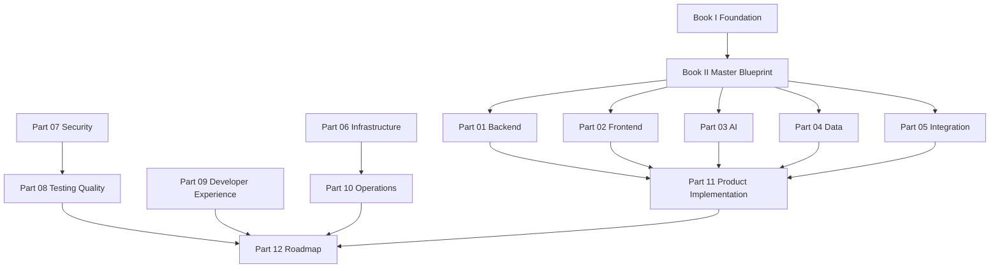

# BOOK III — Chapter Map

> *"This file maps every Book III Part to its chapter range and implementation purpose."*

---

# Chapter Range Summary

| Range | Part | Area |
|---:|---|---|
| 01–25 | PART-01 | Backend Architecture |
| 26–45 | PART-02 | Frontend Architecture |
| 46–65 | PART-03 | AI Architecture |
| 66–85 | PART-04 | Data Architecture |
| 86–105 | PART-05 | Integration Architecture |
| 106–125 | PART-06 | Infrastructure Architecture |
| 126–145 | PART-07 | Security Implementation |
| 146–165 | PART-08 | Testing & Quality Architecture |
| 166–185 | PART-09 | Developer Experience Architecture |
| 186–205 | PART-10 | Operations Architecture |
| 206–225 | PART-11 | Product Implementation Architecture |
| 226–245 | PART-12 | Implementation Roadmap |

---

# Part Dependency Map

---

# How To Use This Map

Use this file when:

- Planning development tasks.
- Deciding which document an AI coding assistant should read first.
- Reviewing pull requests.
- Defining module ownership.
- Checking production readiness.
- Building roadmap phases.

---

# Navigation

**Back:** `./README.md`
