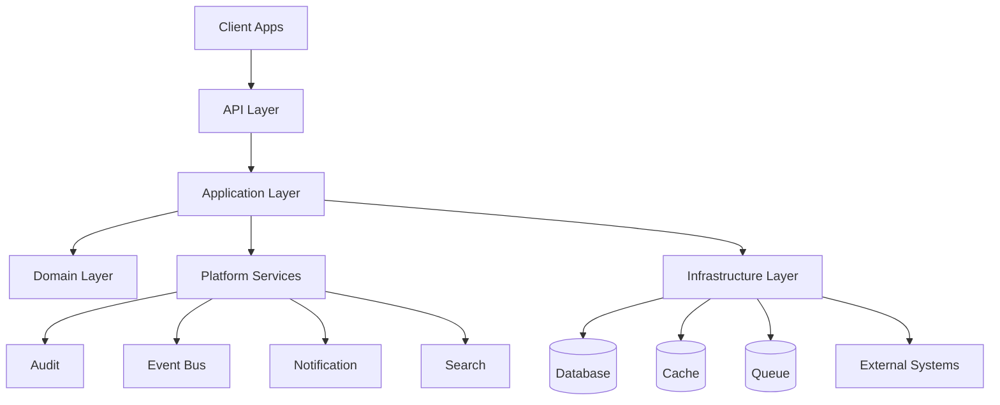

# System Architecture

> *"A system architecture gives implementation teams a shared map before code is written."*

---

# Purpose

This chapter defines Athena's backend system architecture at implementation level.

It explains how backend components should be arranged conceptually before discussing folder structure, frameworks, or coding patterns.

---

# Motivation

Athena is not a small single-purpose application.

Athena includes business domains, platform services, AI capabilities, integrations, data systems, security controls, and infrastructure concerns.

Without a clear backend system architecture, code can quickly become tightly coupled, hard to secure, difficult to test, and painful to evolve.

---

# Architecture Decision

## Decision

Athena backend should use a modular, domain-oriented architecture with clear boundaries between:

- Presentation.
- Application.
- Domain.
- Infrastructure.
- Platform integrations.

## Status

Accepted.

## Reason

This approach supports:

- Long-term maintainability.
- Domain ownership.
- Secure boundaries.
- Testability.
- Modular growth.
- AI-assisted development.
- Future migration from modular monolith to distributed services if required.

## Trade-offs

| Benefit | Trade-off |
|---|---|
| Clear boundaries | More initial structure |
| Easier testing | More files and conventions |
| Safer refactoring | Requires discipline |
| Better AI code generation | Requires strong documentation |

---

# High-Level Backend Map

---

# Backend Responsibilities

Athena backend is responsible for:

- Serving APIs.
- Executing use cases.
- Enforcing authorization.
- Validating input.
- Coordinating domain logic.
- Persisting data.
- Publishing events.
- Calling platform services.
- Integrating external systems.
- Recording audit trails.
- Supporting observability.

---

# Major Backend Areas

## API Layer

Handles HTTP, GraphQL, WebSocket, or other request protocols.

It should not contain business logic.

## Application Layer

Coordinates use cases and workflows.

It controls transaction boundaries and orchestration.

## Domain Layer

Contains business rules, entities, value objects, domain events, and domain services.

It must remain framework-independent.

## Infrastructure Layer

Implements persistence, external APIs, queues, cache, storage, and adapters.

## Platform Services

Provide reusable capabilities such as audit, notification, search, events, storage, configuration, and secrets.

---

# Security Considerations

System architecture must enforce security consistently.

Important rules:

- Authenticate before protected access.
- Authorize every protected action.
- Validate all external inputs.
- Never trust client-provided Organization or Workspace IDs without server-side checks.
- Keep secrets out of source code.
- Log security-relevant actions through Audit.
- Avoid leaking sensitive data in errors or logs.

---

# Common Mistakes

Avoid:

- Putting business logic in controllers.
- Letting database models become domain models without review.
- Bypassing authorization inside internal services.
- Calling external APIs directly from domain entities.
- Sharing infrastructure details across all layers.
- Mixing AI prompt logic with business domain rules.

---

# Implementation Guidance

When implementing a backend feature:

1. Identify the domain.
2. Define the use case.
3. Define input and output DTOs.
4. Apply authorization.
5. Execute domain rules.
6. Persist through repository abstractions.
7. Publish domain or integration events if needed.
8. Record audit events where required.
9. Return safe response data.

---

# Key Takeaways

- Athena backend should be modular and domain-oriented.
- Business logic belongs in the Domain and Application layers.
- Infrastructure details should not leak into domain logic.
- Security and observability are part of system architecture.

---

# Related Documents

- ../../BOOK-02-Master-Blueprint/PART-03-Business-Domains/README.md
- ../../BOOK-02-Master-Blueprint/PART-05-Platform-Services/README.md
- ../../BOOK-02-Master-Blueprint/PART-07-Security-Platform/README.md

---

# Navigation

**Previous:** README.md

**Next:** 02-Clean-Architecture.md
