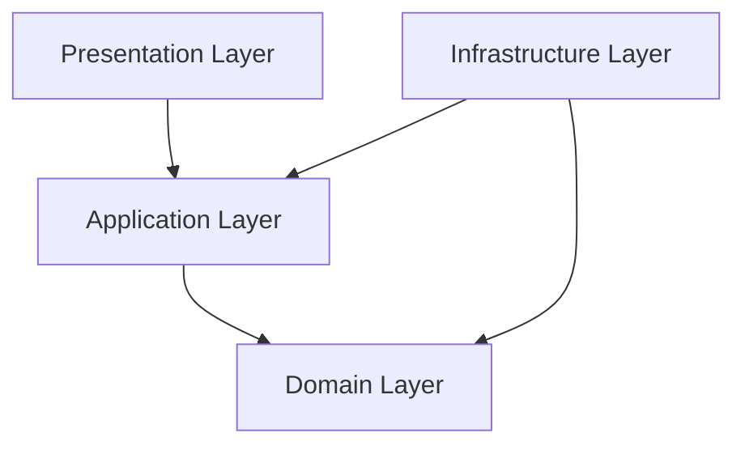
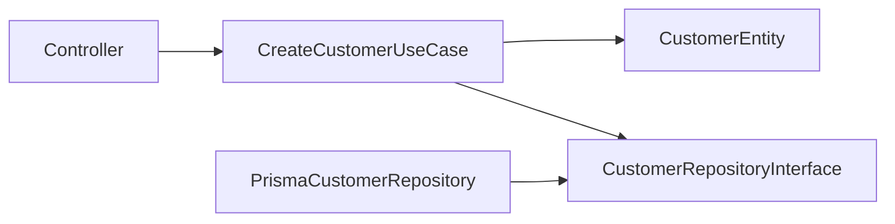

# Clean Architecture

> *"Business rules should not depend on frameworks. Frameworks should depend on business rules."*

---

# Purpose

This chapter defines how Athena applies Clean Architecture in backend implementation.

Clean Architecture protects business logic from framework, database, infrastructure, and delivery mechanism changes.

---

# Motivation

Athena will evolve over time.

Frameworks may change.

Databases may change.

Queues, cache providers, AI providers, and infrastructure may change.

Business rules should survive those changes.

Clean Architecture keeps the most important logic independent from technical tools.

---

# Architecture Decision

## Decision

Athena backend should use Clean Architecture dependency rules.

Dependencies must point inward toward the Domain layer.

## Status

Accepted.

## Reason

This supports:

- Testability.
- Framework independence.
- Better separation of concerns.
- Maintainability.
- Clear boundaries for AI coding assistants.
- Safer long-term refactoring.

---

# Layer Direction



The Domain layer must not depend on Presentation, Infrastructure, database clients, HTTP frameworks, queues, cache providers, or external SDKs.

---

# Layer Responsibilities

## Presentation Layer

Responsible for:

- HTTP controllers.
- Request parsing.
- Response formatting.
- Route-level validation.
- Authentication middleware.
- Transport concerns.

Not responsible for business logic.

---

## Application Layer

Responsible for:

- Use case orchestration.
- Authorization checks.
- Transaction boundaries.
- Calling repositories.
- Calling domain services.
- Publishing events.
- Returning application results.

---

## Domain Layer

Responsible for:

- Entities.
- Value objects.
- Domain rules.
- Domain services.
- Domain events.
- Invariants.
- Business policies.

---

## Infrastructure Layer

Responsible for:

- Database implementation.
- External API clients.
- Queue adapters.
- Cache adapters.
- Storage providers.
- Email/SMS providers.
- AI provider SDKs.
- Framework-specific wiring.

---

# Dependency Rule

Good:

```text
Controller → Use Case → Domain Entity
Repository Implementation → Repository Interface
```

Bad:

```text
Domain Entity → Prisma
Use Case → Express Response
Domain Service → Redis Client
```

---

# Example Boundary



---

# Security Considerations

Clean Architecture improves security because security checks become explicit and testable.

Authorization should normally happen in Application layer use cases, not only in controllers.

Validation should happen at the boundary and again through domain invariants where required.

Sensitive infrastructure details should not leak into domain logic.

---

# Common Mistakes

Avoid:

- Returning raw ORM models from use cases.
- Passing HTTP request objects into domain services.
- Putting authorization only in frontend or controller middleware.
- Importing infrastructure clients inside entities.
- Letting framework decorators dominate business logic.
- Mixing input validation with domain invariants without clear boundaries.

---

# Implementation Guidance

When creating a feature:

1. Define domain concepts first.
2. Define use case input/output.
3. Define repository interface.
4. Implement use case logic.
5. Implement infrastructure repository.
6. Wire dependencies through dependency injection.
7. Keep controllers thin.

---

# Key Takeaways

- Dependencies point inward.
- Domain logic should be framework-independent.
- Controllers should be thin.
- Use cases coordinate application behavior.
- Infrastructure implements contracts.

---

# Related Documents

- 01-System-Architecture.md
- 03-Domain-Driven-Design.md
- 05-Layer-Architecture.md

---

# Navigation

**Previous:** 01-System-Architecture.md

**Next:** 03-Domain-Driven-Design.md
