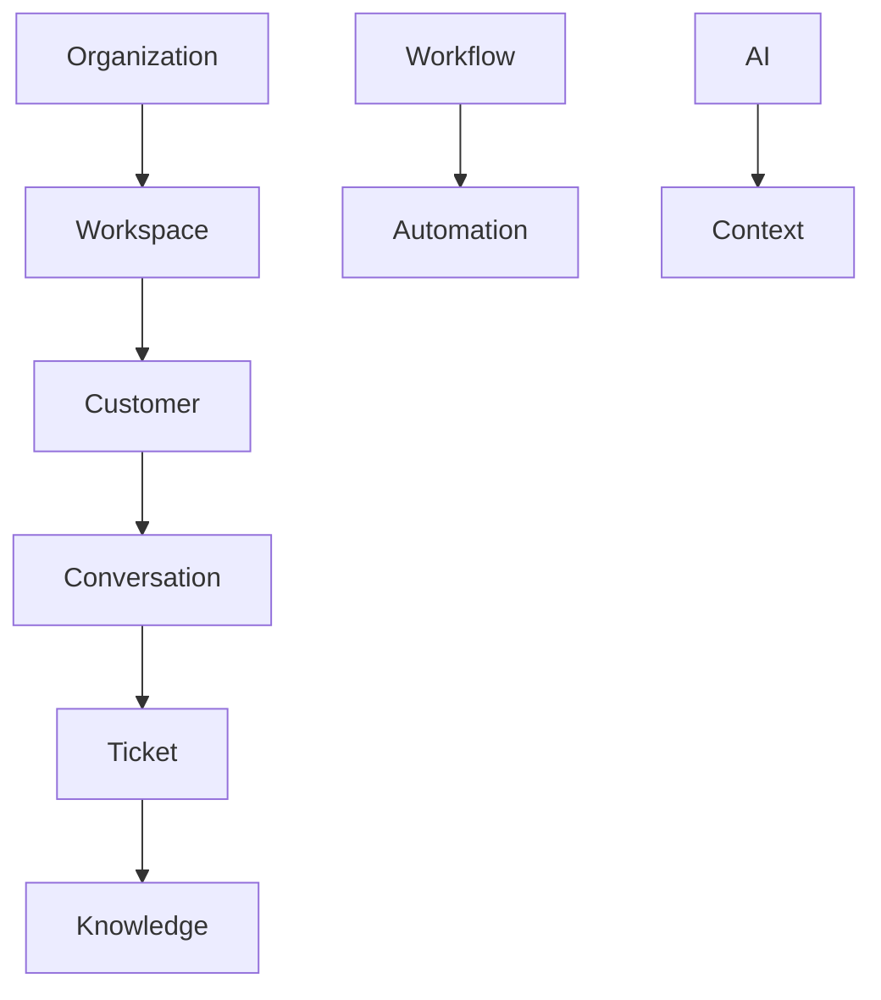

# Domain Driven Design

> *"Good backend design starts with business language, not database tables."*

---

# Purpose

This chapter defines how Athena applies Domain-Driven Design in backend implementation.

Domain-Driven Design helps Athena organize software around business meaning, not technical convenience.

---

# Motivation

Athena contains many business areas:

- Organization.
- Workspace.
- CRM.
- Customer.
- Lead.
- Conversation.
- Ticket.
- Workflow.
- Knowledge.
- AI.
- Billing.
- Integration.

Without domain boundaries, business rules can become scattered across controllers, services, database models, and jobs.

DDD keeps ownership and language clear.

---

# Architecture Decision

## Decision

Athena backend should organize business logic around Domains and bounded contexts.

## Status

Accepted.

## Reason

This supports:

- Clear ownership.
- Better maintainability.
- Easier onboarding.
- Consistent vocabulary.
- Safer modularization.
- Better alignment with Book II.

---

# Core Concepts

## Domain

A business capability area.

Example:

```text
Customer Domain
Workflow Domain
Knowledge Domain
```

## Entity

A domain object with identity.

Example:

```text
Customer
Ticket
Workspace
```

## Value Object

An immutable object defined by value.

Example:

```text
EmailAddress
Money
DateRange
```

## Aggregate

A consistency boundary around related entities and value objects.

## Domain Event

A business fact that already happened.

Example:

```text
CustomerCreated
TicketClosed
WorkflowStarted
```

---

# Domain Map



---

# Implementation Rules

Athena domain code should:

- Use business language.
- Protect invariants.
- Avoid framework dependencies.
- Avoid direct database access.
- Expose behavior through methods.
- Publish domain events when meaningful business changes occur.
- Keep domain concepts aligned with glossary and Book II.

---

# Example

Bad model:

```text
CustomerRecord
- raw database fields only
- no behavior
- no invariants
```

Better model:

```text
Customer
- changeStatus()
- assignOwner()
- updateContactInfo()
- recordInteraction()
```

The better model expresses business behavior.

---

# Security Considerations

Domain rules should protect business invariants, but domain entities should not perform authentication directly.

Authorization decisions usually belong in Application layer use cases.

However, domain logic may enforce rules like:

- Closed tickets cannot be modified.
- Suspended users cannot perform actions.
- Deleted customers cannot receive new conversations.

---

# Common Mistakes

Avoid:

- Naming domains after technical layers.
- Treating every database table as a domain entity.
- Creating anemic models with no behavior.
- Sharing one model across conflicting business contexts.
- Putting external API logic inside domain entities.
- Ignoring glossary definitions.

---

# Implementation Guidance

For every new domain:

1. Define business language.
2. Identify entities and value objects.
3. Define aggregate boundaries.
4. Identify domain events.
5. Define repository contracts.
6. Define use cases.
7. Map persistence separately.

---

# Key Takeaways

- DDD organizes Athena around business meaning.
- Domain logic should use official terminology.
- Domain models should protect business rules.
- Domain boundaries prevent uncontrolled coupling.

---

# Related Documents

- ../../BOOK-02-Master-Blueprint/PART-03-Business-Domains/README.md
- ../../glossary/Domain.md
- ../../glossary/Event.md

---

# Navigation

**Previous:** 02-Clean-Architecture.md

**Next:** 04-Project-Structure.md
