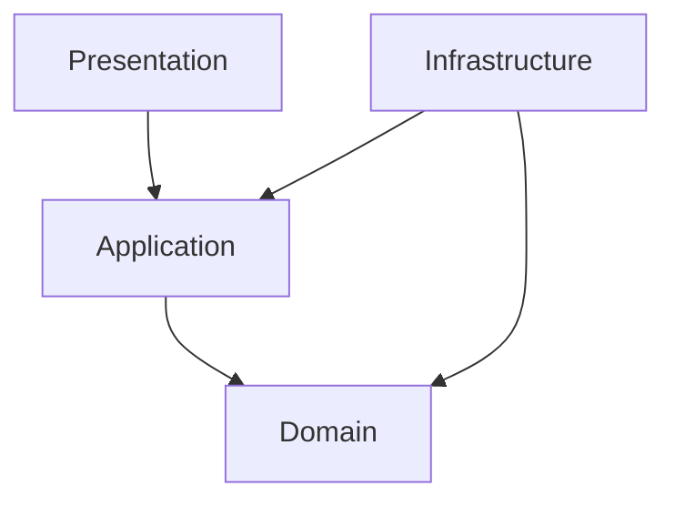

# Project Structure

> *"A good project structure makes the correct architecture easier to follow."*

---

# Purpose

This chapter defines the recommended backend project structure for Clara.

The structure should make domains, layers, dependencies, tests, and infrastructure boundaries easy to understand.

---

# Motivation

Bad folder structure creates hidden architecture problems.

When files are grouped only by technical type, business features become scattered.

When files are grouped without layer boundaries, dependencies become unclear.

Clara needs a structure that supports both domain ownership and Clean Architecture.

---

# Architecture Decision

## Decision

Clara backend should use a domain-first modular structure with explicit internal layers.

## Status

Accepted.

## Reason

This supports:

- Clear domain ownership.
- Better scalability.
- Better AI-assisted coding.
- Easier refactoring.
- Better test organization.
- Reduced accidental coupling.

---

# Recommended Structure

```text
backend/
├── src/
│   ├── modules/
│   │   ├── customer/
│   │   │   ├── domain/
│   │   │   ├── application/
│   │   │   ├── infrastructure/
│   │   │   └── presentation/
│   │   │
│   │   ├── conversation/
│   │   ├── ticket/
│   │   ├── workflow/
│   │   └── organization/
│   │
│   ├── platform/
│   │   ├── audit/
│   │   ├── event-bus/
│   │   ├── notification/
│   │   ├── search/
│   │   └── config/
│   │
│   ├── shared/
│   │   ├── errors/
│   │   ├── result/
│   │   ├── validation/
│   │   ├── logging/
│   │   └── security/
│   │
│   └── main/
│       ├── app.ts
│       ├── container.ts
│       └── server.ts
│
├── tests/
├── migrations/
└── package.json
```

---

# Folder Responsibilities

## `modules/`

Contains business domains.

Each module should own its domain logic and application use cases.

## `platform/`

Contains reusable platform services.

Examples:

- Audit.
- Event Bus.
- Notification.
- Search.
- Config.
- Secrets.

## `shared/`

Contains generic utilities that do not belong to one business domain.

Shared code must be kept small and carefully reviewed.

## `main/`

Contains application bootstrapping, dependency wiring, and runtime startup.

---

# Domain Module Structure

```text
customer/
├── domain/
│   ├── entities/
│   ├── value-objects/
│   ├── events/
│   └── services/
│
├── application/
│   ├── use-cases/
│   ├── dto/
│   └── ports/
│
├── infrastructure/
│   ├── persistence/
│   ├── external/
│   └── mappers/
│
└── presentation/
    ├── controllers/
    ├── routes/
    └── presenters/
```

---

# Dependency Rules



Rules:

- `domain` must not import `presentation`.
- `domain` must not import ORM or framework code.
- `application` may depend on domain contracts.
- `infrastructure` implements contracts.
- `presentation` calls application use cases.

---

# Security Considerations

Project structure should make security checks visible.

Recommended placement:

- Authentication middleware in presentation/bootstrap layer.
- Authorization policies in application layer.
- Sensitive domain rules in domain layer.
- Secret loading in infrastructure/config layer.
- Audit calls from application layer.

---

# Common Mistakes

Avoid:

- Huge `services/` folder with unrelated logic.
- Shared folder becoming a dumping ground.
- Domain modules importing each other freely.
- Repository implementations inside domain.
- Controllers calling database clients directly.
- Putting secrets in config files committed to Git.

---

# Implementation Guidance

When adding a new domain module:

1. Create module folder.
2. Add `domain`, `application`, `infrastructure`, and `presentation`.
3. Define domain model first.
4. Define use cases.
5. Define ports/interfaces.
6. Implement adapters.
7. Wire dependencies in composition root.
8. Add tests beside or under corresponding layer.

---

# Key Takeaways

- Clara uses domain-first structure.
- Layers should be explicit inside each module.
- Shared code must be controlled.
- Structure should guide correct dependencies.

---

# Related Documents

- 02-Clean-Architecture.md
- 03-Domain-Driven-Design.md
- 05-Layer-Architecture.md

---

# Navigation

**Previous:** 03-Domain-Driven-Design.md

**Next:** 05-Layer-Architecture.md
