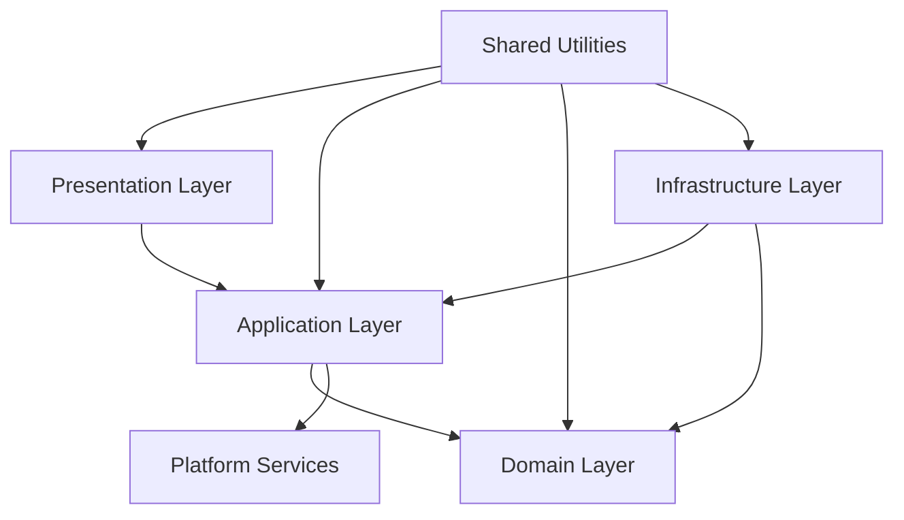
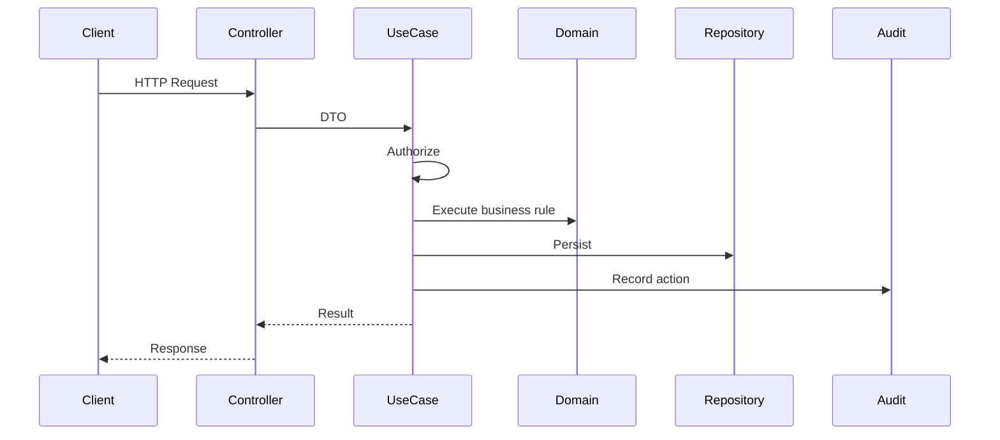

# Layer Architecture

> *"Layers define responsibility boundaries so code changes do not damage unrelated parts of the system."*

---

# Purpose

This chapter defines the backend layer architecture for Clara.

It explains how Presentation, Application, Domain, Infrastructure, Platform, and Shared layers should interact.

---

# Motivation

Backend systems become difficult to maintain when responsibilities are mixed.

Examples:

- Controllers perform business decisions.
- Entities call databases.
- Repositories send HTTP responses.
- External SDKs appear in use cases.
- Authorization is scattered everywhere.

Layer Architecture prevents this by assigning clear responsibilities.

---

# Architecture Decision

## Decision

Clara backend should use explicit layers with strict dependency rules.

## Status

Accepted.

## Reason

This supports:

- Maintainability.
- Testability.
- Security.
- Refactoring.
- Onboarding.
- Clear AI coding assistant behavior.

---

# Layer Map

---

# Presentation Layer

Responsible for:

- Routes.
- Controllers.
- Request parsing.
- Authentication middleware.
- Response formatting.
- Transport-specific concerns.

Should not contain:

- Business rules.
- Transaction logic.
- Database calls.
- External provider logic.

---

# Application Layer

Responsible for:

- Use cases.
- Authorization checks.
- Transaction coordination.
- Calling repositories through interfaces.
- Calling domain services.
- Calling platform services.
- Publishing events.
- Returning application results.

---

# Domain Layer

Responsible for:

- Entities.
- Value objects.
- Aggregates.
- Domain services.
- Domain events.
- Invariants.
- Business rules.

Must not depend on:

- HTTP.
- ORM.
- Redis.
- Queues.
- Frameworks.
- External SDKs.

---

# Infrastructure Layer

Responsible for:

- ORM implementations.
- Database queries.
- Cache adapters.
- Queue adapters.
- External API clients.
- Storage adapters.
- Provider SDK integration.
- Mappers.

---

# Platform Services Layer

Responsible for shared capabilities:

- Audit.
- Event Bus.
- Notification.
- Search.
- Config.
- Secrets.
- Storage.
- Scheduler.

Platform Services must also follow security and dependency rules.

---

# Shared Layer

Shared code should be minimal.

Acceptable shared utilities:

- Result type.
- Error types.
- Date utilities.
- Validation helpers.
- Logging interface.
- Common security helpers.

Shared layer must not become a dumping ground.

---

# Security Considerations

Layering supports security by making responsibility explicit.

Recommended placement:

- Authentication: Presentation / middleware.
- Authorization: Application use case.
- Business invariant: Domain.
- Secret loading: Infrastructure / Config.
- Audit event: Application / Platform.
- Input validation: Presentation and Domain.

---

# Common Mistakes

Avoid:

- Calling repositories from controllers.
- Calling controllers from use cases.
- Putting ORM models in domain.
- Passing raw request objects to domain.
- Hiding authorization inside UI logic.
- Logging sensitive data at any layer.
- Allowing infrastructure to define business rules.

---

# Example Flow

---

# Implementation Guidance

For each feature:

1. Keep controller thin.
2. Put orchestration in use case.
3. Put business rules in domain.
4. Use repository interfaces.
5. Implement repository in infrastructure.
6. Record audit for sensitive actions.
7. Return safe DTOs.

---

# Key Takeaways

- Layers define responsibility.
- Dependency direction must be controlled.
- Domain must stay framework-independent.
- Application coordinates use cases.
- Infrastructure implements details.

---

# Related Documents

- 01-System-Architecture.md
- 02-Clean-Architecture.md
- 04-Project-Structure.md

---

# Navigation

**Previous:** 04-Project-Structure.md

**Next:** ../STAGE-02/06-Dependency-Injection.md
