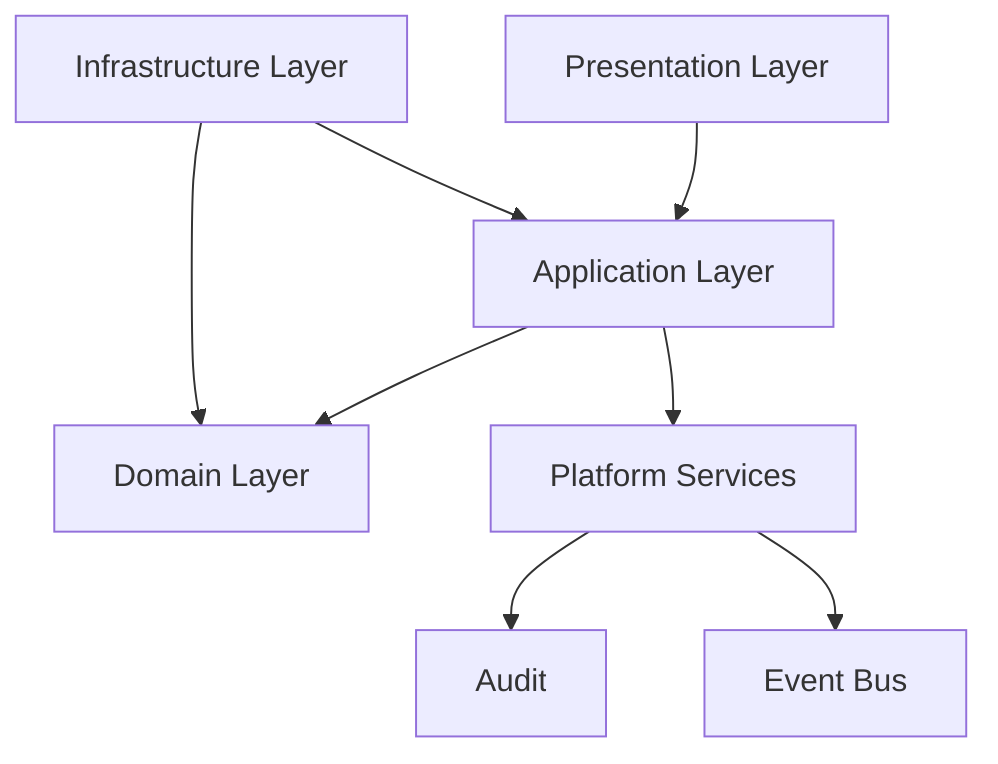
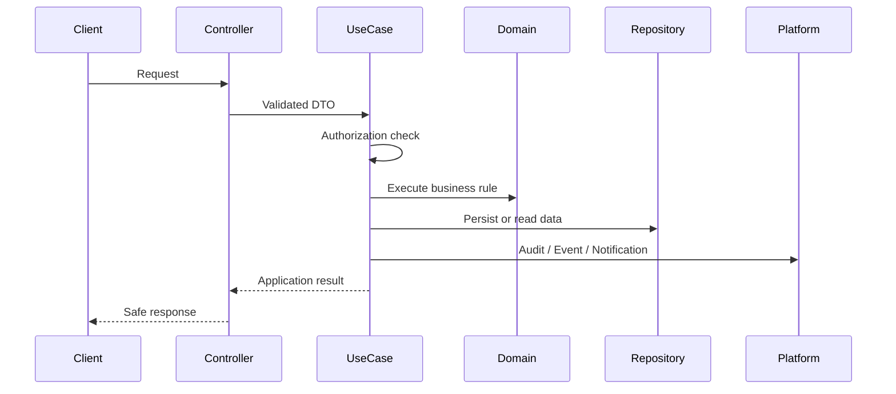

# Configuration

> *"Defines configuration architecture, environment management, validation, feature configuration, and secret separation in Athena backend."*

---

# Purpose

Defines configuration architecture, environment management, validation, feature configuration, and secret separation in Athena backend.

---

# Motivation

Athena backend will contain many modules and many contributors, including human engineers and AI coding assistants.

Without a consistent pattern for **Configuration**, implementation can become inconsistent, insecure, hard to test, and difficult to refactor.

This chapter defines the production-grade pattern that every backend module should follow.

---

# Architecture Decision

## Decision

Athena backend uses validated typed configuration loaded at startup with secrets separated from normal config.

## Status

Accepted.

## Reason

- Prevents invalid production runtime configuration.
- Avoids hard-coded secrets.
- Makes environment behavior explicit.
- Improves deployment safety.

## Trade-offs

| Benefit | Trade-off |
|---|---|
| More explicit implementation | More files and structure |
| Easier testing | Requires discipline |
| Safer refactoring | Slightly more upfront design |
| Better AI-generated code | Requires consistent documentation |

---

# Reference Architecture



---

# Sequence Diagram



---

# Recommended Folder Structure

```text
module/
├── domain/
│   ├── entities/
│   ├── value-objects/
│   ├── events/
│   └── services/
│
├── application/
│   ├── use-cases/
│   ├── dto/
│   └── ports/
│
├── infrastructure/
│   ├── persistence/
│   ├── config/
│   ├── external/
│   └── mappers/
│
└── presentation/
    ├── controllers/
    ├── routes/
    └── presenters/
```

---

# Code Skeleton

```ts
// shared/config/config.schema.ts
import { z } from "zod";

export const configSchema = z.object({
  NODE_ENV: z.enum(["development", "test", "staging", "production"]),
  PORT: z.coerce.number().int().positive(),
  DATABASE_URL: z.string().min(1),
  REDIS_URL: z.string().min(1),
  JWT_ISSUER: z.string().min(1),
  LOG_LEVEL: z.enum(["debug", "info", "warn", "error"]),
});

// shared/config/loadConfig.ts
export type AppConfig = z.infer<typeof configSchema>;

export function loadConfig(env: NodeJS.ProcessEnv): AppConfig {
  const result = configSchema.safeParse(env);

  if (!result.success) {
    throw new Error(`Invalid configuration: ${result.error.message}`);
  }

  return result.data;
}

// main/app.ts
const config = loadConfig(process.env);

```

---

# Implementation Guidelines

- Keep business rules out of controllers.
- Keep domain logic independent from framework and infrastructure.
- Prefer explicit dependencies over hidden global state.
- Use interfaces for boundaries that cross layers.
- Keep input and output DTOs explicit.
- Validate external input before executing use cases.
- Enforce authorization inside use cases for protected actions.
- Record audit events for sensitive operations.

---

# Production Checklist

- [ ] Pattern is applied consistently.
- [ ] Dependencies are explicit.
- [ ] No framework dependency leaks into domain.
- [ ] Errors are handled consistently.
- [ ] Logs are structured.
- [ ] Sensitive operations are audited.
- [ ] Tests cover success and failure paths.
- [ ] Implementation follows Book II blueprint boundaries.

---

# Security Checklist

- [ ] Authentication is enforced before protected access.
- [ ] Authorization is checked server-side.
- [ ] Organization ID is validated server-side.
- [ ] Workspace ID is validated server-side.
- [ ] Input is validated.
- [ ] Sensitive output is filtered.
- [ ] Secrets are not hard-coded.
- [ ] Audit events are recorded where required.
- [ ] Error messages do not leak sensitive data.

---

# Performance Checklist

- [ ] Avoid unnecessary database calls.
- [ ] Avoid N+1 query patterns.
- [ ] Use pagination for list endpoints.
- [ ] Use indexes for common filters.
- [ ] Cache only when invalidation is understood.
- [ ] Avoid blocking I/O in request flow.
- [ ] Measure before optimizing.

---

# Anti-patterns

Avoid:

- Business logic in controllers.
- Direct ORM usage inside domain entities.
- Hidden singleton dependencies.
- Unvalidated environment variables.
- Use cases that skip authorization.
- Repository methods returning raw persistence models.
- Logging secrets or sensitive customer data.
- AI-generated code that ignores architecture boundaries.

---

# Testing Strategy

Recommended tests:

- Unit tests for domain behavior.
- Unit tests for use cases with mocked dependencies.
- Integration tests for repository adapters.
- Configuration validation tests.
- Authorization failure tests.
- Security-sensitive audit tests.
- Regression tests for known edge cases.

---

# AI Coding Guidelines

When using Codex, Cursor, Claude Code, Gemini CLI, or another AI coding assistant:

- Always reference this chapter before generating backend code.
- Ask the AI to preserve Clean Architecture dependency direction.
- Ask the AI to create interfaces before infrastructure implementations.
- Ask the AI to include authorization and validation paths.
- Ask the AI to write tests for success, failure, and permission-denied scenarios.
- Do not accept generated code that places business logic in controllers.
- Do not accept generated code that hard-codes secrets.
- Do not accept generated code that bypasses audit for sensitive actions.

---

# Related Documents

- 01-System-Architecture.md
- 02-Clean-Architecture.md
- 03-Domain-Driven-Design.md
- 04-Project-Structure.md
- 05-Layer-Architecture.md
- ../../BOOK-02-Master-Blueprint/PART-07-Security-Platform/README.md

---

# Navigation

**Previous:** ./06-Dependency-Injection.md

**Next:** ./08-Domain-Models.md
