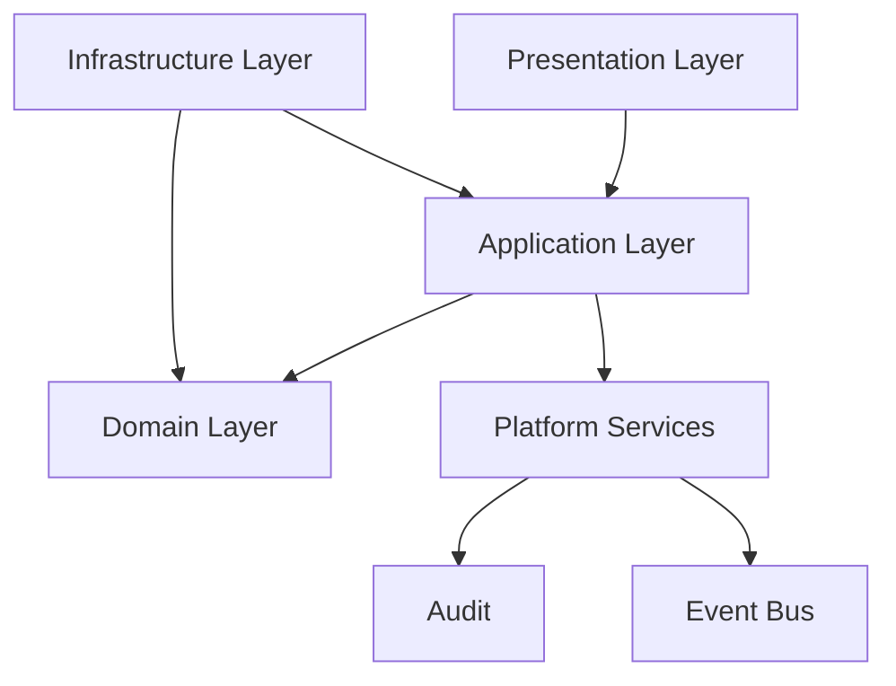
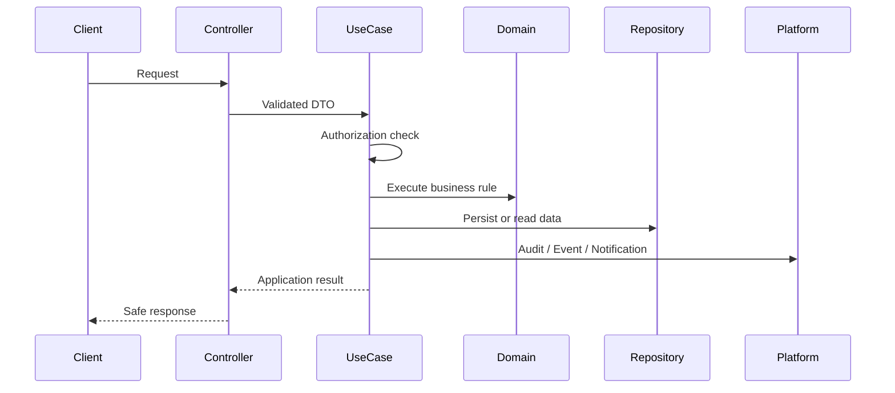

# Use Cases

> *"Defines application use case orchestration, authorization, DTO flow, transactions, domain coordination, and result handling in Clara backend."*

---

# Purpose

Defines application use case orchestration, authorization, DTO flow, transactions, domain coordination, and result handling in Clara backend.

---

# Motivation

Clara backend will contain many modules and many contributors, including human engineers and AI coding assistants.

Without a consistent pattern for **Use Cases**, implementation can become inconsistent, insecure, hard to test, and difficult to refactor.

This chapter defines the production-grade pattern that every backend module should follow.

---

# Architecture Decision

## Decision

Clara backend expresses application behavior through explicit use case classes.

## Status

Accepted.

## Reason

- Keeps controllers thin.
- Makes authorization explicit.
- Improves testability.
- Provides clear entry points for AI coding assistants.

## Trade-offs

| Benefit | Trade-off |
|---|---|
| More explicit implementation | More files and structure |
| Easier testing | Requires discipline |
| Safer refactoring | Slightly more upfront design |
| Better AI-generated code | Requires consistent documentation |

---

# Reference Architecture



---

# Sequence Diagram



---

# Recommended Folder Structure

```text
module/
├── domain/
│   ├── entities/
│   ├── value-objects/
│   ├── events/
│   └── services/
│
├── application/
│   ├── use-cases/
│   ├── dto/
│   └── ports/
│
├── infrastructure/
│   ├── persistence/
│   ├── config/
│   ├── external/
│   └── mappers/
│
└── presentation/
    ├── controllers/
    ├── routes/
    └── presenters/
```

---

# Code Skeleton

```ts
// customer/application/use-cases/UpdateCustomerUseCase.ts
export class UpdateCustomerUseCase {
  constructor(
    private readonly authz: AuthorizationService,
    private readonly unitOfWork: UnitOfWork,
    private readonly customerRepository: CustomerRepository,
  ) {}

  async execute(input: UpdateCustomerInput): Promise<UpdateCustomerOutput> {
    await this.authz.assertCan(input.actor, "customer:update", {
      organizationId: input.organizationId,
      workspaceId: input.workspaceId,
      resourceId: input.customerId,
    });

    return this.unitOfWork.transaction(async () => {
      const customer = await this.customerRepository.findById(input.customerId);

      if (!customer) {
        throw new NotFoundError("Customer not found");
      }

      customer.changeEmail(input.email);

      await this.customerRepository.save(customer);

      return { customerId: customer.id };
    });
  }
}

```

---

# Implementation Guidelines

- Keep business rules out of controllers.
- Keep domain logic independent from framework and infrastructure.
- Prefer explicit dependencies over hidden global state.
- Use interfaces for boundaries that cross layers.
- Keep input and output DTOs explicit.
- Validate external input before executing use cases.
- Enforce authorization inside use cases for protected actions.
- Record audit events for sensitive operations.

---

# Production Checklist

- [ ] Pattern is applied consistently.
- [ ] Dependencies are explicit.
- [ ] No framework dependency leaks into domain.
- [ ] Errors are handled consistently.
- [ ] Logs are structured.
- [ ] Sensitive operations are audited.
- [ ] Tests cover success and failure paths.
- [ ] Implementation follows Book II blueprint boundaries.

---

# Security Checklist

- [ ] Authentication is enforced before protected access.
- [ ] Authorization is checked server-side.
- [ ] Organization ID is validated server-side.
- [ ] Workspace ID is validated server-side.
- [ ] Input is validated.
- [ ] Sensitive output is filtered.
- [ ] Secrets are not hard-coded.
- [ ] Audit events are recorded where required.
- [ ] Error messages do not leak sensitive data.

---

# Performance Checklist

- [ ] Avoid unnecessary database calls.
- [ ] Avoid N+1 query patterns.
- [ ] Use pagination for list endpoints.
- [ ] Use indexes for common filters.
- [ ] Cache only when invalidation is understood.
- [ ] Avoid blocking I/O in request flow.
- [ ] Measure before optimizing.

---

# Anti-patterns

Avoid:

- Business logic in controllers.
- Direct ORM usage inside domain entities.
- Hidden singleton dependencies.
- Unvalidated environment variables.
- Use cases that skip authorization.
- Repository methods returning raw persistence models.
- Logging secrets or sensitive customer data.
- AI-generated code that ignores architecture boundaries.

---

# Testing Strategy

Recommended tests:

- Unit tests for domain behavior.
- Unit tests for use cases with mocked dependencies.
- Integration tests for repository adapters.
- Configuration validation tests.
- Authorization failure tests.
- Security-sensitive audit tests.
- Regression tests for known edge cases.

---

# AI Coding Guidelines

When using Codex, Cursor, Claude Code, Gemini CLI, or another AI coding assistant:

- Always reference this chapter before generating backend code.
- Ask the AI to preserve Clean Architecture dependency direction.
- Ask the AI to create interfaces before infrastructure implementations.
- Ask the AI to include authorization and validation paths.
- Ask the AI to write tests for success, failure, and permission-denied scenarios.
- Do not accept generated code that places business logic in controllers.
- Do not accept generated code that hard-codes secrets.
- Do not accept generated code that bypasses audit for sensitive actions.

---

# Related Documents

- 01-System-Architecture.md
- 02-Clean-Architecture.md
- 03-Domain-Driven-Design.md
- 04-Project-Structure.md
- 05-Layer-Architecture.md
- ../../BOOK-02-Master-Blueprint/PART-07-Security-Platform/README.md

---

# Navigation

**Previous:** ./08-Domain-Models.md

**Next:** ./10-Repositories.md
