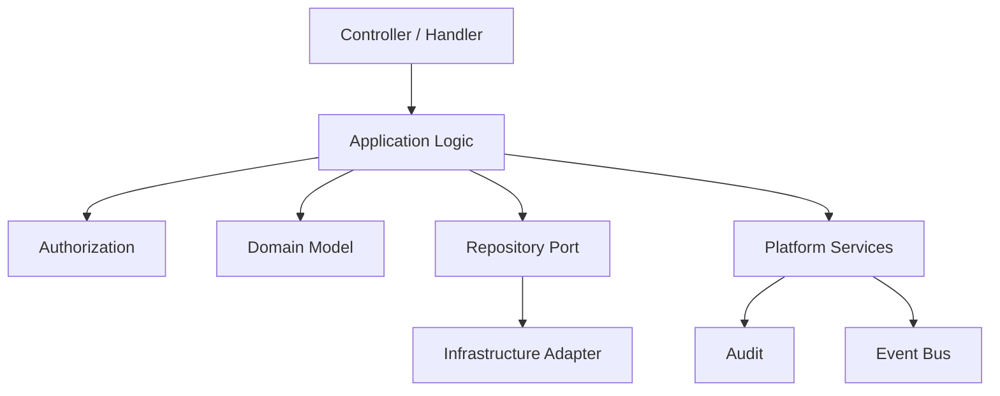
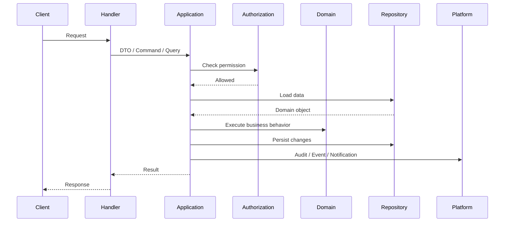

# Transactions

> *"Defines transaction boundaries, consistency rules, unit of work, and safe side-effect handling in Athena backend."*

---

# Purpose

Defines transaction boundaries, consistency rules, unit of work, and safe side-effect handling in Athena backend.

---

# Motivation

Athena backend must separate **business truth** from **application orchestration**.

If this separation is not clear, code becomes difficult to test, business rules become scattered, and infrastructure side effects become mixed with domain behavior.

This chapter defines how **Transactions** should be implemented consistently across Athena backend modules.

---

# Architecture Decision

## Decision

Athena backend uses explicit transaction boundaries inside application use cases and avoids hidden cross-layer transactions.

## Status

Accepted.

## Reason

- Makes consistency boundaries clear.
- Reduces partial-write bugs.
- Keeps transaction ownership inside the Application layer.
- Supports safe event publishing through outbox or post-commit patterns.

## Trade-offs

| Benefit | Trade-off |
|---|---|
| Clearer responsibility boundaries | More explicit structure |
| Better testability | Requires discipline |
| Safer business behavior | More upfront modeling |
| Better AI-generated code | Requires consistent prompts and docs |

---

# Reference Architecture



---

# Sequence Diagram



---

# Recommended Folder Structure

```text
module/
├── domain/
│   ├── entities/
│   ├── value-objects/
│   ├── services/
│   └── events/
│
├── application/
│   ├── commands/
│   ├── queries/
│   ├── use-cases/
│   ├── services/
│   ├── dto/
│   └── ports/
│
├── infrastructure/
│   ├── persistence/
│   ├── event-handlers/
│   └── mappers/
│
└── presentation/
    ├── controllers/
    └── routes/
```

---

# Code Skeleton

```ts
// shared/application/UnitOfWork.ts
export interface UnitOfWork {
  transaction<T>(callback: () => Promise<T>): Promise<T>;
}

// customer/application/use-cases/CreateCustomerUseCase.ts
export class CreateCustomerUseCase {
  constructor(
    private readonly unitOfWork: UnitOfWork,
    private readonly customerRepository: CustomerRepository,
    private readonly outbox: Outbox,
  ) {}

  async execute(input: CreateCustomerInput): Promise<CreateCustomerOutput> {
    return this.unitOfWork.transaction(async () => {
      const customer = Customer.create(input);

      await this.customerRepository.save(customer);

      await this.outbox.add(new CustomerCreated({
        customerId: customer.id,
        organizationId: input.organizationId,
        workspaceId: input.workspaceId,
        createdBy: input.actor.id,
      }));

      return { customerId: customer.id };
    });
  }
}

```

---

# Implementation Guidelines

- Keep controllers thin.
- Put orchestration in use cases or application services.
- Put business rules in domain entities, value objects, or domain services.
- Use domain events for meaningful business facts.
- Keep transaction boundaries explicit.
- Do not call external services directly from domain models.
- Do not publish integration events before persistence is safe.
- Use repository interfaces instead of direct ORM access in application logic.

---

# Production Checklist

- [ ] Responsibility boundaries are clear.
- [ ] Application logic does not contain domain invariants that belong in domain models.
- [ ] Domain logic does not depend on infrastructure.
- [ ] Authorization is enforced server-side.
- [ ] Transaction boundary is explicit.
- [ ] Side effects are safe and auditable.
- [ ] Events are published safely.
- [ ] Tests cover success and failure scenarios.
- [ ] Code follows Book III layer architecture.

---

# Security Checklist

- [ ] Actor identity is passed explicitly.
- [ ] Permission checks happen before protected action.
- [ ] Organization and Workspace scopes are validated.
- [ ] Sensitive actions create audit records.
- [ ] Errors do not leak sensitive data.
- [ ] External side effects are controlled.
- [ ] Domain events do not contain secrets.
- [ ] AI or plugin-triggered actions use the same authorization path.

---

# Performance Checklist

- [ ] Avoid unnecessary domain object loading.
- [ ] Avoid N+1 query patterns.
- [ ] Use projections for read-heavy paths.
- [ ] Keep transactions short.
- [ ] Avoid long external calls inside database transactions.
- [ ] Use asynchronous processing for slow side effects.
- [ ] Measure before optimizing.

---

# Anti-patterns

Avoid:

- Domain services that become generic utility classes.
- Application services that contain all business rules.
- Events that are commands disguised as events.
- CQRS everywhere without need.
- Long transactions around external API calls.
- Controllers coordinating multiple repositories directly.
- AI-generated code that skips authorization or transactions.
- Event publishing before persistence is committed.

---

# Testing Strategy

Recommended tests:

- Unit tests for domain services.
- Unit tests for application services with mocked ports.
- Integration tests for transaction behavior.
- Event publishing tests.
- Authorization failure tests.
- CQRS read/write separation tests where applicable.
- Regression tests for known business edge cases.

---

# AI Coding Guidelines

When using Codex, Cursor, Claude Code, Gemini CLI, or another AI coding assistant:

- Tell the AI which layer it is editing.
- Ask the AI to preserve domain/application/infrastructure boundaries.
- Require authorization checks in use cases.
- Require transaction boundaries for write operations.
- Require tests for permission-denied cases.
- Do not accept generated code that puts ORM logic in domain models.
- Do not accept generated code that publishes events without safe persistence.
- Do not accept generated code that mixes query models with write models without reason.

---

# Related Documents

- ../STAGE-01/02-Clean-Architecture.md
- ../STAGE-01/03-Domain-Driven-Design.md
- ../STAGE-02/09-Use-Cases.md
- ../STAGE-02/10-Repositories.md
- ../../BOOK-02-Master-Blueprint/PART-05-Platform-Services/59-Event-Bus.md

---

# Navigation

**Previous:** ./14-CQRS.md

**Next:** ../STAGE-04/16-Validation.md
