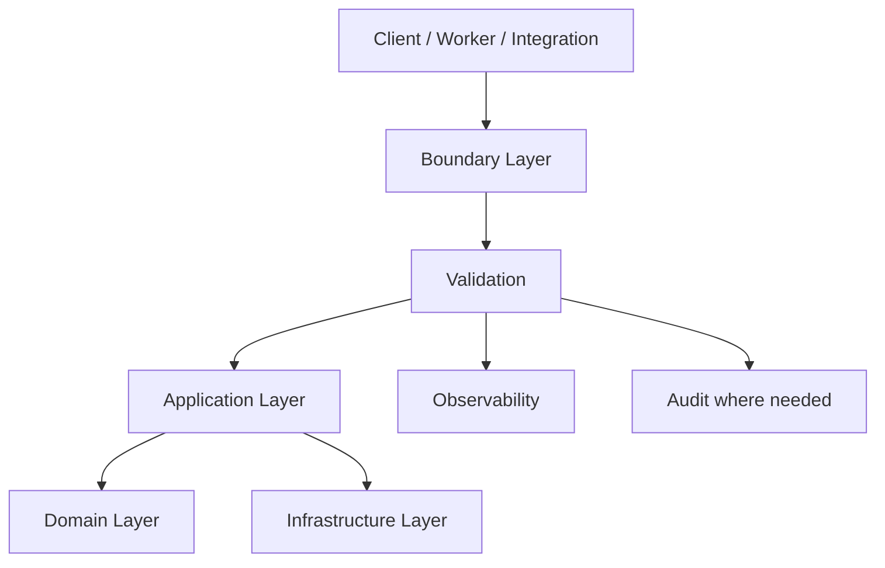

# Validation

> *"Defines input validation, domain invariants, schema validation, and defensive validation across Athena backend."*

---

# Purpose

Defines input validation, domain invariants, schema validation, and defensive validation across Athena backend.

---

# Motivation

Production backend systems fail when runtime quality concerns are treated as afterthoughts.

Athena must handle validation, errors, logging, caching, and background jobs consistently across every module, service, API, workflow, and integration.

This chapter defines how **Validation** should be implemented safely and consistently.

---

# Architecture Decision

## Decision

Athena backend validates external input at system boundaries and protects business invariants inside domain models.

## Status

Accepted.

## Reason

- Prevents invalid data from entering use cases.
- Keeps domain rules protected even when input comes from non-HTTP sources.
- Reduces security risks such as injection and malformed payloads.
- Makes validation behavior consistent across APIs, jobs, workflows, and integrations.

## Trade-offs

| Benefit | Trade-off |
|---|---|
| More predictable runtime behavior | More conventions to follow |
| Better production safety | More upfront implementation |
| Easier debugging | Requires consistent logging and testing |
| Better AI-generated code | Requires explicit guidance |

---

# Reference Architecture



---

# Sequence Diagram

```mermaid
sequenceDiagram
    participant Actor
    participant Boundary
    participant Runtime
    participant UseCase
    participant Infrastructure
    participant Observability

    Actor->>Boundary: Request / Job / Event
    Boundary->>Runtime: Apply runtime rule
    Runtime->>UseCase: Safe input / controlled execution
    UseCase->>Infrastructure: Read / write / side effect
    Infrastructure-->>UseCase: Result
    Runtime->>Observability: Log / metric / trace
    UseCase-->>Boundary: Result
    Boundary-->>Actor: Response / completion
```

---

# Recommended Folder Structure

```text
backend/
└── src/
    ├── shared/
    │   ├── validation/
    │   ├── errors/
    │   ├── logging/
    │   ├── cache/
    │   └── result/
    │
    ├── platform/
    │   ├── jobs/
    │   ├── audit/
    │   └── observability/
    │
    └── modules/
        └── <domain>/
            ├── application/
            ├── domain/
            ├── infrastructure/
            └── presentation/
```

---

# Code Skeleton

```ts
// customer/presentation/validators/createCustomerSchema.ts
import { z } from "zod";

export const createCustomerSchema = z.object({
  organizationId: z.string().uuid(),
  workspaceId: z.string().uuid(),
  name: z.string().min(1).max(120),
  email: z.string().email().optional(),
});

// customer/domain/value-objects/CustomerName.ts
export class CustomerName {
  private constructor(public readonly value: string) {}

  static create(value: string): CustomerName {
    const normalized = value.trim();

    if (normalized.length < 1 || normalized.length > 120) {
      throw new DomainError("Customer name must be between 1 and 120 characters");
    }

    return new CustomerName(normalized);
  }
}

```

---

# Implementation Guidelines

- Keep runtime concerns explicit.
- Validate external input before use case execution.
- Protect domain invariants inside domain models.
- Return safe error responses.
- Log structured operational events.
- Never log secrets or sensitive raw payloads.
- Cache only when invalidation or TTL is clear.
- Use background jobs for slow or retryable operations.
- Ensure job handlers are idempotent.
- Ensure runtime failures are observable.

---

# Production Checklist

- [ ] Runtime behavior is consistent across modules.
- [ ] Failure paths are handled.
- [ ] Logs include correlation IDs.
- [ ] Sensitive data is redacted.
- [ ] Errors are safe for clients.
- [ ] Retry behavior is documented where relevant.
- [ ] Metrics exist for critical paths.
- [ ] Tests cover success and failure scenarios.

---

# Security Checklist

- [ ] Input validation exists at boundaries.
- [ ] Authorization happens before protected operations.
- [ ] Error messages do not leak internals.
- [ ] Logs do not contain secrets.
- [ ] Cache keys include Organization and Workspace scope where relevant.
- [ ] Background jobs verify authorization context where required.
- [ ] Idempotency protects repeated side effects.
- [ ] Sensitive operations are audited.

---

# Performance Checklist

- [ ] Request path avoids slow external calls where possible.
- [ ] Background jobs handle long-running work.
- [ ] Cache usage is measured and justified.
- [ ] Cache invalidation strategy exists.
- [ ] Logs are useful but not excessive.
- [ ] Validation schemas are efficient.
- [ ] Retries use backoff.
- [ ] Queue depth and processing time are observable.

---

# Anti-patterns

Avoid:

- Trusting frontend validation only.
- Throwing raw infrastructure errors to clients.
- Logging full request bodies by default.
- Caching sensitive data without scope and TTL.
- Background jobs without idempotency.
- Infinite retries without dead-letter handling.
- Hiding runtime failures.
- AI-generated code that ignores error and security paths.

---

# Testing Strategy

Recommended tests:

- Unit tests for validation rules.
- Unit tests for error mapping.
- Logging redaction tests.
- Cache hit/miss/invalidation tests.
- Background job idempotency tests.
- Retry and dead-letter tests.
- Authorization failure tests.
- Integration tests for critical runtime behavior.

---

# AI Coding Guidelines

When using Codex, Cursor, Claude Code, Gemini CLI, or another AI coding assistant:

- Ask it to include validation, error handling, and tests.
- Ask it to avoid raw infrastructure errors in responses.
- Ask it to include correlation IDs in logs.
- Ask it to avoid logging secrets or full sensitive payloads.
- Ask it to include idempotency for background jobs.
- Ask it to include cache scope in cache keys.
- Reject generated code that skips security or failure handling.
- Reject generated code that only implements the happy path.

---

# Related Documents

- 15-Transactions.md
- 21-API-Guidelines.md
- ../../BOOK-02-Master-Blueprint/PART-05-Platform-Services/README.md
- ../../BOOK-02-Master-Blueprint/PART-07-Security-Platform/README.md

---

# Navigation

**Previous:** ./15-Transactions.md

**Next:** ./17-Error-Handling.md
