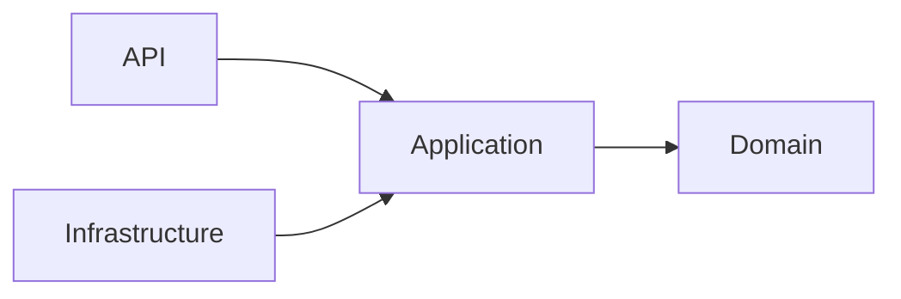
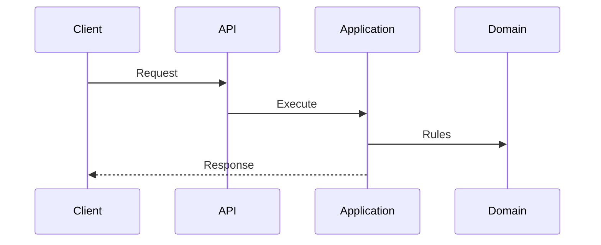

# Observability

## Purpose
Defines Clara backend standard for Observability.

## Architecture Decision
- Standardized across all modules.
- Framework independent.
- Security-first.

## Mermaid


## Sequence


## Code Skeleton
```ts
export class Example {
  execute() {}
}
```

## Production Checklist
- [ ] Ready

## Security Checklist
- [ ] Auth
- [ ] AuthZ
- [ ] Validation

## Performance Checklist
- [ ] Efficient

## Anti-patterns
- Business logic in controllers

## Testing Strategy
- Unit
- Integration

## AI Coding Guidelines
- Preserve architecture
- Generate tests

Previous: ./22-Versioning.md
Next: ./24-Performance.md
