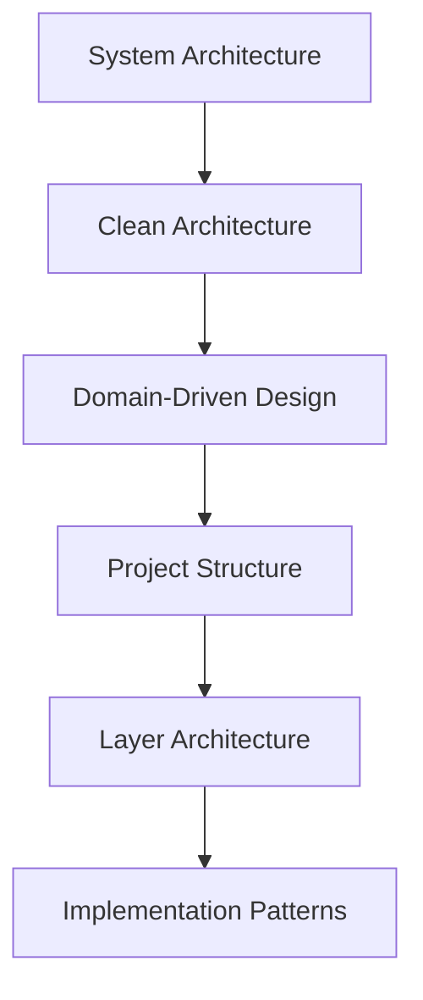
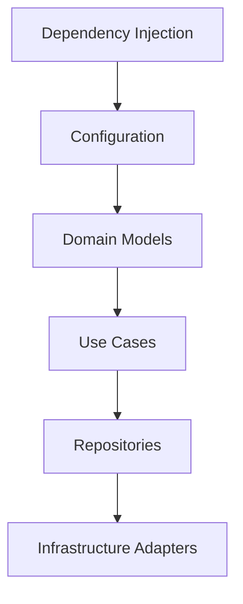
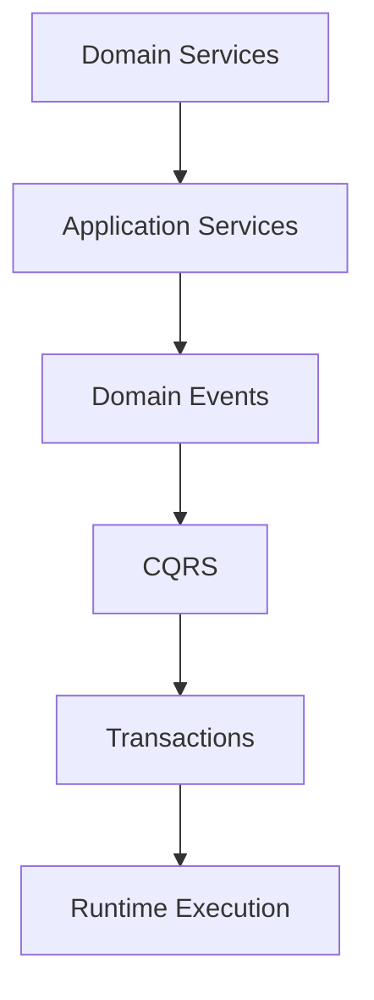

# PART-01 — Backend Architecture

> *"Backend architecture turns platform vision into maintainable production code."*

---

# Purpose

This Part defines the backend implementation architecture for Clara.

It explains how backend code should be structured, layered, tested, secured, observed, and evolved.

Book II defines what Clara should build.

Book III defines how Clara should build it.

---

# Stage 01 Scope

This stage establishes the foundation for backend implementation.

It includes:

- System Architecture.
- Clean Architecture.
- Domain-Driven Design.
- Project Structure.
- Layer Architecture.

---

# Backend Architecture Principles

Clara backend implementation should follow these principles:

- Domain-first.
- Security-first.
- Framework-independent business logic.
- Explicit boundaries.
- Testable use cases.
- Observable runtime behavior.
- Stable contracts.
- Maintainable structure.
- Clear ownership.

---

# Stage 01 Chapter Map

| Chapter | Title | Purpose |
|---|---|---|
| 01 | System Architecture | Defines the high-level backend system architecture |
| 02 | Clean Architecture | Defines dependency direction and layer separation |
| 03 | Domain-Driven Design | Defines domain modeling and business boundaries |
| 04 | Project Structure | Defines repository and folder organization |
| 05 | Layer Architecture | Defines backend layer responsibilities |

---

# Backend Foundation Map



---

# Dependency Rule

Clara backend dependencies should point inward.

```text
Presentation
    ↓
Application
    ↓
Domain

Infrastructure depends on abstractions, not the other way around.
```

Domain logic must not depend on frameworks, databases, queues, cache providers, or HTTP libraries.

---

# Security Baseline

Every backend implementation must consider:

- Authentication.
- Authorization.
- Input validation.
- Output safety.
- Secrets management.
- Audit logging.
- Tenant and Workspace isolation.
- Secure configuration.
- Least privilege.

---

# Related Documents

- ../../BOOK-02-Master-Blueprint/README.md
- ../../BOOK-02-Master-Blueprint/PART-02-Organization-Layer/README.md
- ../../BOOK-02-Master-Blueprint/PART-07-Security-Platform/README.md
- ../../standards/SECURITY-DOCS-STANDARD.md
- ../../templates/architecture-template.md

---

# Navigation

**Previous:** ../README.md

**Next:** 01-System-Architecture.md

---
book: "Book III — Implementation Architecture"
part: "PART-01 — Backend Architecture"
stage: "Stage 02 — Core Backend Pattern"
title: "Core Backend Pattern"
version: "1.1.0"
status: "official"
owner: "Clara Architecture Team"
last_updated: "2026-07-06"
classification: "implementation-architecture"
---

# Stage 02 — Core Backend Pattern

> *"Core backend patterns make implementation predictable, testable, and secure."*

---

# Purpose

Stage 02 refines the core backend implementation patterns used across Clara modules.

This stage replaces the earlier short draft and establishes the stronger format expected for Book III implementation chapters.

---

# Included Chapters

| Chapter | Title |
|---|---|
| 06 | Dependency Injection |
| 07 | Configuration |
| 08 | Domain Models |
| 09 | Use Cases |
| 10 | Repositories |

---

# Stage 02 Quality Standard

Each chapter includes:

- Purpose.
- Motivation.
- Architecture Decision.
- Reference Architecture.
- Sequence Diagram.
- Recommended Folder Structure.
- Code Skeleton.
- Implementation Guidelines.
- Production Checklist.
- Security Checklist.
- Performance Checklist.
- Anti-patterns.
- Testing Strategy.
- AI Coding Guidelines.
- Related Documents.
- Navigation.

---

# Architecture Map



---

# Related Documents

- 01-System-Architecture.md
- 02-Clean-Architecture.md
- 03-Domain-Driven-Design.md
- 04-Project-Structure.md
- 05-Layer-Architecture.md

---

# Navigation

**Previous:** 05-Layer-Architecture.md

**Next:** 06-Dependency-Injection.md


---
book: "Book III — Implementation Architecture"
part: "PART-01 — Backend Architecture"
stage: "Stage 03 — Application Logic"
title: "Application Logic"
version: "1.0.0"
status: "official"
owner: "Clara Architecture Team"
last_updated: "2026-07-06"
classification: "implementation-architecture"
---

# Stage 03 — Application Logic

> *"Application logic coordinates business behavior without owning business meaning."*

---

# Purpose

Stage 03 defines how Clara backend handles application logic.

This stage explains the difference between domain behavior, application orchestration, domain events, CQRS, and transaction boundaries.

---

# Included Chapters

| Chapter | Title |
|---|---|
| 11 | Domain Services |
| 12 | Application Services |
| 13 | Domain Events |
| 14 | CQRS |
| 15 | Transactions |

---

# Stage 03 Quality Standard

Each chapter includes:

- Purpose.
- Motivation.
- Architecture Decision.
- Reference Architecture.
- Sequence Diagram.
- Recommended Folder Structure.
- Code Skeleton.
- Implementation Guidelines.
- Production Checklist.
- Security Checklist.
- Performance Checklist.
- Anti-patterns.
- Testing Strategy.
- AI Coding Guidelines.
- Related Documents.
- Navigation.

---

# Architecture Map



---

# Key Rule

Domain logic answers:

```text
What is true in the business?
```

Application logic answers:

```text
How do we coordinate this operation safely?
```

---

# Related Documents

- ../STAGE-01/02-Clean-Architecture.md
- ../STAGE-01/03-Domain-Driven-Design.md
- ../STAGE-02/09-Use-Cases.md
- ../STAGE-02/10-Repositories.md

---

# Navigation

**Previous:** ../STAGE-02/10-Repositories.md

**Next:** 11-Domain-Services.md
