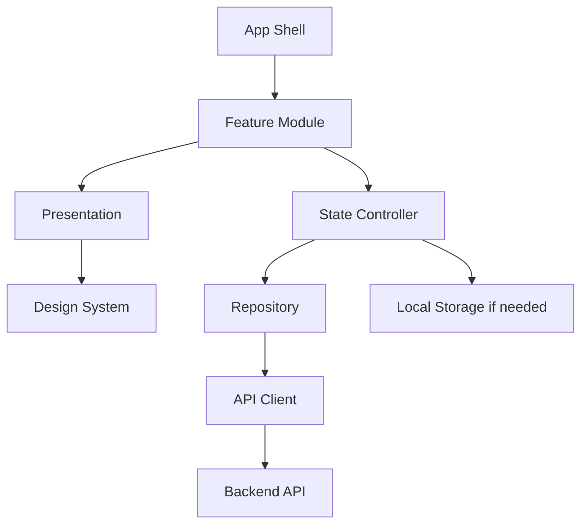
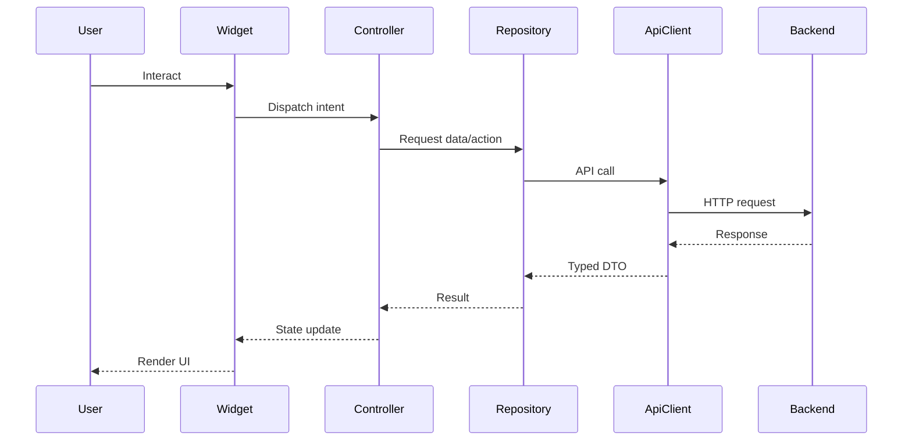

# Frontend Overview

> *"Defines the frontend architecture vision, responsibility boundaries, and product experience foundation for Athena."*

---

# Purpose

Defines the frontend architecture vision, responsibility boundaries, and product experience foundation for Athena.

---

# Motivation

Athena frontend must support many users, workflows, modules, and AI-assisted experiences.

Without clear frontend architecture, UI code can become tightly coupled, difficult to test, inconsistent, inaccessible, and insecure.

This chapter defines how **Frontend Overview** should be implemented consistently across Athena client applications.

---

# Architecture Decision

## Decision

Athena frontend should be built as a modular, feature-oriented application with clear separation between UI, state, data access, and domain-facing application logic.

## Status

Accepted.

## Reason

- Improves consistency across product surfaces.
- Keeps UI code maintainable.
- Supports secure frontend behavior.
- Improves developer and AI coding assistant productivity.
- Reduces duplication across feature modules.

## Trade-offs

| Benefit | Trade-off |
|---|---|
| More consistent frontend code | More conventions to follow |
| Easier testing | More upfront structure |
| Better UX consistency | Requires design system discipline |
| Better AI-generated code | Requires explicit architecture guidance |

---

# Reference Architecture



---

# Sequence Diagram



---

# Recommended Folder Structure

```text
lib/
├── app/
│   ├── app.dart
│   ├── router.dart
│   └── bootstrap.dart
│
├── core/
│   ├── errors/
│   ├── result/
│   ├── validation/
│   └── utils/
│
├── design_system/
│   ├── components/
│   ├── tokens/
│   └── theme/
│
├── features/
│   └── <feature>/
│       ├── domain/
│       ├── application/
│       ├── data/
│       └── presentation/
│
└── platform/
    ├── api/
    ├── auth/
    ├── storage/
    ├── localization/
    └── observability/
```

---

# Code Skeleton

```dart
// lib/app/app.dart
class AthenaApp extends StatelessWidget {
  const AthenaApp({super.key});

  @override
  Widget build(BuildContext context) {
    return MaterialApp.router(
      title: 'Athena',
      routerConfig: appRouter,
      theme: AthenaTheme.light(),
      darkTheme: AthenaTheme.dark(),
    );
  }
}

```

---

# Implementation Guidelines

- Keep widgets focused on rendering.
- Put state transitions in controllers.
- Put API calls behind repositories or API clients.
- Use shared design system components.
- Avoid hard-coded colors, spacing, and text.
- Avoid calling backend APIs directly from widgets.
- Map backend errors into safe user-facing messages.
- Keep permission-aware UI separate from backend authorization.
- Write tests for state, rendering, and failure cases.

---

# Production Checklist

- [ ] UI follows design system.
- [ ] State is explicit and testable.
- [ ] API access is typed.
- [ ] Loading, empty, success, and error states exist.
- [ ] Sensitive data is not stored insecurely.
- [ ] User-facing text supports localization.
- [ ] Accessibility basics are covered.
- [ ] Feature works across expected screen sizes.
- [ ] Tests cover critical flows.

---

# Security Checklist

- [ ] Backend remains source of truth for authorization.
- [ ] Tokens are stored only in secure storage.
- [ ] Sensitive data is not logged.
- [ ] Local cache is scoped and classified.
- [ ] Permission UI does not replace server-side checks.
- [ ] Error messages do not expose internals.
- [ ] External links are handled safely.
- [ ] User input is validated before submission.

---

# Performance Checklist

- [ ] Avoid unnecessary rebuilds.
- [ ] Use lazy lists for large collections.
- [ ] Avoid blocking UI thread.
- [ ] Cache only where justified.
- [ ] Optimize images and assets.
- [ ] Paginate large data sets.
- [ ] Avoid repeated API calls on rebuild.
- [ ] Measure before optimizing.

---

# Anti-patterns

Avoid:

- Business logic inside widgets.
- Raw HTTP calls inside UI components.
- Hard-coded colors and spacing.
- Hard-coded user-facing strings.
- Treating hidden buttons as authorization.
- Storing tokens in plain preferences.
- Ignoring loading and error states.
- Giant widgets with multiple responsibilities.
- AI-generated UI that bypasses architecture boundaries.

---

# Testing Strategy

Recommended tests:

- Widget tests for important UI states.
- Unit tests for state controllers.
- Unit tests for validators.
- Repository tests with mocked API clients.
- Golden tests for design system components where useful.
- Integration tests for critical flows.
- Accessibility checks for key screens.

---

# AI Coding Guidelines

When using Codex, Cursor, Claude Code, Gemini CLI, or another AI coding assistant:

- Tell the AI which feature module it is editing.
- Require separation between widget, controller, repository, and API client.
- Require loading, empty, error, and success states.
- Require tests for state controllers and important widgets.
- Do not accept generated UI with hard-coded secrets or tokens.
- Do not accept generated UI that treats frontend permission checks as final authorization.
- Do not accept raw HTTP calls directly from widgets.
- Ask the AI to reuse design system components.

---

# Related Documents

- ../PART-01-Backend-Architecture/README.md
- ../../BOOK-02-Master-Blueprint/PART-02-Organization-Layer/README.md
- ../../BOOK-02-Master-Blueprint/PART-07-Security-Platform/README.md

---

# Navigation

**Previous:** ./README.md

**Next:** ./27-Flutter-Architecture.md
