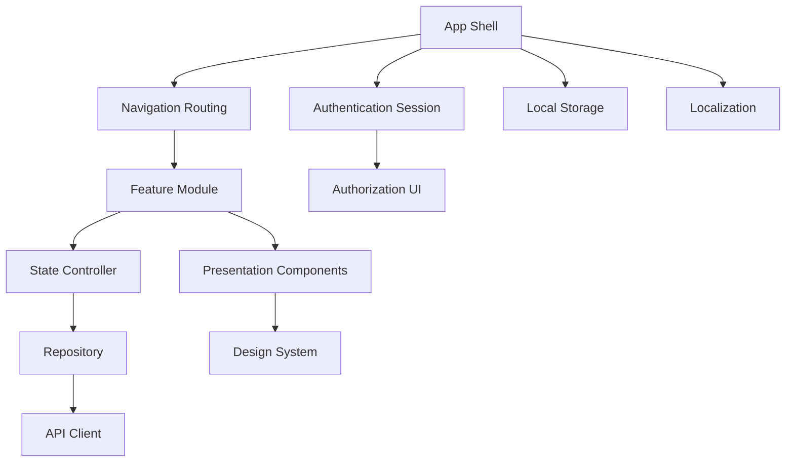

# PART-02 — Frontend Architecture

> *"Frontend architecture turns platform capability into usable, safe, and consistent product experience."*

---

# Purpose

Part II defines Athena's frontend implementation architecture.

It explains how Athena's frontend should be structured, routed, styled, tested, secured, localized, optimized, and evolved.

This Part is designed for Flutter-based frontend development, but the principles can also guide web, desktop, browser extension, and future client applications.

---

# Goals

- Define frontend architecture standards.
- Keep UI separate from business and data access logic.
- Ensure consistent product experience through a design system.
- Support secure authentication and permission-aware UI.
- Standardize API access and error handling.
- Support accessibility, localization, performance, and offline behavior.
- Provide guidance for AI coding assistants.

---

# Scope

## In Scope

- Flutter architecture.
- Project structure.
- Routing.
- State management.
- Design system.
- Theme tokens.
- Component architecture.
- Forms.
- API client.
- Authentication session.
- Authorization UI.
- Error handling.
- Loading and empty states.
- Local storage.
- Offline strategy.
- Localization.
- Accessibility.
- Performance.
- Frontend summary.

## Out of Scope

- Final UI design.
- Final visual branding.
- Backend API implementation.
- Final mobile store deployment.
- Final browser extension architecture.

---

# Chapter Map

| Chapter | Title |
|---|---|
| 26 | Frontend Overview |
| 27 | Flutter Architecture |
| 28 | Project Structure |
| 29 | Navigation Routing |
| 30 | State Management |
| 31 | Design System |
| 32 | Theme Tokens |
| 33 | Component Architecture |
| 34 | Forms Validation |
| 35 | API Client |
| 36 | Authentication Session |
| 37 | Authorization UI |
| 38 | Error Handling |
| 39 | Loading Empty States |
| 40 | Local Storage |
| 41 | Offline Strategy |
| 42 | Localization |
| 43 | Accessibility |
| 44 | Performance |
| 45 | Frontend Summary |

---

# Frontend Architecture Map

---

# Related Documents

- ../PART-01-Backend-Architecture/README.md
- ../../BOOK-02-Master-Blueprint/PART-01-Platform-Vision/README.md
- ../../BOOK-02-Master-Blueprint/PART-07-Security-Platform/README.md

---

# Navigation

**Previous:** ../PART-01-Backend-Architecture/25-Backend-Summary.md

**Next:** 26-Frontend-Overview.md
