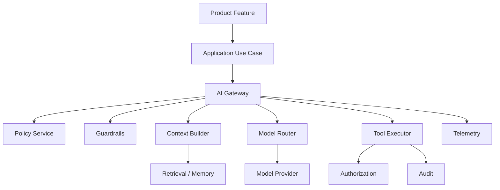
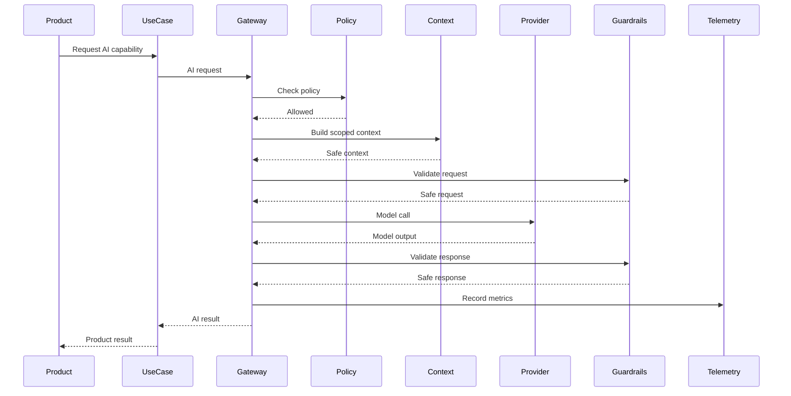

# AI Observability

> *"Defines AI traces, latency metrics, token usage, model routing logs, tool execution logs, and quality monitoring."*

---

# Purpose

Defines AI traces, latency metrics, token usage, model routing logs, tool execution logs, and quality monitoring.

---

# Motivation

AI capabilities can create major product leverage, but they also introduce new risks: hallucination, prompt injection, data leakage, uncontrolled cost, unsafe tool execution, inconsistent output, and difficult debugging.

Athena must treat AI as a production platform capability, not as scattered SDK calls.

This chapter defines how **AI Observability** should be implemented safely and consistently.

---

# Architecture Decision

## Decision

Athena AI operations should emit structured telemetry without leaking prompts, secrets, or sensitive customer data.

## Status

Accepted.

## Reason

- Centralizes AI behavior.
- Improves security and governance.
- Reduces vendor lock-in.
- Makes AI behavior observable.
- Enables evaluation and regression testing.
- Helps AI coding assistants generate consistent implementation.

## Trade-offs

| Benefit | Trade-off |
|---|---|
| Safer AI behavior | More platform code |
| Better observability | More telemetry design |
| Easier provider switching | Requires abstraction discipline |
| Stronger governance | More review process |
| Better production reliability | More testing and evaluation |

---

# Reference Architecture



---

# Sequence Diagram



---

# Recommended Folder Structure

```text
backend/
└── src/
    ├── ai/
    │   ├── application/
    │   │   ├── gateway/
    │   │   ├── context/
    │   │   ├── memory/
    │   │   ├── tools/
    │   │   ├── agents/
    │   │   ├── evaluation/
    │   │   └── policy/
    │   │
    │   ├── domain/
    │   │   ├── prompts/
    │   │   ├── events/
    │   │   └── value-objects/
    │   │
    │   ├── infrastructure/
    │   │   ├── providers/
    │   │   ├── vector-store/
    │   │   ├── persistence/
    │   │   └── telemetry/
    │   │
    │   └── presentation/
    │       └── controllers/
    │
    └── modules/
        └── <product-module>/
```

---

# Code Skeleton

```ts
// ai/platform/AiTelemetry.ts
export class AiTelemetry {
  recordCompletion(event: AiCompletionTelemetryEvent): void {
    metrics.histogram("ai.completion.latency_ms", event.latencyMs);
    metrics.counter("ai.completion.tokens.input", event.inputTokens);
    metrics.counter("ai.completion.tokens.output", event.outputTokens);

    logger.info("AI completion finished", {
      correlationId: event.correlationId,
      provider: event.provider,
      model: event.model,
      capability: event.capability,
    });
  }
}

```

---

# Implementation Guidelines

- Never call model providers directly from product modules.
- Route all AI calls through AI Gateway.
- Enforce authorization before AI reads or acts on user data.
- Scope all context by Organization and Workspace.
- Keep prompts versioned and reviewable.
- Keep tool execution explicit, validated, authorized, and audited.
- Use guardrails before and after model calls.
- Prefer structured outputs where product behavior depends on AI output.
- Add telemetry for latency, tokens, provider, model, and failure reason.
- Use human review for sensitive, irreversible, or external-facing actions.

---

# Production Checklist

- [ ] All AI calls go through AI Gateway.
- [ ] Provider abstraction exists.
- [ ] Prompt version is recorded.
- [ ] Context is tenant-scoped.
- [ ] Tool calls are authorized.
- [ ] Sensitive actions are audited.
- [ ] Guardrails are applied.
- [ ] Token usage is measured.
- [ ] Evaluation dataset exists for critical AI features.
- [ ] Fallback behavior exists for model/provider failure.
- [ ] Human review exists where needed.

---

# Security Checklist

- [ ] Prompt injection risk is considered.
- [ ] Model output is treated as untrusted.
- [ ] AI cannot bypass authorization.
- [ ] Tools validate all arguments.
- [ ] Tool execution is auditable.
- [ ] Secrets are not sent to model providers.
- [ ] Sensitive data is redacted where required.
- [ ] Context retrieval respects Organization and Workspace boundaries.
- [ ] Memory is consent-aware and deletable.
- [ ] External AI providers are configured through secrets manager.

---

# Performance Checklist

- [ ] Token budget is controlled.
- [ ] Context size is limited.
- [ ] Retrieval limit is explicit.
- [ ] AI calls have timeouts.
- [ ] Retries use backoff.
- [ ] Slow AI workflows use background jobs.
- [ ] Streaming is used where useful.
- [ ] Caching is used only when safe.
- [ ] Cost and latency are observable.

---

# Anti-patterns

Avoid:

- Direct SDK calls from controllers or product services.
- Sending full database records to models.
- Using frontend-hidden buttons as AI authorization.
- Trusting AI output without validation.
- Executing AI tool calls without permission checks.
- Storing AI memory without consent and retention rules.
- Prompt templates hard-coded across many files.
- Logging raw prompts containing sensitive data.
- Skipping evaluation because output “looks good”.
- Allowing AI to perform irreversible actions without review.

---

# Testing Strategy

Recommended tests:

- Unit tests for AI policy rules.
- Unit tests for prompt rendering.
- Context scoping tests.
- RAG retrieval tests.
- Tool schema validation tests.
- Authorization failure tests for tool execution.
- Guardrail tests for blocked inputs and outputs.
- Evaluation tests using golden datasets.
- Integration tests with mocked model providers.
- Regression tests for high-risk AI workflows.

---

# AI Coding Guidelines

When using Codex, Cursor, Claude Code, Gemini CLI, or another AI coding assistant:

- Tell the AI to use the AI Gateway, never direct provider SDK calls.
- Require authorization and tenant scope checks.
- Require guardrail invocation for request and response.
- Require structured output validation for machine-actionable results.
- Require tests for denied permissions and invalid tool arguments.
- Ask the AI to avoid logging raw prompts or sensitive outputs.
- Ask the AI to record telemetry without exposing sensitive content.
- Reject generated code that lets AI tools act without audit.
- Reject generated code that stores memory without consent and deletion path.

---

# Related Documents

- ../PART-01-Backend-Architecture/README.md
- ../PART-02-Frontend-Architecture/README.md
- ../../BOOK-02-Master-Blueprint/PART-04-AI-Platform/README.md
- ../../BOOK-02-Master-Blueprint/PART-07-Security-Platform/README.md

---

# Navigation

**Previous:** ./58-AI-Evaluation.md

**Next:** ./60-Cost-Control.md
