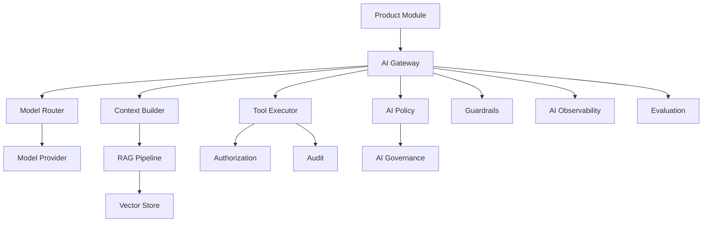

# PART-03 — AI Architecture

> *"AI in Athena is not a shortcut around architecture; it is a platform capability governed by architecture."*

---

# Purpose

Part III defines the implementation architecture for Athena AI capabilities.

It turns the conceptual AI platform from Book II into production-grade implementation patterns covering gateway design, model provider abstraction, prompt architecture, context engineering, RAG, memory, tool calling, agents, guardrails, evaluation, observability, cost control, governance, and AI security.

---

# Goals

- Centralize AI access through a safe AI Gateway.
- Prevent direct uncontrolled model calls.
- Define safe context engineering and RAG patterns.
- Standardize prompt templates and prompt versioning.
- Make AI tool execution authorized and auditable.
- Support memory without violating privacy or tenant isolation.
- Evaluate AI behavior before production rollout.
- Make AI usage observable and cost-aware.
- Defend against prompt injection, data exfiltration, and tool abuse.

---

# Scope

## In Scope

- AI Gateway.
- Model provider abstraction.
- Prompt architecture.
- Context engineering.
- RAG pipeline.
- Vector retrieval.
- Memory architecture.
- Tool calling.
- Agent architecture.
- AI workflow orchestration.
- Guardrails.
- Evaluation.
- Observability.
- Cost control.
- Rate limits.
- Human-in-the-loop.
- AI security.
- AI governance.

## Out of Scope

- Model training from scratch.
- Final ML infrastructure.
- Low-level GPU serving.
- Vendor-specific SDK deep dive.
- Final production model selection.

---

# Chapter Map

| Chapter | Title |
|---|---|
| 46 | AI Architecture Overview |
| 47 | AI Gateway |
| 48 | Model Provider Abstraction |
| 49 | Prompt Architecture |
| 50 | Context Engineering |
| 51 | RAG Pipeline |
| 52 | Vector Retrieval |
| 53 | Memory Architecture |
| 54 | Tool Calling |
| 55 | Agent Architecture |
| 56 | AI Workflow Orchestration |
| 57 | Guardrails |
| 58 | AI Evaluation |
| 59 | AI Observability |
| 60 | Cost Control |
| 61 | Rate Limits |
| 62 | Human In The Loop |
| 63 | AI Security |
| 64 | AI Governance |
| 65 | AI Architecture Summary |

---

# AI Architecture Map



---

# Critical Rule

No Athena module should call an AI model provider directly.

All AI access must go through:

```text
Product Module → AI Gateway → Policy / Guardrails / Provider / Telemetry
```

---

# Related Documents

- ../PART-01-Backend-Architecture/README.md
- ../PART-02-Frontend-Architecture/README.md
- ../../BOOK-02-Master-Blueprint/PART-04-AI-Platform/README.md
- ../../BOOK-02-Master-Blueprint/PART-07-Security-Platform/README.md

---

# Navigation

**Previous:** ../PART-02-Frontend-Architecture/45-Frontend-Summary.md

**Next:** 46-AI-Architecture-Overview.md
