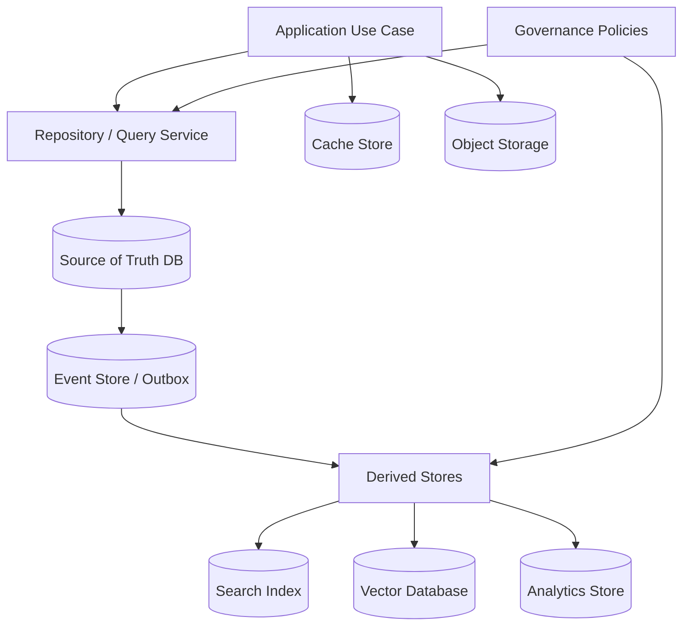
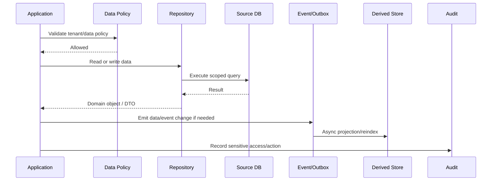

# Data Pipeline Implementation

> *"Defines data pipeline ingestion, transformation, validation, deduplication, scheduling, monitoring, and replay."*

---

# Purpose

Defines data pipeline ingestion, transformation, validation, deduplication, scheduling, monitoring, and replay.

---

# Motivation

Data is one of the highest-risk parts of Athena.

Bad data architecture can cause privacy leaks, tenant isolation failures, broken AI context, slow queries, unrecoverable incidents, inconsistent reporting, and dangerous production migrations.

This chapter defines how **Data Pipeline Implementation** should be implemented safely and consistently.

---

# Architecture Decision

## Decision

Athena data pipelines should be idempotent, observable, replayable, and isolated from transactional request paths.

## Status

Accepted.

## Reason

- Protects tenant isolation.
- Improves data reliability.
- Supports safe production evolution.
- Makes security and privacy enforceable.
- Improves observability and incident response.
- Helps AI coding assistants generate safe data-layer code.

## Trade-offs

| Benefit | Trade-off |
|---|---|
| Safer data access | More explicit data modeling |
| Better production reliability | More upfront design |
| Easier recovery | Requires operational discipline |
| Stronger privacy | Requires classification and policy work |
| Better AI/RAG grounding | Requires metadata and retrieval discipline |

---

# Reference Architecture



---

# Sequence Diagram



---

# Recommended Folder Structure

```text
backend/
└── src/
    ├── data/
    │   ├── governance/
    │   ├── migrations/
    │   ├── retention/
    │   ├── privacy/
    │   ├── backup/
    │   └── pipelines/
    │
    ├── platform/
    │   ├── database/
    │   ├── cache/
    │   ├── object-storage/
    │   ├── search/
    │   ├── vector-store/
    │   ├── audit/
    │   └── analytics/
    │
    └── modules/
        └── <domain>/
            ├── application/
            │   ├── ports/
            │   └── read-models/
            ├── domain/
            └── infrastructure/
                ├── persistence/
                ├── mappers/
                └── projections/
```

---

# Code Skeleton

```ts
// data-pipeline/application/PipelineJobHandler.ts
export class PipelineJobHandler {
  constructor(
    private readonly checkpointStore: CheckpointStore,
    private readonly transformer: DataTransformer,
    private readonly destination: DataDestination,
  ) {}

  async handle(batch: DataBatch): Promise<void> {
    const checkpoint = await this.checkpointStore.get(batch.pipelineName);

    const transformed = await this.transformer.transform(batch.records, checkpoint);

    await this.destination.write(transformed);

    await this.checkpointStore.save(batch.pipelineName, batch.nextCheckpoint);
  }
}

```

---

# Implementation Guidelines

- Always include tenant scope in data access.
- Keep source-of-truth data separate from derived data.
- Treat cache, search, vector, and analytics stores as rebuildable unless explicitly documented otherwise.
- Avoid direct ad-hoc database calls from controllers.
- Use migrations for all schema changes.
- Keep migrations backward-compatible for rolling deploys.
- Add indexes intentionally based on query patterns.
- Record audit logs for sensitive actions.
- Classify data before storing or exposing it.
- Avoid storing secrets in normal application tables.

---

# Production Checklist

- [ ] Tenant scope is enforced.
- [ ] Data ownership is documented.
- [ ] Schema changes are migration-based.
- [ ] Migrations are reviewed.
- [ ] Backup strategy exists.
- [ ] Restore strategy is tested.
- [ ] Data retention policy exists.
- [ ] Privacy classification exists.
- [ ] Audit requirements are satisfied.
- [ ] Derived stores can be rebuilt.
- [ ] Query performance is measured.

---

# Security Checklist

- [ ] Organization ID is enforced server-side.
- [ ] Workspace ID is enforced server-side where applicable.
- [ ] Authorization is checked before sensitive access.
- [ ] PII is classified and protected.
- [ ] Secrets are not stored in ordinary tables.
- [ ] Cache keys are tenant-scoped.
- [ ] Vector search uses metadata filters.
- [ ] Object access uses signed URLs or controlled proxy.
- [ ] Audit logs are tamper-resistant.
- [ ] Backup data is encrypted.

---

# Performance Checklist

- [ ] Common queries have indexes.
- [ ] List endpoints are paginated.
- [ ] Avoid N+1 queries.
- [ ] Large backfills are async.
- [ ] Migrations avoid long blocking locks.
- [ ] Cache TTL is explicit.
- [ ] Derived stores are updated asynchronously.
- [ ] Search and vector retrieval limits are explicit.
- [ ] Slow queries are observable.
- [ ] Storage growth is monitored.

---

# Anti-patterns

Avoid:

- Direct database access from controllers.
- Missing tenant filters in queries.
- Using cache as source of truth.
- Running destructive migrations without rollback plan.
- Storing raw secrets in database rows.
- Sending unrestricted database records to AI context.
- Vector search without metadata filters.
- Search indexes treated as authoritative data.
- Backups that are never restore-tested.
- Analytics events containing unnecessary PII.

---

# Testing Strategy

Recommended tests:

- Repository integration tests.
- Tenant isolation tests.
- Migration tests.
- Query performance smoke tests.
- Cache scoping tests.
- Search reindex tests.
- Vector metadata filter tests.
- Backup restore drills.
- Privacy masking tests.
- Audit log tests.
- Data retention job tests.

---

# AI Coding Guidelines

When using Codex, Cursor, Claude Code, Gemini CLI, or another AI coding assistant:

- Require tenant scope in every query.
- Require repository/query service patterns.
- Require migration files for schema changes.
- Require tests for tenant isolation.
- Ask the AI to avoid raw SQL unless necessary and reviewed.
- Ask the AI to add indexes only with query rationale.
- Reject generated code that queries without Organization/Workspace scope.
- Reject generated code that stores secrets in application tables.
- Reject generated code that sends unrestricted data to AI context.
- Reject generated code that treats cache/search/vector stores as authoritative without documentation.

---

# Related Documents

- ../PART-01-Backend-Architecture/README.md
- ../PART-03-AI-Architecture/README.md
- ../../BOOK-02-Master-Blueprint/PART-06-Data-Platform/README.md
- ../../BOOK-02-Master-Blueprint/PART-07-Security-Platform/README.md

---

# Navigation

**Previous:** ./77-Cache-Store-Implementation.md

**Next:** ./79-Backup-Restore.md
