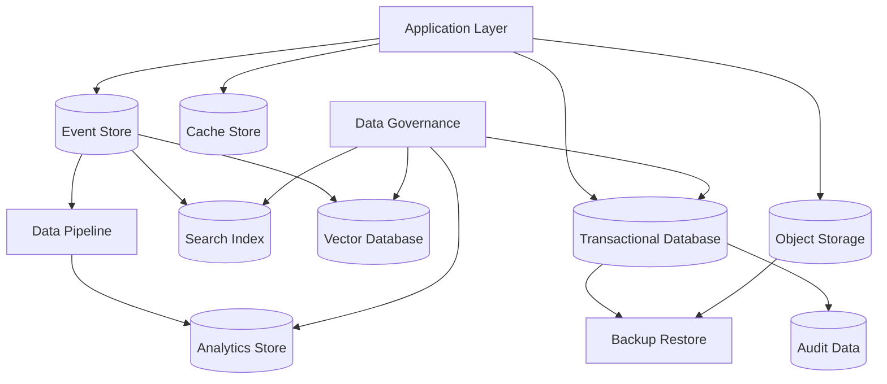

# PART-04 — Data Architecture

> *"Data architecture protects Athena from becoming fast, clever, and wrong."*

---

# Purpose

Part IV defines Athena's implementation architecture for data.

It turns the Book II Data Platform concepts into production-grade implementation standards for database design, schema evolution, data ownership, access patterns, event store, search, vector retrieval, object storage, cache, pipelines, backup, disaster recovery, privacy, audit, and analytics.

---

# Goals

- Establish clear data ownership boundaries.
- Protect tenant isolation across every storage layer.
- Standardize database schema and migration practices.
- Make derived stores rebuildable.
- Keep cache, search, vector, and analytics stores scoped and safe.
- Support privacy, retention, auditability, backup, and disaster recovery.
- Provide AI coding assistants with safe data implementation rules.

---

# Scope

## In Scope

- Relational database design.
- Schema design.
- Data ownership.
- Data access patterns.
- Database migrations.
- Consistency model.
- Event store.
- Search index.
- Vector database.
- Object storage.
- Cache store.
- Data pipelines.
- Backup and restore.
- Disaster recovery.
- Data retention.
- Data privacy.
- Audit data.
- Analytics data.

## Out of Scope

- Vendor-specific deep dive.
- Full data warehouse implementation.
- Final compliance certification.
- Low-level database tuning manual.
- Final infrastructure provisioning.

---

# Chapter Map

| Chapter | Title |
|---|---|
| 66 | Data Architecture Overview |
| 67 | Database Design |
| 68 | Schema Design |
| 69 | Data Ownership |
| 70 | Data Access Patterns |
| 71 | Database Migrations |
| 72 | Consistency Model |
| 73 | Event Store Implementation |
| 74 | Search Index Implementation |
| 75 | Vector Database Implementation |
| 76 | Object Storage Implementation |
| 77 | Cache Store Implementation |
| 78 | Data Pipeline Implementation |
| 79 | Backup Restore |
| 80 | Disaster Recovery |
| 81 | Data Retention |
| 82 | Data Privacy |
| 83 | Audit Data |
| 84 | Analytics Data |
| 85 | Data Architecture Summary |

---

# Data Architecture Map



---

# Critical Rule

Every data access path must preserve:

```text
Organization scope
Workspace scope
Permission scope
Data classification
Retention policy
Audit requirements where needed
```

---

# Related Documents

- ../PART-01-Backend-Architecture/README.md
- ../PART-03-AI-Architecture/README.md
- ../../BOOK-02-Master-Blueprint/PART-06-Data-Platform/README.md
- ../../BOOK-02-Master-Blueprint/PART-07-Security-Platform/README.md

---

# Navigation

**Previous:** ../PART-03-AI-Architecture/65-AI-Architecture-Summary.md

**Next:** 66-Data-Architecture-Overview.md
