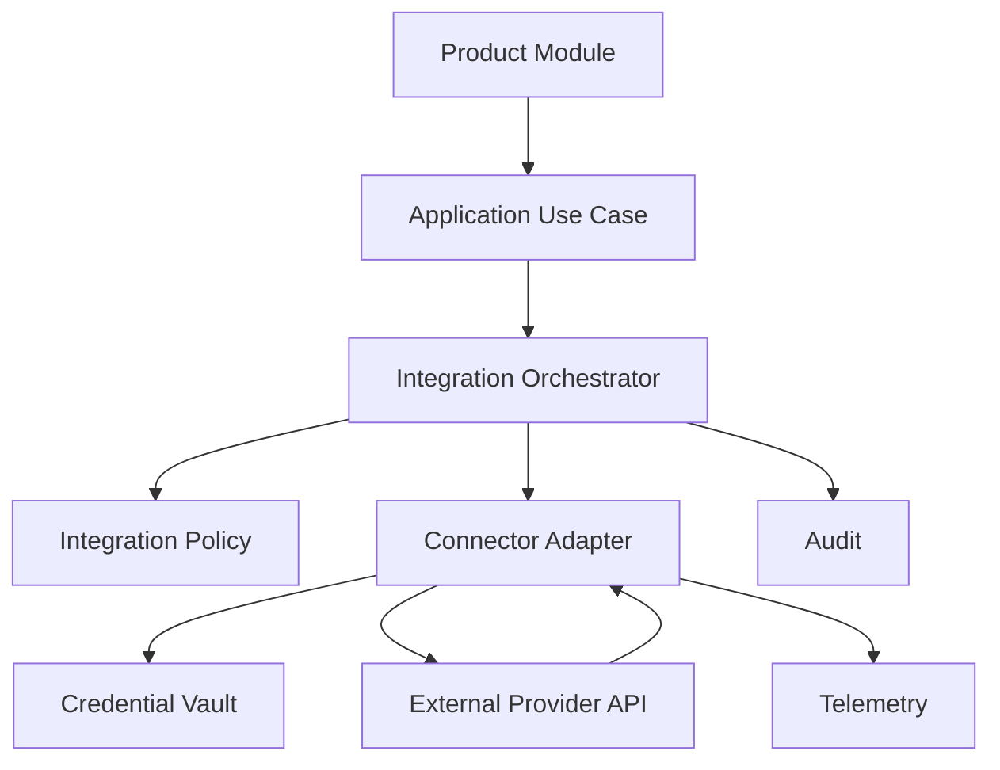
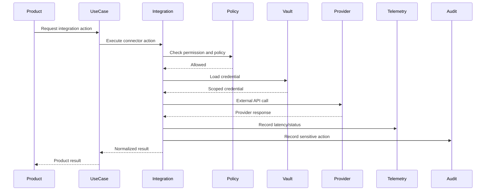

# Marketplace Integration

> *"Defines marketplace packaging, review, installation, permission approval, version updates, and tenant-level enablement."*

---

# Purpose

Defines marketplace packaging, review, installation, permission approval, version updates, and tenant-level enablement.

---

# Motivation

Integrations are powerful but risky.

They connect Clara to external systems, external data, external identities, external failures, and external attack surfaces.

If integration code is scattered, Clara can suffer from credential leaks, SSRF, webhook spoofing, provider lock-in, inconsistent retries, duplicate writes, broken tenant isolation, and poor incident response.

This chapter defines how **Marketplace Integration** should be implemented safely and consistently.

---

# Architecture Decision

## Decision

Clara marketplace packages should be reviewed, signed, permission-declared, versioned, and enabled per tenant/workspace.

## Status

Accepted.

## Reason

- Protects tenant and workspace boundaries.
- Keeps provider-specific logic isolated.
- Improves reliability for external failures.
- Reduces credential exposure.
- Makes integrations observable.
- Supports safe plugin, extension, and marketplace growth.
- Helps AI coding assistants generate secure integration code.

## Trade-offs

| Benefit | Trade-off |
|---|---|
| Safer external connectivity | More adapter code |
| Better provider isolation | More contracts to maintain |
| Easier retries and recovery | More reliability infrastructure |
| Stronger security | More policy enforcement |
| Better marketplace readiness | More review process |

---

# Reference Architecture



---

# Sequence Diagram



---

# Recommended Folder Structure

```text
backend/
└── src/
    ├── integration/
    │   ├── application/
    │   │   ├── orchestrator/
    │   │   ├── policy/
    │   │   ├── auth/
    │   │   ├── reliability/
    │   │   └── observability/
    │   │
    │   ├── connectors/
    │   │   ├── slack/
    │   │   ├── google/
    │   │   ├── whatsapp/
    │   │   └── generic/
    │   │
    │   ├── webhook/
    │   │   ├── ingress/
    │   │   ├── inbox/
    │   │   └── delivery/
    │   │
    │   ├── sdk/
    │   │   ├── plugin/
    │   │   └── extension/
    │   │
    │   └── marketplace/
    │
    └── modules/
        └── <product-module>/
```

---

# Code Skeleton

```ts
// marketplace/application/InstallPackageUseCase.ts
export class InstallPackageUseCase {
  constructor(
    private readonly packageRepository: MarketplacePackageRepository,
    private readonly policy: MarketplacePolicy,
  ) {}

  async execute(input: InstallPackageInput): Promise<void> {
    const pkg = await this.packageRepository.findApprovedVersion(input.packageId, input.version);

    await this.policy.assertInstallAllowed(input.actor, pkg.requestedPermissions);

    await this.packageRepository.installForWorkspace({
      organizationId: input.organizationId,
      workspaceId: input.workspaceId,
      packageId: pkg.id,
      version: pkg.version,
    });
  }
}

```

---

# Implementation Guidelines

- Never call external providers directly from controllers or domain models.
- Keep provider schemas isolated from Clara domain models.
- Validate every inbound payload.
- Verify webhook signatures before processing.
- Store external credentials in vault/secret storage.
- Use scoped credentials and least privilege.
- Enforce authorization before connector execution.
- Use idempotency for webhook processing and external writes.
- Use retries only for safe retryable operations.
- Record telemetry for all external calls.
- Redact sensitive provider data from logs.

---

# Production Checklist

- [ ] Connector adapter exists.
- [ ] Provider-specific schema is isolated.
- [ ] Credential storage is secure.
- [ ] Authorization is enforced.
- [ ] Webhook signature verification exists where applicable.
- [ ] Idempotency exists for inbound events and outbound writes.
- [ ] Retry policy exists.
- [ ] Rate limit policy exists.
- [ ] External call timeout exists.
- [ ] Telemetry exists for latency, status, and provider errors.
- [ ] Sensitive actions are audited.

---

# Security Checklist

- [ ] No hard-coded provider credentials.
- [ ] Tokens are encrypted at rest.
- [ ] Webhooks are signature verified.
- [ ] Inbound payloads are validated.
- [ ] External URLs are allowlisted where needed to reduce SSRF risk.
- [ ] Integration actions require server-side authorization.
- [ ] Tenant scope is enforced.
- [ ] Logs redact tokens, secrets, and sensitive payloads.
- [ ] Plugin/extension permissions are explicitly declared.
- [ ] Marketplace packages are reviewed before enablement.

---

# Performance Checklist

- [ ] External calls have timeouts.
- [ ] Retries use exponential backoff.
- [ ] Long-running integration work runs in background jobs.
- [ ] Rate limits prevent provider abuse.
- [ ] Provider latency is measured.
- [ ] Webhook processing is fast and async where possible.
- [ ] Duplicate events are ignored safely.
- [ ] Large syncs use pagination and checkpoints.
- [ ] Connector health is monitored.

---

# Anti-patterns

Avoid:

- Direct provider SDK calls inside product modules.
- Webhook processing without signature verification.
- External writes without idempotency keys.
- Infinite retries.
- Logging OAuth tokens.
- Treating provider response as trusted internal data.
- Mixing provider schemas into domain entities.
- Running long external syncs inside request-response flow.
- Plugins with implicit permissions.
- Extension content scripts with privileged tokens.

---

# Testing Strategy

Recommended tests:

- Connector unit tests.
- Provider API mock integration tests.
- Webhook signature verification tests.
- Idempotency tests.
- Retry and dead-letter tests.
- Authorization failure tests.
- Credential access tests.
- Data mapping tests.
- Rate limit tests.
- Marketplace package validation tests.
- Plugin/extension permission tests.

---

# AI Coding Guidelines

When using Codex, Cursor, Claude Code, Gemini CLI, or another AI coding assistant:

- Require connector adapters instead of direct external API calls.
- Require signature verification for webhook handlers.
- Require idempotency for inbound events and external writes.
- Require credential vault access instead of hard-coded tokens.
- Require timeout and retry policies for external calls.
- Require tenant scope in every integration action.
- Require authorization checks before connector execution.
- Reject generated code that logs secrets.
- Reject generated code that trusts external payloads without validation.
- Reject generated code that exposes privileged tokens to browser content scripts.

---

# Related Documents

- ../PART-01-Backend-Architecture/README.md
- ../PART-04-Data-Architecture/README.md
- ../../BOOK-02-Master-Blueprint/PART-08-Integration-Platform/README.md
- ../../BOOK-02-Master-Blueprint/PART-07-Security-Platform/README.md

---

# Navigation

**Previous:** ./95-Extension-SDK-Implementation.md

**Next:** ./97-Third-Party-API-Clients.md
