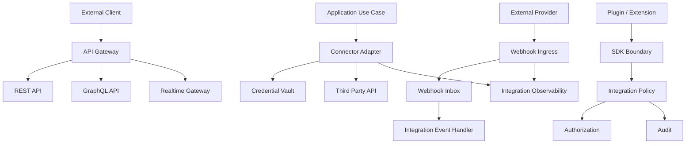

# PART-05 — Integration Architecture

> *"Integration architecture is how Athena safely connects to the outside world without losing control of trust, data, or reliability."*

---

# Purpose

Part V defines Athena's implementation architecture for integrations.

It turns Book II Integration Platform concepts into production-grade implementation standards for REST API, GraphQL, webhooks, realtime messaging, OAuth, API gateway integration, external connectors, plugin SDK, extension SDK, marketplace, third-party API clients, authentication, authorization, rate limits, idempotency, event-driven integration, data mapping, observability, and security.

---

# Goals

- Standardize internal and external integration patterns.
- Keep external provider schemas out of Athena domain models.
- Secure inbound and outbound integration flows.
- Make webhook and external API processing idempotent.
- Protect tenant and workspace boundaries.
- Make integration failures observable and recoverable.
- Provide safe patterns for plugins, extensions, and marketplace packages.

---

# Scope

## In Scope

- REST API.
- GraphQL.
- Webhooks.
- WebSocket/realtime.
- OAuth.
- API gateway integration.
- External connectors.
- Plugin SDK.
- Extension SDK.
- Marketplace packages.
- Third-party API clients.
- Integration authentication and authorization.
- Rate limits and quotas.
- Idempotency and retries.
- Event-driven integration.
- Data mapping and transformation.
- Integration observability.
- Integration security.

## Out of Scope

- Final partner contracts.
- Vendor-specific deep implementation.
- Public developer portal design.
- Full marketplace business model.
- Final extension store distribution.

---

# Chapter Map

| Chapter | Title |
|---|---|
| 86 | Integration Architecture Overview |
| 87 | REST API Implementation |
| 88 | GraphQL Implementation |
| 89 | Webhook Implementation |
| 90 | WebSocket Realtime |
| 91 | OAuth Implementation |
| 92 | API Gateway Integration |
| 93 | External Connector Architecture |
| 94 | Plugin SDK Implementation |
| 95 | Extension SDK Implementation |
| 96 | Marketplace Integration |
| 97 | Third Party API Clients |
| 98 | Integration Authentication |
| 99 | Integration Authorization |
| 100 | Rate Limit Quota |
| 101 | Idempotency Retry |
| 102 | Event Driven Integration |
| 103 | Data Mapping Transformation |
| 104 | Integration Observability |
| 105 | Integration Security Summary |

---

# Integration Architecture Map



---

# Critical Rule

No product module should call an external provider directly.

All integrations must go through:

```text
Product Module → Integration Orchestrator / Connector Adapter → Policy / Credential Vault / Telemetry
```

---

# Related Documents

- ../PART-01-Backend-Architecture/README.md
- ../PART-04-Data-Architecture/README.md
- ../../BOOK-02-Master-Blueprint/PART-08-Integration-Platform/README.md
- ../../BOOK-02-Master-Blueprint/PART-07-Security-Platform/README.md

---

# Navigation

**Previous:** ../PART-04-Data-Architecture/85-Data-Architecture-Summary.md

**Next:** 86-Integration-Architecture-Overview.md
