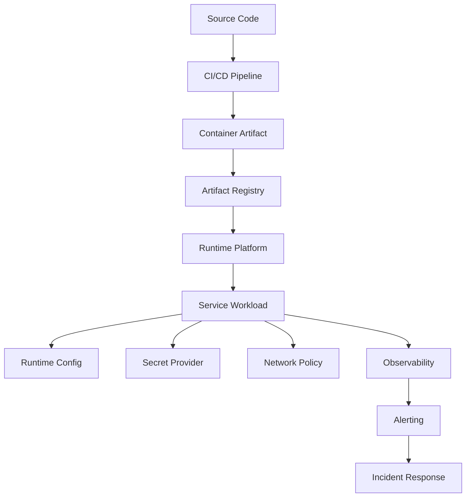
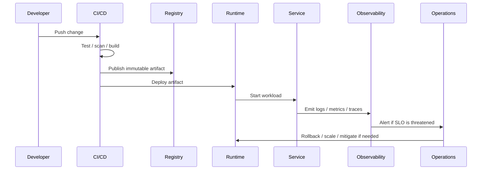

# Scaling Strategy

> *"Defines horizontal scaling, vertical scaling, autoscaling, queue scaling, capacity planning, and bottleneck management."*

---

# Purpose

Defines horizontal scaling, vertical scaling, autoscaling, queue scaling, capacity planning, and bottleneck management.

---

# Motivation

Infrastructure is where architecture meets production reality.

Good application code can still fail if deployment is unsafe, secrets are leaked, logs are missing, scaling is uncontrolled, or incidents have no runbooks.

This chapter defines how **Scaling Strategy** should be implemented safely and consistently for Athena.

---

# Architecture Decision

## Decision

Athena should scale stateless services horizontally, scale workers by queue pressure, and scale stateful systems through capacity planning.

## Status

Accepted.

## Reason

- Improves production reliability.
- Reduces deployment risk.
- Strengthens security boundaries.
- Makes operations observable.
- Supports safe scaling.
- Improves incident response.
- Helps AI coding assistants generate production-safe infrastructure code.

## Trade-offs

| Benefit | Trade-off |
|---|---|
| Safer production releases | More pipeline and platform work |
| Better security posture | More policy and access management |
| Better incident response | More runbook maintenance |
| Better scalability | More operational planning |
| Better observability | More telemetry cost and discipline |

---

# Reference Architecture



---

# Sequence Diagram



---

# Recommended Folder Structure

```text
infra/
├── environments/
│   ├── development/
│   ├── staging/
│   └── production/
│
├── kubernetes/
│   ├── base/
│   ├── overlays/
│   ├── network-policies/
│   └── service-accounts/
│
├── ci-cd/
│   ├── pipelines/
│   ├── quality-gates/
│   └── release-workflows/
│
├── observability/
│   ├── dashboards/
│   ├── alerts/
│   ├── log-pipelines/
│   └── tracing/
│
├── security/
│   ├── secrets/
│   ├── policies/
│   └── access-control/
│
└── runbooks/
```

---

# Code Skeleton

```yaml
apiVersion: autoscaling/v2
kind: HorizontalPodAutoscaler
metadata:
  name: athena-api-hpa
spec:
  scaleTargetRef:
    apiVersion: apps/v1
    kind: Deployment
    name: athena-api
  minReplicas: 3
  maxReplicas: 20
  metrics:
    - type: Resource
      resource:
        name: cpu
        target:
          type: Utilization
          averageUtilization: 70

```

---

# Implementation Guidelines

- Prefer Infrastructure as Code over manual configuration.
- Use immutable build artifacts.
- Separate environments clearly.
- Keep production access restricted and auditable.
- Validate configuration before startup.
- Never commit secrets.
- Use least privilege for runtime identities.
- Add health checks to every service.
- Add logs, metrics, and traces to critical paths.
- Create runbooks for major operational failures.
- Test rollback and recovery paths.

---

# Production Checklist

- [ ] Infrastructure is defined as code.
- [ ] Deployment is automated.
- [ ] Artifact is immutable.
- [ ] Rollback path exists.
- [ ] Health checks exist.
- [ ] Runtime config is validated.
- [ ] Secrets are managed securely.
- [ ] Logs, metrics, and traces exist.
- [ ] Alerts are actionable.
- [ ] Runbook exists for critical failure.
- [ ] Production access is restricted.

---

# Security Checklist

- [ ] No secrets in source code.
- [ ] Secrets are stored in managed secret storage.
- [ ] Runtime identity uses least privilege.
- [ ] Network access is restricted by policy.
- [ ] Ingress is protected with TLS.
- [ ] Egress is controlled where possible.
- [ ] CI/CD permissions are minimized.
- [ ] Container images are scanned.
- [ ] Production access is audited.
- [ ] Debug mode is disabled in production.

---

# Performance Checklist

- [ ] Resource requests and limits exist.
- [ ] Autoscaling policy exists where needed.
- [ ] Load balancer health checks exist.
- [ ] Startup and readiness times are monitored.
- [ ] Queue depth is monitored for workers.
- [ ] Database and cache connections are pooled.
- [ ] Metrics cardinality is controlled.
- [ ] Capacity planning exists for stateful systems.
- [ ] High-latency dependencies are observable.

---

# Anti-patterns

Avoid:

- Manual production changes without tracking.
- Mutable production artifacts.
- Hard-coded internal service addresses.
- Running containers as root without need.
- Missing readiness and liveness probes.
- Committing `.env` files.
- Broad admin permissions in CI/CD.
- Alerts that nobody owns.
- Logs without correlation IDs.
- Scaling stateful systems without capacity planning.
- Assuming backups work without restore testing.

---

# Testing Strategy

Recommended tests:

- CI pipeline validation tests.
- Container build tests.
- Smoke tests after deployment.
- Health check tests.
- Configuration validation tests.
- Secret injection tests.
- Network policy tests.
- Load and capacity tests.
- Failover and rollback drills.
- Alert firing tests.
- Runbook simulation exercises.

---

# AI Coding Guidelines

When using Codex, Cursor, Claude Code, Gemini CLI, or another AI coding assistant:

- Require Infrastructure as Code.
- Require least privilege service accounts.
- Require health probes for workloads.
- Require resource requests and limits.
- Require secret references instead of literal secrets.
- Require CI/CD quality gates.
- Ask the AI to include rollback and smoke test steps.
- Reject generated infrastructure that exposes services publicly by default.
- Reject generated infrastructure that runs as root without reason.
- Reject generated infrastructure that disables TLS or weakens production security.

---

# Related Documents

- ../PART-01-Backend-Architecture/README.md
- ../PART-04-Data-Architecture/README.md
- ../PART-05-Integration-Architecture/README.md
- ../../BOOK-02-Master-Blueprint/PART-09-Infrastructure/README.md
- ../../BOOK-02-Master-Blueprint/PART-07-Security-Platform/README.md

---

# Navigation

**Previous:** ./121-Alerting-Incident-Response.md

**Next:** ./123-Multi-Region-Architecture.md
