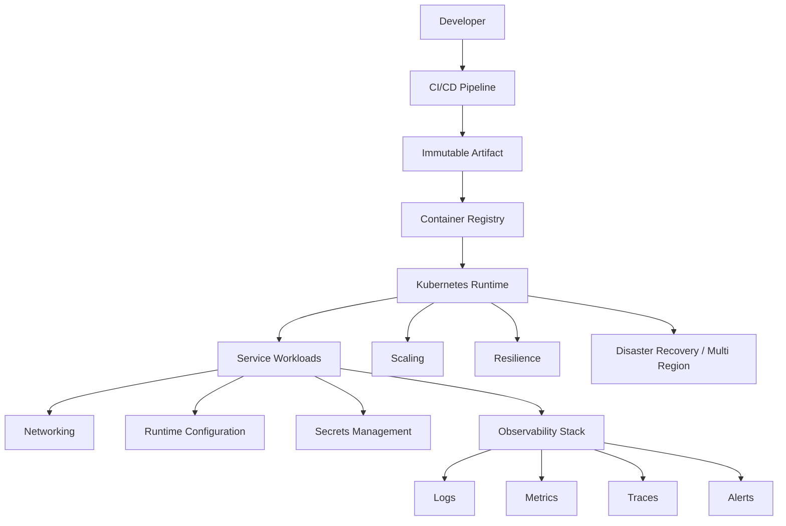

# PART-06 — Infrastructure Architecture

> *"Infrastructure architecture turns code into a reliable production system."*

---

# Purpose

Part VI defines Athena's implementation architecture for infrastructure.

It covers deployment, containers, Kubernetes, CI/CD, environment strategy, networking, load balancing, service discovery, secrets, runtime configuration, observability infrastructure, logging, metrics, tracing, alerting, scaling, multi-region strategy, resilience, and infrastructure summary.

---

# Goals

- Make Athena deployments reproducible and safe.
- Standardize runtime environments.
- Secure secrets and network boundaries.
- Provide production-grade observability.
- Support scalable and reliable service operation.
- Establish incident response and recovery patterns.
- Provide infrastructure rules for AI coding assistants.

---

# Scope

## In Scope

- Deployment architecture.
- Container architecture.
- Kubernetes architecture.
- CI/CD.
- Environment strategy.
- Networking.
- Load balancing.
- Service discovery.
- Secrets management.
- Runtime configuration.
- Observability infrastructure.
- Logging, metrics, and tracing.
- Alerting and incident response.
- Scaling strategy.
- Multi-region architecture.
- Reliability and resilience.

## Out of Scope

- Final cloud vendor decision.
- Full Terraform module implementation.
- Exact production cluster sizing.
- Final cost model.
- Final SOC/compliance certification.

---

# Chapter Map

| Chapter | Title |
|---|---|
| 106 | Infrastructure Architecture Overview |
| 107 | Deployment Architecture |
| 108 | Container Architecture |
| 109 | Kubernetes Architecture |
| 110 | CI CD Architecture |
| 111 | Environment Strategy |
| 112 | Networking Architecture |
| 113 | Load Balancing |
| 114 | Service Discovery |
| 115 | Secrets Management |
| 116 | Runtime Configuration |
| 117 | Observability Infrastructure |
| 118 | Logging Infrastructure |
| 119 | Metrics Infrastructure |
| 120 | Tracing Infrastructure |
| 121 | Alerting Incident Response |
| 122 | Scaling Strategy |
| 123 | Multi Region Architecture |
| 124 | Reliability Resilience |
| 125 | Infrastructure Summary |

---

# Infrastructure Architecture Map



---

# Critical Rule

Athena infrastructure must be:

```text
Automated
Immutable
Observable
Secure by default
Least privilege
Environment-aware
Recoverable
```

---

# Related Documents

- ../PART-01-Backend-Architecture/README.md
- ../PART-04-Data-Architecture/README.md
- ../PART-05-Integration-Architecture/README.md
- ../../BOOK-02-Master-Blueprint/PART-09-Infrastructure/README.md
- ../../BOOK-02-Master-Blueprint/PART-07-Security-Platform/README.md

---

# Navigation

**Previous:** ../PART-05-Integration-Architecture/105-Integration-Security-Summary.md

**Next:** 106-Infrastructure-Architecture-Overview.md
