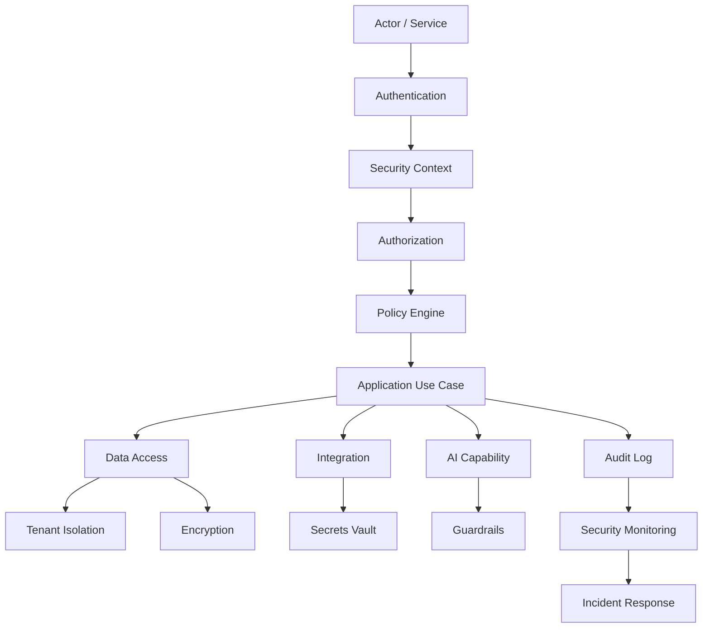

# Identity Access Management

> *"Defines identity lifecycle, user identity, service identity, roles, permissions, groups, and access review."*

---

# Purpose

Defines identity lifecycle, user identity, service identity, roles, permissions, groups, and access review.

---

# Motivation

Security bugs in production are expensive, damaging, and often caused by unclear ownership or inconsistent implementation.

Athena handles organizations, workspaces, users, customer data, integrations, AI workflows, secrets, audit logs, and operational systems. That means security must be built into every layer, not added later.

This chapter defines how **Identity Access Management** should be implemented safely and consistently.

---

# Architecture Decision

## Decision

Athena IAM should centralize identity and access decisions while allowing domain modules to declare resource-specific permissions.

## Status

Accepted.

## Reason

- Reduces security risk.
- Protects customer and tenant data.
- Makes access decisions explicit.
- Improves auditability and compliance readiness.
- Supports secure AI, integration, and data workflows.
- Helps AI coding assistants generate secure implementation.

## Trade-offs

| Benefit | Trade-off |
|---|---|
| Stronger production security | More controls to implement |
| Better auditability | More logging and evidence collection |
| Safer tenant isolation | More explicit data scoping |
| Better incident response | More operational process |
| Better AI-generated code | Requires stricter prompts and review |

---

# Reference Architecture



---

# Sequence Diagram

```mermaid
sequenceDiagram
    participant Actor
    participant Boundary
    participant Authn
    participant Authz
    participant App
    participant Data
    participant Audit
    participant Monitor

    Actor->>Boundary: Request action
    Boundary->>Authn: Verify identity/session
    Authn-->>Boundary: Security context
    Boundary->>App: Forward request with actor context
    App->>Authz: Check permission and tenant scope
    Authz-->>App: Allowed / denied
    App->>Data: Execute scoped operation
    Data-->>App: Result
    App->>Audit: Record sensitive action
    Audit->>Monitor: Emit security signal
    App-->>Boundary: Safe response
    Boundary-->>Actor: Response
```

---

# Recommended Folder Structure

```text
backend/
└── src/
    ├── security/
    │   ├── auth/
    │   ├── authz/
    │   ├── iam/
    │   ├── tenant/
    │   ├── crypto/
    │   ├── keys/
    │   ├── secrets/
    │   ├── validation/
    │   ├── audit/
    │   ├── threat-modeling/
    │   ├── vulnerability/
    │   ├── compliance/
    │   └── incident-response/
    │
    ├── platform/
    │   ├── observability/
    │   ├── database/
    │   └── infrastructure/
    │
    └── modules/
        └── <domain>/
            ├── application/
            ├── infrastructure/
            └── presentation/
```

---

# Code Skeleton

```ts
// security/iam/Permission.ts
export type Permission = {
  key: string;
  description: string;
  resourceType: string;
  action: "create" | "read" | "update" | "delete" | "execute" | "admin";
  riskLevel: "low" | "medium" | "high" | "critical";
};

export const customerReadPermission: Permission = {
  key: "customer:read",
  description: "Read customer profile and metadata",
  resourceType: "customer",
  action: "read",
  riskLevel: "medium",
};

```

---

# Implementation Guidelines

- Enforce authentication at system boundaries.
- Enforce authorization inside application use cases.
- Never trust frontend permission checks as final security.
- Preserve Organization and Workspace scope in every protected operation.
- Validate all external input.
- Treat AI output and external provider payloads as untrusted.
- Use secure storage for tokens, secrets, keys, and credentials.
- Redact secrets and sensitive data from logs.
- Create audit records for sensitive actions.
- Add security tests for permission-denied and tenant-isolation cases.
- Fail closed when security context is missing.

---

# Production Checklist

- [ ] Security owner is defined.
- [ ] Authentication path is documented.
- [ ] Authorization checks are server-side.
- [ ] Tenant isolation is tested.
- [ ] Secrets are stored in managed vault.
- [ ] Sensitive data is encrypted where required.
- [ ] Audit logs exist for sensitive actions.
- [ ] Security tests run in CI/CD.
- [ ] Vulnerability scanning exists.
- [ ] Incident runbook exists.
- [ ] Compliance evidence is collectable.

---

# Security Checklist

- [ ] No hard-coded credentials.
- [ ] No raw secrets in logs.
- [ ] No unscoped tenant queries.
- [ ] No protected action without authorization.
- [ ] No sensitive AI context without permission.
- [ ] No webhook without signature verification where applicable.
- [ ] No external payload trusted without validation.
- [ ] No debug mode in production.
- [ ] No overly broad service account permissions.
- [ ] No missing audit path for high-risk actions.

---

# Performance Checklist

- [ ] Authorization checks are efficient and cache-safe where appropriate.
- [ ] Security logs avoid excessive cardinality.
- [ ] Encryption use is appropriate for sensitivity level.
- [ ] Secret retrieval is cached only safely and briefly.
- [ ] Policy evaluation does not create N+1 database access.
- [ ] Security scans are optimized in CI/CD.
- [ ] Audit writes are reliable and do not block critical paths unnecessarily.

---

# Anti-patterns

Avoid:

- Authorization only in frontend.
- Admin bypasses without audit.
- Tenant ID accepted blindly from client.
- Direct object access without ownership checks.
- Storing secrets in `.env` committed to git.
- Logging JWTs, API keys, OAuth tokens, or passwords.
- Security exceptions without expiration.
- AI tool execution without authorization.
- Webhook handlers without signature verification.
- Compliance evidence assembled manually after the fact.

---

# Testing Strategy

Recommended tests:

- Authentication tests.
- Authorization allow/deny tests.
- Tenant isolation tests.
- Permission regression tests.
- Secret leak tests.
- Input validation tests.
- Audit log tests.
- Threat-model abuse-case tests.
- Security integration tests.
- Vulnerability scan gates.
- Incident response tabletop exercises.

---

# AI Coding Guidelines

When using Codex, Cursor, Claude Code, Gemini CLI, or another AI coding assistant:

- Require server-side authorization.
- Require tenant scope in all data access.
- Require input validation.
- Require audit logs for sensitive actions.
- Require tests for denied access.
- Require secrets to be referenced through secret providers.
- Ask the AI to fail closed when security context is missing.
- Reject generated code that stores secrets in source code.
- Reject generated code that logs sensitive values.
- Reject generated code that uses frontend checks as final authorization.
- Reject generated code that ignores Organization/Workspace boundaries.

---

# Related Documents

- ../PART-01-Backend-Architecture/README.md
- ../PART-03-AI-Architecture/README.md
- ../PART-04-Data-Architecture/README.md
- ../PART-05-Integration-Architecture/README.md
- ../PART-06-Infrastructure-Architecture/README.md
- ../../BOOK-02-Master-Blueprint/PART-07-Security-Platform/README.md

---

# Navigation

**Previous:** ./126-Security-Implementation-Overview.md

**Next:** ./128-Authentication-Implementation.md
