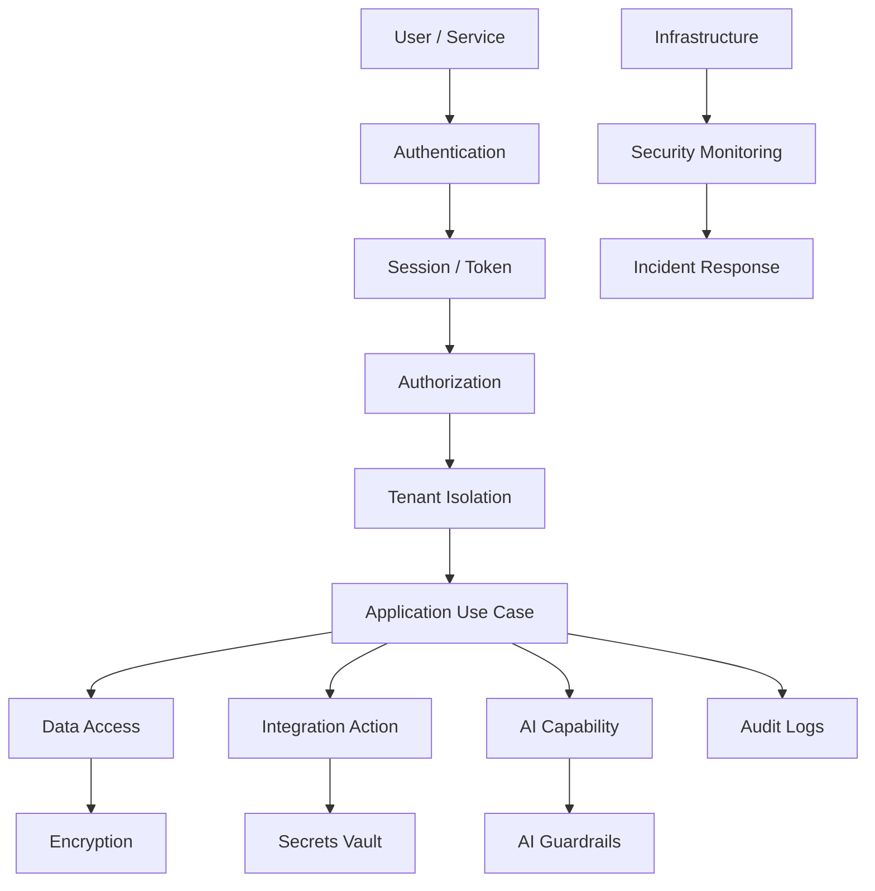

# PART-07 — Security Implementation

> *"Security implementation is not a checklist at the end; it is the control system that keeps Clara trustworthy in production."*

---

# Purpose

Part VII defines Clara's implementation architecture for production security.

It covers IAM, authentication, authorization, RBAC/ABAC, tenant isolation, zero trust, encryption, key management, secrets, input validation, secure coding, threat modeling, vulnerability management, security testing, audit logging, compliance evidence, and incident response.

---

# Goals

- Make security controls explicit and reusable.
- Protect tenant and workspace boundaries.
- Prevent unauthorized access to data and actions.
- Secure secrets, keys, credentials, and tokens.
- Standardize secure coding rules.
- Integrate security testing into CI/CD.
- Support auditability and compliance readiness.
- Prepare Clara for security incidents before they happen.

---

# Scope

## In Scope

- IAM.
- Authentication.
- Authorization.
- RBAC and ABAC.
- Tenant isolation.
- Zero trust implementation.
- Encryption in transit and at rest.
- Key management.
- Secrets security.
- Validation and sanitization.
- Secure coding standards.
- Threat modeling.
- Vulnerability management.
- Security testing.
- Audit logging.
- Compliance evidence.
- Security incident response.

## Out of Scope

- Final legal compliance certification.
- Final SOC 2 / ISO 27001 audit execution.
- Vendor-specific security console setup.
- Full penetration testing report.
- Final customer security questionnaire.

---

# Chapter Map

| Chapter | Title |
|---|---|
| 126 | Security Implementation Overview |
| 127 | Identity Access Management |
| 128 | Authentication Implementation |
| 129 | Authorization Implementation |
| 130 | RBAC ABAC |
| 131 | Tenant Isolation |
| 132 | Zero Trust Implementation |
| 133 | Encryption In Transit |
| 134 | Encryption At Rest |
| 135 | Key Management |
| 136 | Secrets Security |
| 137 | Input Validation Sanitization |
| 138 | Secure Coding Standards |
| 139 | Threat Modeling |
| 140 | Vulnerability Management |
| 141 | Security Testing |
| 142 | Audit Logging Security |
| 143 | Compliance Evidence |
| 144 | Security Incident Response |
| 145 | Security Implementation Summary |

---

# Security Architecture Map



---

# Critical Rule

Every sensitive Clara operation must answer:

```text
Who is acting?
What are they trying to do?
Which tenant/resource is affected?
Are they allowed?
What data is exposed?
Was the action audited?
```

---

# Related Documents

- ../PART-01-Backend-Architecture/README.md
- ../PART-03-AI-Architecture/README.md
- ../PART-04-Data-Architecture/README.md
- ../PART-05-Integration-Architecture/README.md
- ../PART-06-Infrastructure-Architecture/README.md
- ../../BOOK-02-Master-Blueprint/PART-07-Security-Platform/README.md

---

# Navigation

**Previous:** ../PART-06-Infrastructure-Architecture/125-Infrastructure-Summary.md

**Next:** 126-Security-Implementation-Overview.md
