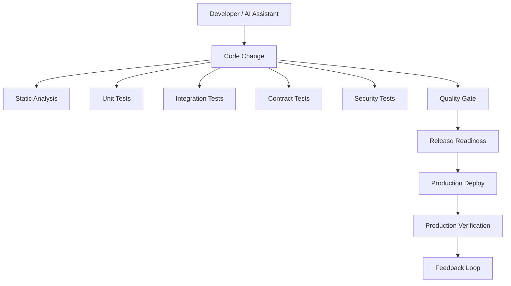
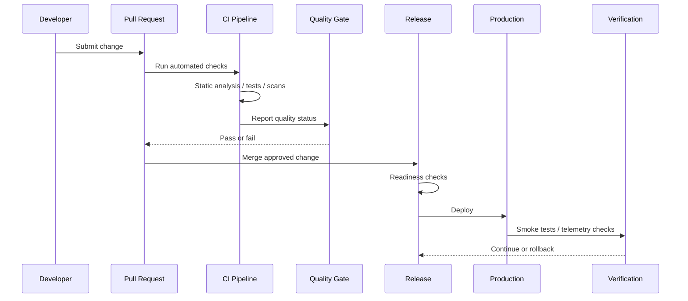

# Production Verification

> *"Defines post-deployment verification, smoke tests, canary checks, dashboards, alerts, rollback triggers, and production confidence signals."*

---

# Purpose

Defines post-deployment verification, smoke tests, canary checks, dashboards, alerts, rollback triggers, and production confidence signals.

---

# Motivation

Production quality cannot rely on manual confidence or optimistic assumptions.

Athena has complex backend systems, frontend workflows, data stores, integrations, AI capabilities, security controls, and infrastructure. A weak test strategy can allow regressions that break trust, leak data, create duplicate side effects, or ship unsafe AI behavior.

This chapter defines how **Production Verification** should be implemented consistently.

---

# Architecture Decision

## Decision

Athena deployments should be verified in production using smoke tests, telemetry, canary analysis, and rollback thresholds.

## Status

Accepted.

## Reason

- Improves production confidence.
- Reduces regression risk.
- Protects security-sensitive behavior.
- Makes release readiness measurable.
- Helps teams review AI-generated code safely.
- Improves long-term maintainability.

## Trade-offs

| Benefit | Trade-off |
|---|---|
| Higher release confidence | More test infrastructure |
| Fewer production regressions | More upfront engineering |
| Safer security behavior | More negative-path tests |
| Better AI-generated code review | More explicit standards |
| Faster debugging | More observability and fixtures |

---

# Reference Architecture



---

# Sequence Diagram



---

# Recommended Folder Structure

```text
repo/
├── apps/
│   ├── backend/
│   │   ├── src/
│   │   └── test/
│   │       ├── unit/
│   │       ├── integration/
│   │       ├── contract/
│   │       └── security/
│   │
│   └── frontend/
│       ├── lib/
│       └── test/
│           ├── unit/
│           ├── widget/
│           ├── golden/
│           └── e2e/
│
├── packages/
│   └── shared-test-utils/
│
├── test-data/
│   ├── fixtures/
│   ├── factories/
│   └── datasets/
│
├── quality/
│   ├── gates/
│   ├── reports/
│   ├── checklists/
│   └── release-readiness/
│
└── .github/
    └── workflows/
```

---

# Code Skeleton

```yaml
production_verification:
  smoke_tests:
    - health_readiness
    - login_flow
    - customer_list_api
    - background_job_enqueue

  rollback_triggers:
    - p95_latency_regression
    - error_rate_above_threshold
    - critical_alert_fired
    - failed_smoke_test
```

---

# Implementation Guidelines

- Prefer automated tests over manual confidence.
- Keep unit tests fast and deterministic.
- Use integration tests for real boundaries.
- Use contract tests for public and cross-service interfaces.
- Keep E2E tests focused on critical journeys.
- Include negative-path tests, not only happy paths.
- Test authorization and tenant isolation explicitly.
- Use synthetic test data by default.
- Do not depend on production customer data.
- Make quality gates block unsafe changes.
- Verify production after deployment.

---

# Production Checklist

- [ ] Critical paths have tests.
- [ ] Security-sensitive paths have negative tests.
- [ ] Tenant isolation is tested.
- [ ] CI quality gates exist.
- [ ] Release readiness checklist exists.
- [ ] Production smoke tests exist.
- [ ] Regression tests exist for past incidents.
- [ ] Test data is synthetic or anonymized.
- [ ] Test results are visible to reviewers.
- [ ] Failed quality gates block merge/release.

---

# Security Checklist

- [ ] Permission-denied scenarios are tested.
- [ ] Cross-tenant access is tested.
- [ ] Input validation abuse cases are tested.
- [ ] Secrets are scanned in CI.
- [ ] Dependency vulnerabilities are scanned.
- [ ] AI tool execution is tested for authorization.
- [ ] Webhook signatures are tested.
- [ ] Sensitive logs are tested for redaction.
- [ ] Test environments do not contain uncontrolled production data.
- [ ] Security exceptions require approval and expiration.

---

# Performance Checklist

- [ ] Performance tests focus on critical paths.
- [ ] Tests avoid unnecessary slowness in PR flow.
- [ ] Heavy tests run in scheduled or release pipelines.
- [ ] Test environments are sized realistically where needed.
- [ ] Performance regression thresholds are defined.
- [ ] Flaky tests are tracked and fixed.
- [ ] Test data setup is efficient.
- [ ] CI duration is monitored.

---

# Anti-patterns

Avoid:

- Testing only happy paths.
- Treating coverage percentage as quality.
- Huge E2E suites replacing unit/integration tests.
- Tests depending on execution order.
- Flaky tests ignored as normal.
- Production data copied into dev/test without controls.
- Security tests run only manually.
- AI outputs shipped without evaluation.
- Quality gates that can be bypassed silently.
- Release readiness based only on “looks good”.

---

# Testing Strategy

Recommended tests:

- Unit tests for pure logic.
- Integration tests for infrastructure boundaries.
- Contract tests for APIs and events.
- E2E tests for critical user journeys.
- Security tests for authz and tenant isolation.
- Performance regression tests.
- Reliability tests for retries and idempotency.
- AI evaluation tests for prompts, tools, and RAG.
- Data migration and rollback tests.
- Production smoke tests after deployment.

---

# AI Coding Guidelines

When using Codex, Cursor, Claude Code, Gemini CLI, or another AI coding assistant:

- Ask the AI to generate tests with implementation.
- Require negative-path tests.
- Require authorization and tenant isolation tests.
- Require mocks only where they do not hide important boundaries.
- Ask the AI to keep tests deterministic.
- Ask the AI to avoid brittle snapshots.
- Ask the AI to include test data factories.
- Reject generated code with no tests for critical behavior.
- Reject generated tests that only assert implementation details.
- Reject generated tests that use real secrets or production data.

---

# Related Documents

- ../PART-01-Backend-Architecture/README.md
- ../PART-02-Frontend-Architecture/README.md
- ../PART-03-AI-Architecture/README.md
- ../PART-04-Data-Architecture/README.md
- ../PART-07-Security-Implementation/README.md

---

# Navigation

**Previous:** ./163-Release-Readiness.md

**Next:** ./165-Testing-Quality-Summary.md
