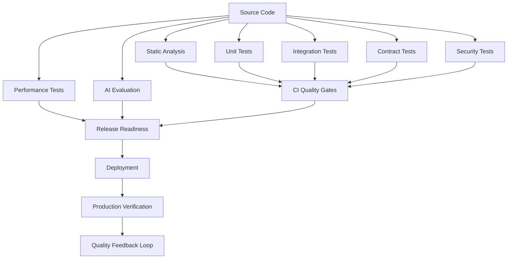

# PART-08 — Testing & Quality Architecture

> *"Quality is not confidence by feeling; quality is confidence by evidence."*

---

# Purpose

Part VIII defines Clara's implementation architecture for testing and quality.

It covers test strategy, unit tests, integration tests, contract tests, end-to-end tests, security testing, performance testing, reliability testing, AI evaluation, data testing, frontend testing, backend testing, test data management, CI quality gates, code review, static analysis, release readiness, and production verification.

---

# Goals

- Make product quality measurable.
- Prevent production regressions.
- Protect security and tenant isolation through automated tests.
- Keep AI behavior testable and release-gated.
- Reduce risk from database migrations and integration changes.
- Ensure CI/CD blocks unsafe changes.
- Standardize review quality across human and AI-generated code.
- Verify production after deployment.

---

# Scope

## In Scope

- Test strategy.
- Unit testing.
- Integration testing.
- Contract testing.
- End-to-end testing.
- Security testing.
- Performance testing.
- Reliability testing.
- AI evaluation testing.
- Data testing.
- Frontend testing.
- Backend testing.
- Test data management.
- CI quality gates.
- Code review quality.
- Static analysis.
- Release readiness.
- Production verification.

## Out of Scope

- Final vendor-specific testing tools.
- Complete test implementation for every module.
- Full QA team operating model.
- Manual regression script library.
- Full compliance audit execution.

---

# Chapter Map

| Chapter | Title |
|---|---|
| 146 | Testing Quality Overview |
| 147 | Test Strategy |
| 148 | Unit Testing |
| 149 | Integration Testing |
| 150 | Contract Testing |
| 151 | End to End Testing |
| 152 | Security Testing |
| 153 | Performance Testing |
| 154 | Reliability Testing |
| 155 | AI Evaluation Testing |
| 156 | Data Testing |
| 157 | Frontend Testing |
| 158 | Backend Testing |
| 159 | Test Data Management |
| 160 | CI Quality Gates |
| 161 | Code Review Quality |
| 162 | Static Analysis |
| 163 | Release Readiness |
| 164 | Production Verification |
| 165 | Testing Quality Summary |

---

# Testing Architecture Map



---

# Critical Rule

Clara quality must protect the highest-risk areas first:

```text
Authentication
Authorization
Tenant isolation
Data migrations
AI tool execution
External integrations
Billing-sensitive workflows
Security-sensitive actions
```

---

# Related Documents

- ../PART-01-Backend-Architecture/README.md
- ../PART-02-Frontend-Architecture/README.md
- ../PART-03-AI-Architecture/README.md
- ../PART-04-Data-Architecture/README.md
- ../PART-07-Security-Implementation/README.md

---

# Navigation

**Previous:** ../PART-07-Security-Implementation/145-Security-Implementation-Summary.md

**Next:** 146-Testing-Quality-Overview.md
