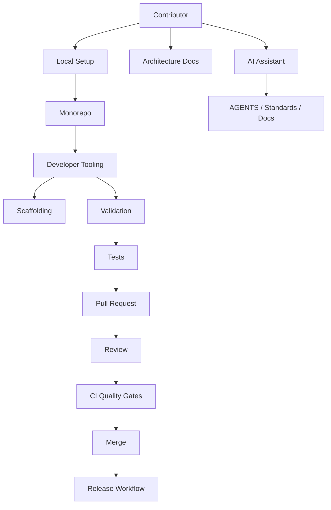
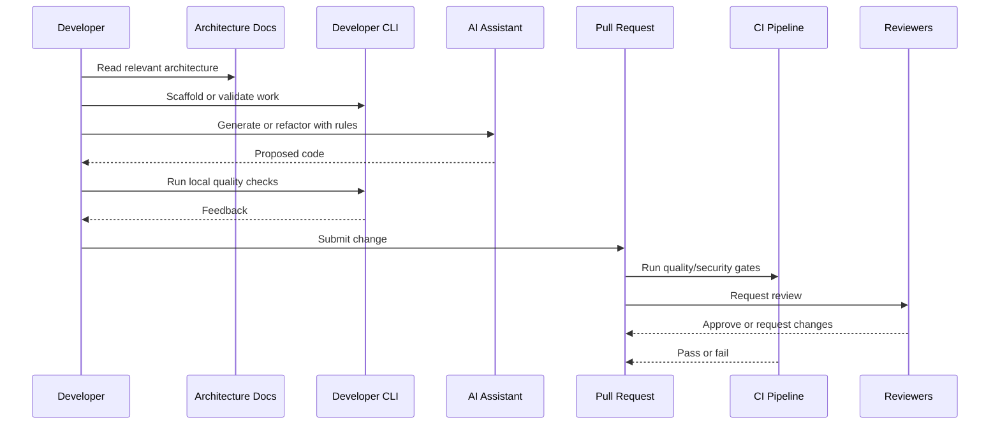

# Git Branching Workflow

> *"Defines branch naming, commit hygiene, trunk-based development, release branches, and hotfix rules."*

---

# Purpose

Defines branch naming, commit hygiene, trunk-based development, release branches, and hotfix rules.

---

# Motivation

Developer experience directly affects production quality.

If the right workflow is hard, developers and AI coding assistants will drift toward shortcuts: inconsistent structure, missing tests, unsafe secrets handling, weak authorization checks, poor documentation, and fragile releases.

Clara must design developer experience so secure and production-ready engineering becomes the default path.

This chapter defines how **Git Branching Workflow** should be implemented consistently.

---

# Architecture Decision

## Decision

Clara should use trunk-based development with short-lived feature branches and protected main branch quality gates.

## Status

Accepted.

## Reason

- Reduces developer friction.
- Improves onboarding speed.
- Makes architecture easier to follow.
- Helps human and AI contributors produce consistent code.
- Improves security and quality through automation.
- Reduces production risk from workflow mistakes.

## Trade-offs

| Benefit | Trade-off |
|---|---|
| Faster onboarding | More tooling to maintain |
| More consistent code | More conventions to learn |
| Safer AI-generated code | More prompt and review discipline |
| Better quality gates | Longer CI if unmanaged |
| Better documentation | Requires documentation ownership |

---

# Reference Architecture



---

# Sequence Diagram



---

# Recommended Folder Structure

```text
repo/
├── apps/
├── packages/
├── docs/
│   ├── BOOK-01-Clara-Foundation/
│   ├── BOOK-02-Master-Blueprint/
│   └── BOOK-03-Implementation-Architecture/
│
├── tooling/
│   ├── cli/
│   ├── generators/
│   ├── validators/
│   ├── mock-api/
│   └── quality/
│
├── scripts/
│   ├── setup/
│   ├── dev/
│   ├── test/
│   └── release/
│
├── .github/
│   ├── workflows/
│   └── pull_request_template.md
│
├── AGENTS.md
└── README.md
```

---

# Code Skeleton

```text
Branch naming:

feature/customer-import
fix/webhook-signature-validation
security/token-redaction
docs/book-iii-part-09
chore/dependency-upgrade

Protected branches:

main
release/*
hotfix/*
```

---

# Implementation Guidelines

- Automate repetitive development workflows.
- Keep local setup reproducible.
- Keep documentation close to implementation.
- Use templates for repeated architecture patterns.
- Make quality checks easy to run locally.
- Make CI gates match local developer checks.
- Use AI assistants with explicit project rules.
- Review AI-generated code as untrusted code.
- Keep secrets out of local and repository defaults.
- Prefer synthetic test data.
- Track developer friction and improve it.

---

# Production Checklist

- [ ] Workflow is documented.
- [ ] Local setup is reproducible.
- [ ] Quality checks can run locally.
- [ ] CI quality gates exist.
- [ ] Architecture docs are linked.
- [ ] AI assistant rules are documented.
- [ ] Code generation produces tests.
- [ ] Dependency policy exists.
- [ ] PR review checklist exists.
- [ ] Security-sensitive changes require review.

---

# Security Checklist

- [ ] No secrets are committed.
- [ ] Local development uses safe dummy credentials.
- [ ] AI prompts do not include real secrets.
- [ ] Generated code is reviewed for authorization and tenant isolation.
- [ ] Dependency additions are scanned.
- [ ] Mock APIs do not expose real customer data.
- [ ] Debugging workflows avoid sensitive production data.
- [ ] PR checklist includes security impact.
- [ ] DevSecOps gates block unsafe changes.

---

# Performance Checklist

- [ ] Local setup is fast enough for daily work.
- [ ] CI duration is monitored.
- [ ] Slow tests are separated from fast PR checks.
- [ ] Tooling caches dependencies safely.
- [ ] Code generation reduces repetitive work.
- [ ] Mock APIs reduce dependency on slow external systems.
- [ ] Developer metrics identify bottlenecks.
- [ ] Documentation is easy to find.

---

# Anti-patterns

Avoid:

- Manual setup steps that are not documented.
- CI checks that cannot be reproduced locally.
- AI-generated code accepted without review.
- Generated modules without tests.
- PRs too large to review safely.
- Documentation updated only after implementation drifts.
- Real production data in local development.
- Secrets in examples or screenshots.
- Dependency additions without review.
- Quality gates that can be bypassed silently.

---

# Testing Strategy

Recommended tests:

- CLI command tests.
- Generator output tests.
- Architecture validation tests.
- Documentation link checks.
- PR template validation.
- Dependency policy tests.
- Mock API contract tests.
- Local setup smoke tests.
- CI workflow validation.
- Security scan checks.

---

# AI Coding Guidelines

When using Codex, Cursor, Claude Code, Gemini CLI, or another AI coding assistant:

- Provide relevant Book III chapter context.
- Provide AGENTS.md and module-specific rules.
- Ask for tests with every implementation.
- Ask for architecture boundaries to be preserved.
- Ask for authorization and tenant isolation checks.
- Ask it to avoid secrets, real tokens, and production data.
- Reject generated code that bypasses quality gates.
- Reject generated code that invents architecture not documented.
- Reject generated code that only implements happy paths.
- Review all generated code like code from an unknown contributor.

---

# Related Documents

- ../PART-01-Backend-Architecture/README.md
- ../PART-02-Frontend-Architecture/README.md
- ../PART-07-Security-Implementation/README.md
- ../PART-08-Testing-Quality-Architecture/README.md
- ../../BOOK-01-Clara-Foundation/README.md
- ../../BOOK-02-Master-Blueprint/README.md

---

# Navigation

**Previous:** ./170-Coding-Standards-Implementation.md

**Next:** ./172-Pull-Request-Workflow.md
