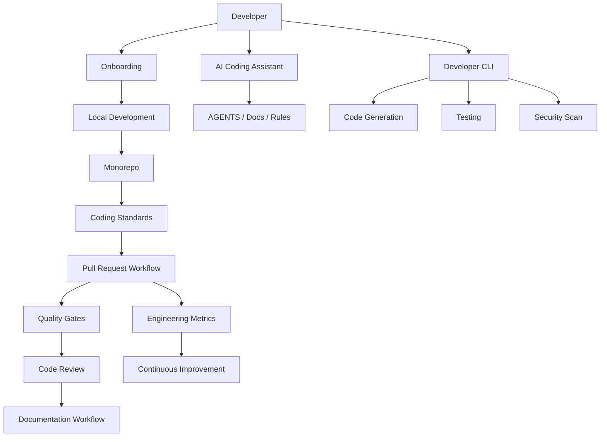

# PART-09 — Developer Experience Architecture

> *"Developer experience is architecture for the people and tools building the system."*

---

# Purpose

Part IX defines Clara's implementation architecture for developer experience.

It covers monorepo strategy, local development, onboarding, coding standards, Git workflow, pull requests, documentation workflow, AI coding assistants, code generation, dependency management, API mocking, debugging, CLI tooling, feature flags, ADRs, engineering metrics, DevSecOps, contribution governance, and DX summary.

---

# Goals

- Make Clara easy to develop locally.
- Keep engineering workflows secure and consistent.
- Reduce onboarding friction.
- Make architecture visible during development.
- Provide safe workflows for AI coding assistants.
- Standardize code generation and scaffolding.
- Automate quality, security, and release checks.
- Measure developer friction and improve continuously.

---

# Scope

## In Scope

- Monorepo strategy.
- Local development environment.
- Developer onboarding.
- Coding standards.
- Git branching workflow.
- Pull request workflow.
- Documentation workflow.
- AI coding assistant workflow.
- Code generation standards.
- Package dependency management.
- API mocking and sandbox.
- Debugging strategy.
- Developer tooling CLI.
- Feature flag workflow.
- Architecture decision workflow.
- Engineering metrics.
- DevSecOps workflow.
- Contribution governance.

## Out of Scope

- Final hiring/onboarding HR process.
- Vendor-specific DX platform choice.
- Full internal developer portal implementation.
- Final team structure.
- Complete automation scripts for every command.

---

# Chapter Map

| Chapter | Title |
|---|---|
| 166 | Developer Experience Overview |
| 167 | Monorepo Strategy |
| 168 | Local Development Environment |
| 169 | Developer Onboarding |
| 170 | Coding Standards Implementation |
| 171 | Git Branching Workflow |
| 172 | Pull Request Workflow |
| 173 | Documentation Workflow |
| 174 | AI Coding Assistant Workflow |
| 175 | Code Generation Standards |
| 176 | Package Dependency Management |
| 177 | API Mocking Sandbox |
| 178 | Debugging Strategy |
| 179 | Developer Tooling CLI |
| 180 | Feature Flag Workflow |
| 181 | Architecture Decision Workflow |
| 182 | Engineering Metrics |
| 183 | DevSecOps Workflow |
| 184 | Contribution Governance |
| 185 | Developer Experience Summary |

---

# Developer Experience Architecture Map



---

# Critical Rule

Clara developer experience must optimize for:

```text
Secure defaults
Fast feedback
Architecture consistency
AI-safe workflows
Production readiness
Low onboarding friction
```

---

# Related Documents

- ../PART-01-Backend-Architecture/README.md
- ../PART-02-Frontend-Architecture/README.md
- ../PART-07-Security-Implementation/README.md
- ../PART-08-Testing-Quality-Architecture/README.md
- ../../BOOK-01-Clara-Foundation/README.md
- ../../BOOK-02-Master-Blueprint/README.md

---

# Navigation

**Previous:** ../PART-08-Testing-Quality-Architecture/165-Testing-Quality-Summary.md

**Next:** 166-Developer-Experience-Overview.md
