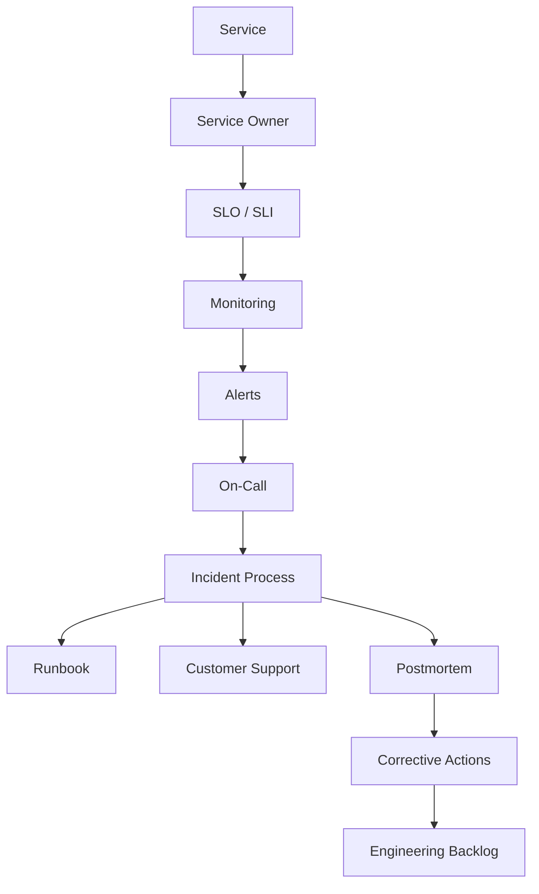
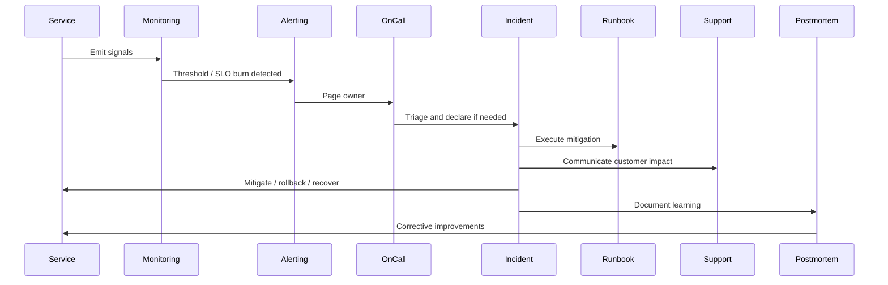

# Operational Monitoring

> *"Defines operational monitoring across services, infrastructure, data, integrations, AI, queues, and customer-facing workflows."*

---

# Purpose

Defines operational monitoring across services, infrastructure, data, integrations, AI, queues, and customer-facing workflows.

---

# Motivation

Production systems do not stay reliable by accident.

Clara needs clear service ownership, measured reliability, actionable alerts, incident response, production access controls, recovery drills, and continuous improvement. Without operations architecture, teams react late, alerts become noise, incidents repeat, and customer trust suffers.

This chapter defines how **Operational Monitoring** should be implemented consistently.

---

# Architecture Decision

## Decision

Clara operational monitoring should focus on customer impact, service health, reliability signals, security signals, and business-critical workflows.

## Status

Accepted.

## Reason

- Improves production reliability.
- Reduces customer impact from incidents.
- Makes operational ownership explicit.
- Improves response and recovery time.
- Reduces alert fatigue.
- Supports safer production changes.
- Helps engineering teams learn from failures.

## Trade-offs

| Benefit | Trade-off |
|---|---|
| Better reliability | More operational discipline |
| Faster incident response | Requires on-call process |
| Clearer ownership | Requires service catalog maintenance |
| Better customer trust | Requires communication process |
| Better continuous improvement | Requires postmortem follow-through |

---

# Reference Architecture



---

# Sequence Diagram



---

# Recommended Folder Structure

```text
ops/
├── service-catalog/
│   ├── services.yml
│   └── ownership.yml
│
├── slos/
│   ├── api.yml
│   ├── frontend.yml
│   ├── ai.yml
│   └── integration.yml
│
├── runbooks/
│   ├── api-high-error-rate.md
│   ├── queue-backlog.md
│   ├── database-restore.md
│   └── security-incident.md
│
├── incidents/
│   ├── templates/
│   └── postmortems/
│
├── release/
│   ├── readiness-checklist.md
│   └── rollback-guides/
│
├── support/
│   ├── escalation.md
│   └── customer-communication.md
│
└── drills/
    ├── disaster-recovery/
    └── incident-tabletop/
```

---

# Code Skeleton

```yaml
monitoring:
  service_health:
    - availability
    - error_rate
    - latency
    - saturation

  workflow_health:
    - customer_message_ingestion
    - ai_reply_generation
    - webhook_processing
    - background_job_completion

  infrastructure_health:
    - cpu
    - memory
    - disk
    - network
    - queue_depth
```

---

# Implementation Guidelines

- Every production service must have an owner.
- Every critical service should define SLOs.
- Alerts must be actionable and routed to the right owner.
- Every page should have a runbook.
- Incident severity must be based on customer impact.
- Production changes must be traceable.
- Production access must be restricted and audited.
- Backup and disaster recovery must be tested.
- Postmortems must produce corrective actions.
- Operational improvements should enter normal engineering backlog.

---

# Production Checklist

- [ ] Service owner is defined.
- [ ] Service tier is defined.
- [ ] SLO/SLI exists for critical service.
- [ ] Dashboard exists.
- [ ] Alerts are actionable.
- [ ] Runbook exists.
- [ ] Escalation path exists.
- [ ] Release rollback path exists.
- [ ] Production access is audited.
- [ ] Backup/restore process is tested where applicable.
- [ ] Postmortem process exists.

---

# Security Checklist

- [ ] Production access is least privilege.
- [ ] Break-glass access is audited.
- [ ] Sensitive incidents have evidence preservation.
- [ ] Customer-impacting security events have escalation path.
- [ ] Runbooks avoid exposing secrets.
- [ ] Logs used in incidents are access-controlled.
- [ ] Support workflows avoid leaking customer data.
- [ ] Maintenance operations require authorization.
- [ ] DR drills include credential/security validation.

---

# Performance Checklist

- [ ] Capacity trends are monitored.
- [ ] SLOs include latency where relevant.
- [ ] Queue depth and worker throughput are monitored.
- [ ] Cost/performance trade-offs are reviewed.
- [ ] High-cardinality metrics are controlled.
- [ ] Release verification checks latency regression.
- [ ] Scaling actions are documented.
- [ ] Performance incidents create regression tests.

---

# Anti-patterns

Avoid:

- Services without owners.
- Alerts without runbooks.
- Paging for non-actionable events.
- Incidents without timeline.
- Postmortems without corrective actions.
- Production access without expiration.
- Releases without rollback plan.
- Backup strategy without restore tests.
- Cost optimization that weakens security or reliability.
- Customer support escalation with unclear ownership.

---

# Testing Strategy

Recommended operational tests:

- Alert firing tests.
- Runbook simulation.
- Incident tabletop exercises.
- Disaster recovery drills.
- Backup restore tests.
- Production access review.
- Release rollback drills.
- Load and capacity review.
- Customer support escalation drill.
- Postmortem action tracking review.

---

# AI Coding Guidelines

When using Codex, Cursor, Claude Code, Gemini CLI, or another AI coding assistant:

- Ask the AI to include runbook updates for operationally sensitive changes.
- Ask the AI to include alerts and dashboards for new critical services.
- Ask the AI to include rollback notes for risky releases.
- Ask the AI to preserve production access restrictions.
- Ask the AI to avoid exposing secrets in runbooks.
- Ask the AI to include SLO impact when changing critical paths.
- Reject generated operational docs with no owner.
- Reject generated alert rules with no runbook.
- Reject generated release plans without rollback path.

---

# Related Documents

- ../PART-06-Infrastructure-Architecture/README.md
- ../PART-07-Security-Implementation/README.md
- ../PART-08-Testing-Quality-Architecture/README.md
- ../PART-09-Developer-Experience-Architecture/README.md
- ../../BOOK-02-Master-Blueprint/PART-09-Infrastructure/README.md

---

# Navigation

**Previous:** ./195-Production-Access-Operations.md

**Next:** ./197-Alert-Management.md
