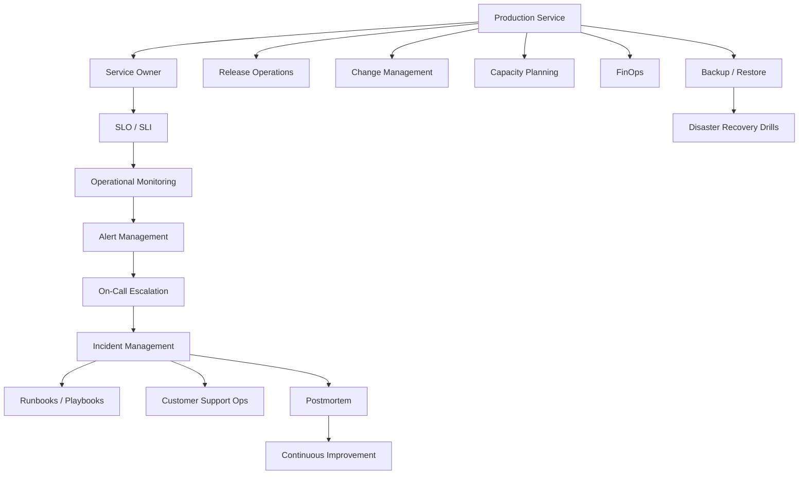

# PART-10 — Operations Architecture

> *"Operations architecture is how Clara stays reliable after the code is deployed."*

---

# Purpose

Part X defines Clara's implementation architecture for production operations.

It covers SRE model, service ownership, SLO/SLI, incident management, on-call escalation, runbooks, change management, release operations, production access, monitoring, alert management, capacity planning, cost management, backup restore operations, disaster recovery drills, customer support operations, maintenance windows, postmortems, and continuous improvement.

---

# Goals

- Make production ownership explicit.
- Align reliability with customer impact.
- Standardize incident response.
- Reduce alert noise and improve actionability.
- Control production access.
- Improve release safety.
- Practice recovery before real disasters.
- Track operational cost and capacity.
- Improve reliability continuously through postmortems.

---

# Scope

## In Scope

- SRE operating model.
- Service ownership.
- SLO, SLI, and error budgets.
- Incident management.
- On-call escalation.
- Runbooks and playbooks.
- Change management.
- Release operations.
- Production access operations.
- Operational monitoring.
- Alert management.
- Capacity planning.
- Cost management / FinOps.
- Backup restore operations.
- Disaster recovery drills.
- Customer support operations.
- Maintenance windows.
- Postmortem and continuous improvement.

## Out of Scope

- Final staffing schedule.
- Final external status page vendor.
- Final on-call vendor configuration.
- Legal customer communication templates.
- Full production support handbook.

---

# Chapter Map

| Chapter | Title |
|---|---|
| 186 | Operations Architecture Overview |
| 187 | SRE Operating Model |
| 188 | Service Ownership |
| 189 | SLO SLI Error Budget |
| 190 | Incident Management |
| 191 | On Call Escalation |
| 192 | Runbooks Playbooks |
| 193 | Change Management |
| 194 | Release Operations |
| 195 | Production Access Operations |
| 196 | Operational Monitoring |
| 197 | Alert Management |
| 198 | Capacity Planning |
| 199 | Cost Management FinOps |
| 200 | Backup Restore Operations |
| 201 | Disaster Recovery Drills |
| 202 | Customer Support Operations |
| 203 | Maintenance Windows |
| 204 | Postmortem Continuous Improvement |
| 205 | Operations Summary |

---

# Operations Architecture Map



---

# Critical Rule

Clara operations must be designed around customer trust:

```text
Reliability
Security
Recoverability
Transparency
Ownership
Continuous improvement
```

---

# Related Documents

- ../PART-06-Infrastructure-Architecture/README.md
- ../PART-07-Security-Implementation/README.md
- ../PART-08-Testing-Quality-Architecture/README.md
- ../PART-09-Developer-Experience-Architecture/README.md
- ../../BOOK-02-Master-Blueprint/PART-09-Infrastructure/README.md
- ../../BOOK-02-Master-Blueprint/PART-10-Roadmap/README.md

---

# Navigation

**Previous:** ../PART-09-Developer-Experience-Architecture/185-Developer-Experience-Summary.md

**Next:** 186-Operations-Architecture-Overview.md
