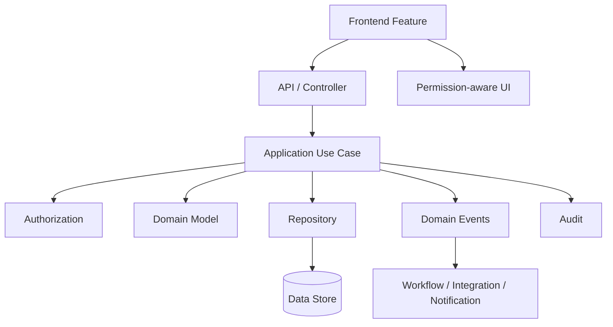
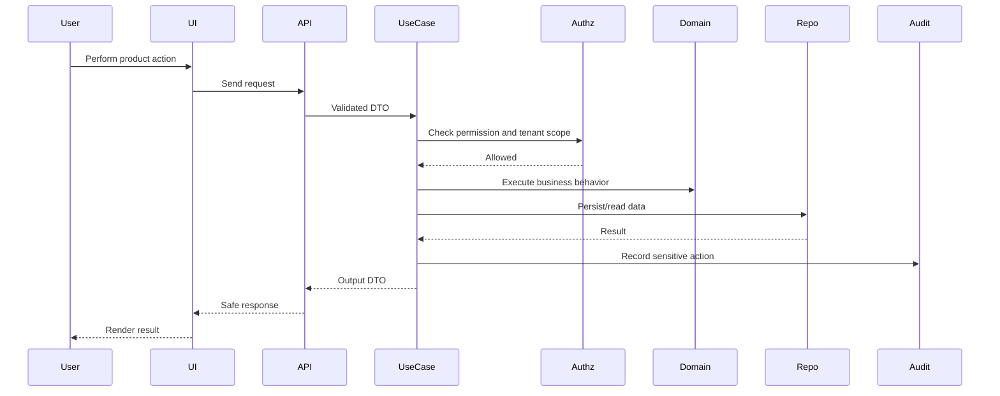

# Product Implementation Overview

> *"Defines Clara product implementation architecture, module boundaries, product capability ownership, and production implementation expectations."*

---

# Purpose

Defines Clara product implementation architecture, module boundaries, product capability ownership, and production implementation expectations.

---

# Motivation

Product modules are where users experience Clara.

If product modules are implemented inconsistently, Clara will become difficult to maintain, insecure, hard to test, and confusing to extend. Product implementation must preserve architecture boundaries while still delivering usable product capabilities.

This chapter defines how **Product Implementation Overview** should be implemented consistently.

---

# Architecture Decision

## Decision

Clara product capabilities should be implemented as modular domains with explicit ownership, APIs, data boundaries, permissions, events, and operational readiness.

## Status

Accepted.

## Reason

- Makes product modules easier to build and maintain.
- Preserves tenant isolation and permission boundaries.
- Keeps data ownership explicit.
- Supports secure AI and integration usage.
- Makes product behavior testable.
- Helps AI coding assistants generate module-consistent code.

## Trade-offs

| Benefit | Trade-off |
|---|---|
| More consistent product modules | More upfront documentation |
| Better security and tenant isolation | More explicit permission design |
| Easier testing and refactoring | More module structure |
| Better AI-generated implementation | Requires strict architecture references |
| Better operational ownership | Requires runbook discipline |

---

# Reference Architecture



---

# Sequence Diagram



---

# Recommended Folder Structure

```text
modules/
└── <product-module>/
    ├── README.md
    ├── domain/
    │   ├── entities/
    │   ├── value-objects/
    │   ├── services/
    │   └── events/
    │
    ├── application/
    │   ├── use-cases/
    │   ├── commands/
    │   ├── queries/
    │   ├── dto/
    │   └── ports/
    │
    ├── infrastructure/
    │   ├── persistence/
    │   ├── mappers/
    │   ├── projections/
    │   └── integrations/
    │
    ├── presentation/
    │   ├── controllers/
    │   ├── routes/
    │   └── presenters/
    │
    ├── frontend/
    │   ├── pages/
    │   ├── components/
    │   ├── controllers/
    │   └── repositories/
    │
    └── tests/
        ├── unit/
        ├── integration/
        ├── contract/
        └── security/
```

---

# Code Skeleton

```text
Product implementation rule of thumb:

Every product module needs:
- Clear user problem
- Clear domain boundary
- Clear permissions
- Clear data ownership
- Clear API contract
- Clear UI entry point
- Clear events
- Clear audit rules
- Clear tests
- Clear operational ownership
```

---

# Implementation Guidelines

- Keep product module boundaries explicit.
- Keep business rules in domain/application layers.
- Keep controllers and UI thin.
- Declare permissions before implementing protected actions.
- Enforce tenant scope server-side.
- Keep product APIs versioned and documented.
- Emit domain events for important business changes.
- Audit sensitive product actions.
- Keep AI calls behind AI Gateway.
- Keep integration calls behind connector adapters.
- Include tests for success, failure, authorization, and tenant isolation.

---

# Production Checklist

- [ ] Module purpose is documented.
- [ ] Domain owner is defined.
- [ ] Data owner is defined.
- [ ] Permissions are defined.
- [ ] API contract is defined.
- [ ] UI entry point is defined.
- [ ] Domain events are defined where needed.
- [ ] Audit rules are defined.
- [ ] Tests are included.
- [ ] Operational owner is defined.
- [ ] Runbook exists for critical modules.

---

# Security Checklist

- [ ] Authentication is required for protected module access.
- [ ] Authorization is enforced server-side.
- [ ] Organization and Workspace scope are enforced.
- [ ] Frontend permission checks are usability-only.
- [ ] Sensitive actions are audited.
- [ ] Data exposure is minimized.
- [ ] External provider payloads are validated.
- [ ] AI output is treated as untrusted.
- [ ] Secrets are not stored in module code.
- [ ] Cross-module access goes through approved interfaces.

---

# Performance Checklist

- [ ] List endpoints are paginated.
- [ ] Common queries are indexed.
- [ ] Avoid N+1 data access.
- [ ] Expensive work runs asynchronously.
- [ ] Cache is used only with clear invalidation.
- [ ] Product dashboards use read models.
- [ ] Large exports run as background jobs.
- [ ] Module-level metrics exist for critical flows.

---

# Anti-patterns

Avoid:

- Product logic in frontend widgets.
- Product logic directly in controllers.
- Direct database queries from UI-facing handlers.
- Missing permission design.
- Hidden cross-module coupling.
- Tenant scope accepted blindly from client.
- AI provider calls directly from product modules.
- External provider SDK calls directly from product modules.
- Audit logs added only after incidents.
- Tests that cover only happy paths.

---

# Testing Strategy

Recommended tests:

- Domain unit tests.
- Use case tests.
- Authorization failure tests.
- Tenant isolation tests.
- API contract tests.
- Frontend state/widget tests.
- Repository integration tests.
- Event publishing tests.
- Audit logging tests.
- E2E tests for critical product flows.

---

# AI Coding Guidelines

When using Codex, Cursor, Claude Code, Gemini CLI, or another AI coding assistant:

- Give the AI this chapter and the relevant backend/frontend/security chapters.
- Ask it to follow the product module folder structure.
- Ask it to define permissions before implementing actions.
- Ask it to include authorization and tenant scope checks.
- Ask it to include tests for denied access.
- Ask it to avoid direct AI provider or external provider calls.
- Ask it to update README/module documentation.
- Reject generated product code that bypasses module boundaries.
- Reject generated product code without security checks.
- Reject generated product code without tests for critical flows.

---

# Related Documents

- ../PART-01-Backend-Architecture/README.md
- ../PART-02-Frontend-Architecture/README.md
- ../PART-03-AI-Architecture/README.md
- ../PART-04-Data-Architecture/README.md
- ../PART-05-Integration-Architecture/README.md
- ../PART-07-Security-Implementation/README.md
- ../PART-10-Operations-Architecture/README.md
- ../../BOOK-02-Master-Blueprint/PART-03-Business-Domains/README.md

---

# Navigation

**Previous:** ./README.md

**Next:** ./207-Organization-Module.md
