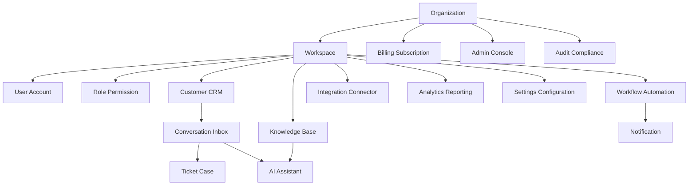

# PART-11 — Product Implementation Architecture

> *"Product implementation is where architecture becomes user-visible capability."*

---

# Purpose

Part XI defines Clara's implementation architecture for product modules.

It maps platform architecture into concrete product capabilities such as Organization, Workspace, User Account, Role/Permission, Customer CRM, Conversation Inbox, Ticketing, Knowledge Base, Workflow Automation, Notification, AI Assistant, Integration Connector, Billing, Admin Console, Analytics, Audit Compliance, Settings, and product module templates.

---

# Goals

- Standardize implementation of Clara product modules.
- Keep product capabilities modular and domain-owned.
- Preserve Organization and Workspace tenant boundaries.
- Make product permissions explicit.
- Keep AI and integrations behind approved platform boundaries.
- Ensure each product module has data ownership, APIs, UI flows, tests, audit, and operational ownership.
- Provide AI coding assistants with repeatable module implementation rules.

---

# Scope

## In Scope

- Product module architecture.
- Organization and Workspace implementation.
- User account and access modules.
- CRM and conversation modules.
- Ticketing and knowledge modules.
- Workflow and notification modules.
- AI Assistant product experience.
- Integration connector management.
- Billing and entitlement.
- Admin console.
- Analytics and reporting.
- Audit and compliance.
- Settings and configuration.
- Product module template.

## Out of Scope

- Final UI visual design.
- Final pricing strategy.
- Final third-party provider contracts.
- Final legal compliance certification.
- Complete product roadmap prioritization.

---

# Chapter Map

| Chapter | Title |
|---|---|
| 206 | Product Implementation Overview |
| 207 | Organization Module |
| 208 | Workspace Module |
| 209 | User Account Module |
| 210 | Role Permission Module |
| 211 | Customer CRM Module |
| 212 | Conversation Inbox Module |
| 213 | Ticket Case Module |
| 214 | Knowledge Base Module |
| 215 | Workflow Automation Module |
| 216 | Notification Module |
| 217 | AI Assistant Product Module |
| 218 | Integration Connector Module |
| 219 | Billing Subscription Module |
| 220 | Admin Console Module |
| 221 | Analytics Reporting Module |
| 222 | Audit Compliance Module |
| 223 | Settings Configuration Module |
| 224 | Product Module Template |
| 225 | Product Implementation Summary |

---

# Product Architecture Map



---

# Critical Rule

Every Clara product module must declare:

```text
Domain owner
Data owner
Permissions
API contract
Events
Audit rules
Security boundaries
Testing strategy
Operational owner
```

---

# Related Documents

- ../PART-01-Backend-Architecture/README.md
- ../PART-02-Frontend-Architecture/README.md
- ../PART-03-AI-Architecture/README.md
- ../PART-04-Data-Architecture/README.md
- ../PART-05-Integration-Architecture/README.md
- ../PART-07-Security-Implementation/README.md
- ../PART-10-Operations-Architecture/README.md
- ../../BOOK-02-Master-Blueprint/PART-03-Business-Domains/README.md

---

# Navigation

**Previous:** ../PART-10-Operations-Architecture/205-Operations-Summary.md

**Next:** 206-Product-Implementation-Overview.md
