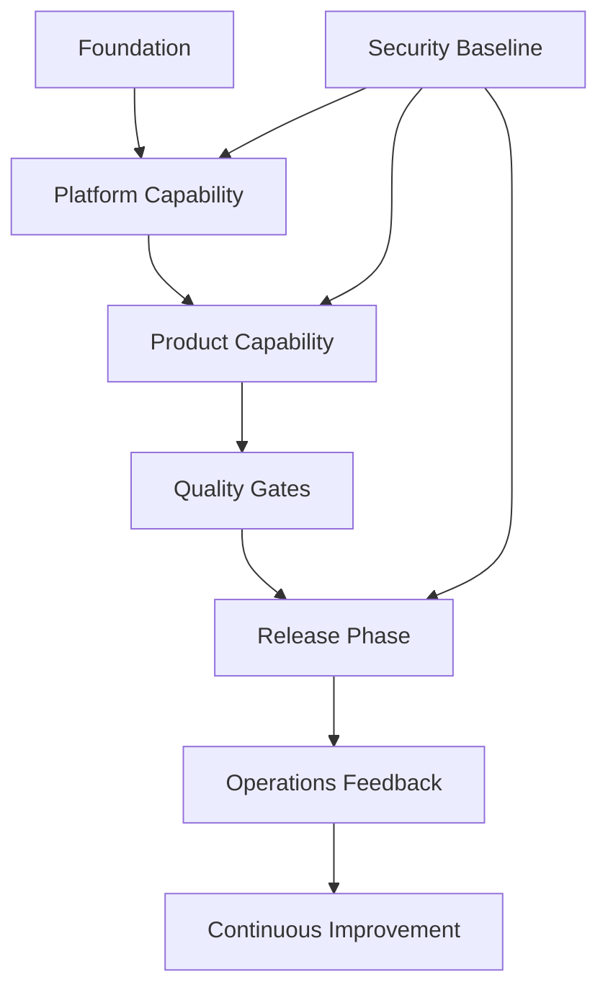
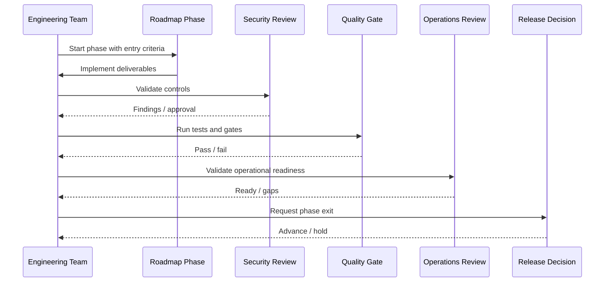

# Phase 7 Core Product MVP

> *"Defines MVP module implementation sequence for Organization, Workspace, User, Role, Customer CRM, Conversation Inbox, Knowledge Base, and AI Reply Drafting."*

---

# Purpose

Defines MVP module implementation sequence for Organization, Workspace, User, Role, Customer CRM, Conversation Inbox, Knowledge Base, and AI Reply Drafting.

---

# Motivation

A strong architecture still fails if implementation happens in the wrong order.

Clara has backend, frontend, data, security, AI, integration, infrastructure, testing, operations, and product modules. If teams build product capabilities before foundations are ready, technical debt becomes structural debt.

This chapter defines how **Phase 7 Core Product MVP** should guide implementation safely and consistently.

---

# Architecture Decision

## Decision

Clara MVP should focus on a thin but production-grade vertical slice instead of a wide but fragile feature set.

## Status

Accepted.

## Reason

- Reduces delivery risk.
- Keeps architecture implementation aligned.
- Makes security and quality gates explicit.
- Prevents premature scaling.
- Supports controlled release maturity.
- Helps human and AI contributors understand implementation priority.

## Trade-offs

| Benefit | Trade-off |
|---|---|
| Safer execution | Less feature rush |
| Clearer priorities | Requires phase discipline |
| Better production readiness | More upfront planning |
| Stronger quality gates | Some work waits for foundation |
| Better team alignment | Requires roadmap governance |

---

# Reference Architecture



---

# Sequence Diagram



---

# Recommended Folder Structure

```text
docs/
└── BOOK-03-Implementation-Architecture/
    └── PART-12-Implementation-Roadmap/
        ├── README.md
        ├── 226-Implementation-Roadmap-Overview.md
        ├── ...
        └── 245-Implementation-Roadmap-Summary.md

roadmap/
├── phases/
│   ├── phase-00-repository-foundation.md
│   ├── phase-01-backend-foundation.md
│   └── phase-12-production-readiness.md
│
├── checklists/
│   ├── security-gates.md
│   ├── quality-gates.md
│   └── production-readiness.md
│
├── risks/
│   └── implementation-risk-register.md
│
└── status/
    └── roadmap-progress.md
```

---

# Code Skeleton

```yaml
mvp_modules:
  priority_order:
    - organization
    - workspace
    - user_account
    - role_permission
    - customer_crm
    - conversation_inbox
    - knowledge_base
    - ai_reply_drafting
    - audit_viewer
    - basic_settings
```

---

# Implementation Guidelines

- Define entry criteria before starting each phase.
- Define deliverables clearly.
- Define exit criteria objectively.
- Include security checks in every phase.
- Include quality gates before release phases.
- Avoid building feature breadth before foundation depth.
- Keep MVP as a production-grade vertical slice.
- Use feature flags for controlled rollout.
- Track risks explicitly.
- Update roadmap based on incidents, metrics, and customer feedback.

---

# Production Checklist

- [ ] Phase owner is defined.
- [ ] Entry criteria are defined.
- [ ] Deliverables are defined.
- [ ] Exit criteria are defined.
- [ ] Security gate is defined.
- [ ] Quality gate is defined.
- [ ] Operational readiness is defined.
- [ ] Rollback or recovery plan exists where needed.
- [ ] Risks are documented.
- [ ] Documentation is updated.

---

# Security Checklist

- [ ] Security baseline is not skipped.
- [ ] Tenant isolation is tested before product data usage.
- [ ] Secrets management is in place before integrations.
- [ ] AI Gateway and guardrails exist before AI features.
- [ ] OAuth/token vault exists before external connectors.
- [ ] Audit logging exists before sensitive actions.
- [ ] Production access controls exist before production readiness.
- [ ] Security review is required for high-risk phases.

---

# Performance Checklist

- [ ] Performance baseline exists before scaling.
- [ ] Critical API latency is measured.
- [ ] Queue processing is measured.
- [ ] AI latency and cost are measured.
- [ ] Database query performance is reviewed.
- [ ] Scaling decisions use production evidence.
- [ ] Cost impact is considered in later phases.

---

# Anti-patterns

Avoid:

- Building broad features before foundations.
- Treating MVP as throwaway code.
- Skipping security baseline for speed.
- Direct AI provider calls before AI Gateway.
- Direct integrations before connector foundation.
- Production launch without restore test.
- Alpha/Beta without feedback process.
- Enterprise promises before enterprise controls.
- Scaling optimization before measured bottlenecks.
- Roadmap progress without exit criteria.

---

# Testing Strategy

Recommended tests and checks:

- Phase exit checklist review.
- Security gate review.
- Quality gate review.
- Architecture conformance review.
- Migration dry run.
- Production readiness test.
- DR drill.
- AI evaluation test.
- Integration contract test.
- Incident tabletop exercise.

---

# AI Coding Guidelines

When using Codex, Cursor, Claude Code, Gemini CLI, or another AI coding assistant:

- Tell the AI which roadmap phase is active.
- Give it the relevant Book III Part documents.
- Ask it to implement only deliverables allowed in the current phase.
- Ask it to include tests and security checks.
- Ask it to avoid adding premature features.
- Ask it to update docs and checklists.
- Reject generated work that skips phase exit criteria.
- Reject generated work that bypasses security foundation.
- Reject generated work that creates hidden dependencies on future phases.

---

# Related Documents

- ../PART-01-Backend-Architecture/README.md
- ../PART-02-Frontend-Architecture/README.md
- ../PART-03-AI-Architecture/README.md
- ../PART-04-Data-Architecture/README.md
- ../PART-05-Integration-Architecture/README.md
- ../PART-06-Infrastructure-Architecture/README.md
- ../PART-07-Security-Implementation/README.md
- ../PART-08-Testing-Quality-Architecture/README.md
- ../PART-09-Developer-Experience-Architecture/README.md
- ../PART-10-Operations-Architecture/README.md
- ../PART-11-Product-Implementation-Architecture/README.md
- ../../BOOK-02-Master-Blueprint/PART-10-Roadmap/README.md

---

# Navigation

**Previous:** ./233-Phase-6-Integration-Platform-Foundation.md

**Next:** ./235-Phase-8-Observability-Operations-Baseline.md
