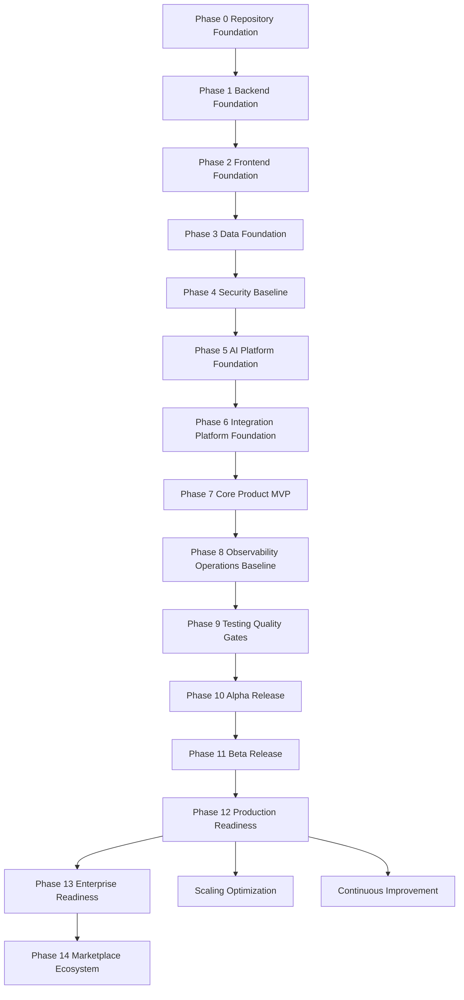

# PART-12 — Implementation Roadmap

> *"A roadmap is not just a schedule; it is a risk-reduction strategy."*

---

# Purpose

Part XII defines Athena's implementation roadmap.

It translates Book III architecture into an executable phased delivery plan, from repository foundation to backend, frontend, data, security, AI, integration, MVP, operations, testing, alpha, beta, production readiness, enterprise readiness, marketplace ecosystem, migration, scaling, governance, and continuous improvement.

---

# Goals

- Define safe implementation sequence.
- Prevent building product features on weak foundation.
- Make security, data, and quality gates explicit.
- Establish Alpha, Beta, and Production readiness criteria.
- Make enterprise and marketplace readiness deliberate.
- Provide AI coding assistants and engineering teams with phase-specific guidance.
- Keep implementation aligned with Book I, Book II, and Book III.

---

# Scope

## In Scope

- Foundation phases.
- Backend and frontend implementation order.
- Data and security baselines.
- AI and integration platform foundations.
- MVP vertical slice.
- Observability and operations baseline.
- Testing and quality gates.
- Alpha and Beta release readiness.
- Production readiness.
- Enterprise readiness.
- Marketplace ecosystem readiness.
- Migration strategy.
- Scaling optimization.
- Governance and continuous improvement.

## Out of Scope

- Exact calendar dates.
- Final staffing plan.
- Final commercial launch plan.
- Final sales strategy.
- Final cloud cost forecast.

---

# Chapter Map

| Chapter | Title |
|---|---|
| 226 | Implementation Roadmap Overview |
| 227 | Phase 0 Repository Foundation |
| 228 | Phase 1 Backend Foundation |
| 229 | Phase 2 Frontend Foundation |
| 230 | Phase 3 Data Foundation |
| 231 | Phase 4 Security Baseline |
| 232 | Phase 5 AI Platform Foundation |
| 233 | Phase 6 Integration Platform Foundation |
| 234 | Phase 7 Core Product MVP |
| 235 | Phase 8 Observability Operations Baseline |
| 236 | Phase 9 Testing Quality Gates |
| 237 | Phase 10 Alpha Release |
| 238 | Phase 11 Beta Release |
| 239 | Phase 12 Production Readiness |
| 240 | Phase 13 Enterprise Readiness |
| 241 | Phase 14 Marketplace Ecosystem |
| 242 | Migration Legacy Strategy |
| 243 | Scaling Optimization Phase |
| 244 | Governance Continuous Improvement |
| 245 | Implementation Roadmap Summary |

---

# Roadmap Architecture Map



---

# Critical Rule

Athena implementation should not advance phases by vibes.

Each phase must have:

```text
Entry criteria
Deliverables
Security checks
Quality checks
Exit criteria
Owner
Risk review
```

---

# Related Documents

- ../PART-01-Backend-Architecture/README.md
- ../PART-02-Frontend-Architecture/README.md
- ../PART-03-AI-Architecture/README.md
- ../PART-04-Data-Architecture/README.md
- ../PART-05-Integration-Architecture/README.md
- ../PART-06-Infrastructure-Architecture/README.md
- ../PART-07-Security-Implementation/README.md
- ../PART-08-Testing-Quality-Architecture/README.md
- ../PART-09-Developer-Experience-Architecture/README.md
- ../PART-10-Operations-Architecture/README.md
- ../PART-11-Product-Implementation-Architecture/README.md
- ../../BOOK-02-Master-Blueprint/PART-10-Roadmap/README.md

---

# Navigation

**Previous:** ../PART-11-Product-Implementation-Architecture/225-Product-Implementation-Summary.md

**Next:** 226-Implementation-Roadmap-Overview.md
