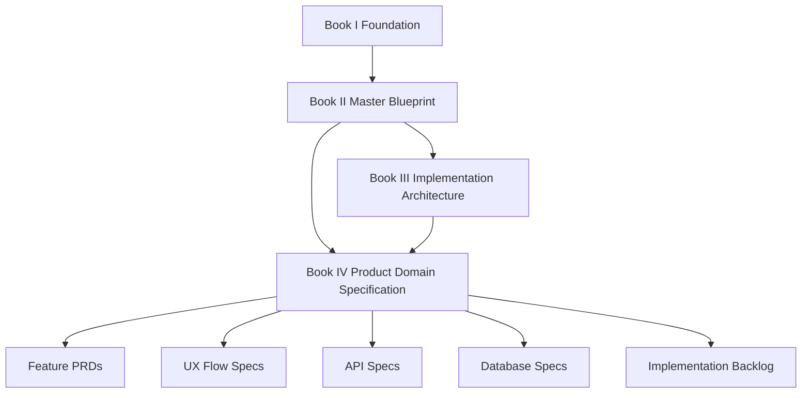

# BOOK IV — Chapter Map

> *"The chapter map keeps product specification navigable as Clara grows."*

---

# Current Released Chapters

| Chapter | Title | Part |
|---:|---|---|
| 01 | Book IV Overview | PART-01 |
| 02 | Clara Product Definition | PART-01 |
| 03 | Product Scope | PART-01 |
| 04 | Target Users | PART-01 |
| 05 | Core Use Cases | PART-01 |
| 06 | Product Principles | PART-01 |
| 07 | MVP Scope | PART-01 |
| 08 | Non Goals | PART-01 |
| 09 | Product Risks | PART-01 |
| 10 | Part 01 Summary | PART-01 |

---

# Planned Chapter Ranges

| Range | Part | Area |
|---:|---|---|
| 01–10 | PART-01 | Product Vision and Scope |
| 11–25 | PART-02 | User Roles and Permissions |
| 26–40 | PART-03 | Organization and Workspace |
| 41–60 | PART-04 | Customer CRM |
| 61–80 | PART-05 | Conversations and Inbox |
| 81–100 | PART-06 | Ticketing and Case Management |
| 101–120 | PART-07 | Knowledge Base |
| 121–140 | PART-08 | AI Assistant Product |
| 141–160 | PART-09 | Workflow Automation |
| 161–180 | PART-10 | Integrations and Channels |
| 181–200 | PART-11 | Billing and Admin |
| 201–220 | PART-12 | Analytics Audit and Settings |

---

# Dependency Map

---

# Navigation

**Back:** `./README.md`
