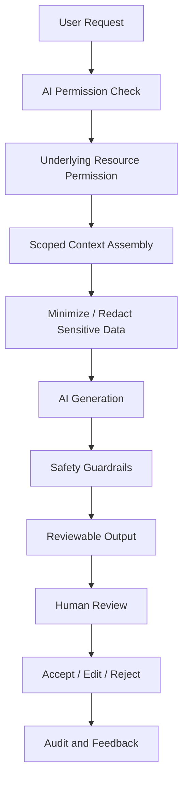

# BOOK IV — AI Governance Map

> *"CLARA AI assists. Humans govern."*

---

# AI Governance Principle

CLARA AI must be:

```text
Permission-aware
Context-scoped
Knowledge-grounded where possible
Human-reviewable
Auditable
Safe by default
Non-autonomous for high-risk MVP actions
```

---

# AI Product Features

| Feature | MVP Status | Human Review | Audit Required |
|---|---|---:|---:|
| AI reply draft | Included | Yes | Yes |
| Conversation summary | Optional | Recommended | Yes |
| Ticket summary | Optional | Recommended | Yes |
| Customer insight | Optional/deferred | Yes | Yes |
| Knowledge grounding | Included if AI enabled | N/A | Retrieval/audit metadata recommended |
| AI chat | Deferred or contextual only | Depends | Yes |
| AI tool actions | Deferred | Yes | Yes |
| AI workflow generation | Deferred | Yes | Yes |
| Auto-send reply | Not allowed in MVP | Required before future enablement | Yes |
| Autonomous destructive action | Not allowed | Required | Yes |

---

# AI Context Boundaries

AI may use context only when all are true:

- Actor has AI feature permission.
- Actor has underlying resource permission.
- Resource belongs to allowed Organization/Workspace.
- Knowledge article is eligible for AI grounding.
- Context does not include unnecessary secrets or sensitive data.
- Request is logged or traceable according to risk.

---

# AI Safety Flow



---

# AI Non-Negotiables

In MVP, CLARA AI must not:

- Auto-send customer replies.
- Access cross-workspace data without permission.
- Use unpublished/draft knowledge as trusted grounding by default.
- Reveal hidden system prompts or secrets.
- Execute destructive tool actions.
- Create active workflows without human approval.
- Become a shortcut around RBAC.

---

# AI Readiness Checklist

- [ ] AI feature has product purpose.
- [ ] AI feature has explicit permissions.
- [ ] Context sources are listed.
- [ ] Context scope is enforced.
- [ ] Human review requirement is defined.
- [ ] Output labeling is defined.
- [ ] Audit event is defined.
- [ ] Failure fallback is defined.
- [ ] Evaluation/feedback path exists.
- [ ] Security review completed.

---

# Navigation

**Previous:** `BOOK-04-PERMISSION-MAP.md`

**Next:** `BOOK-04-IMPLEMENTATION-READINESS-GUIDE.md`
