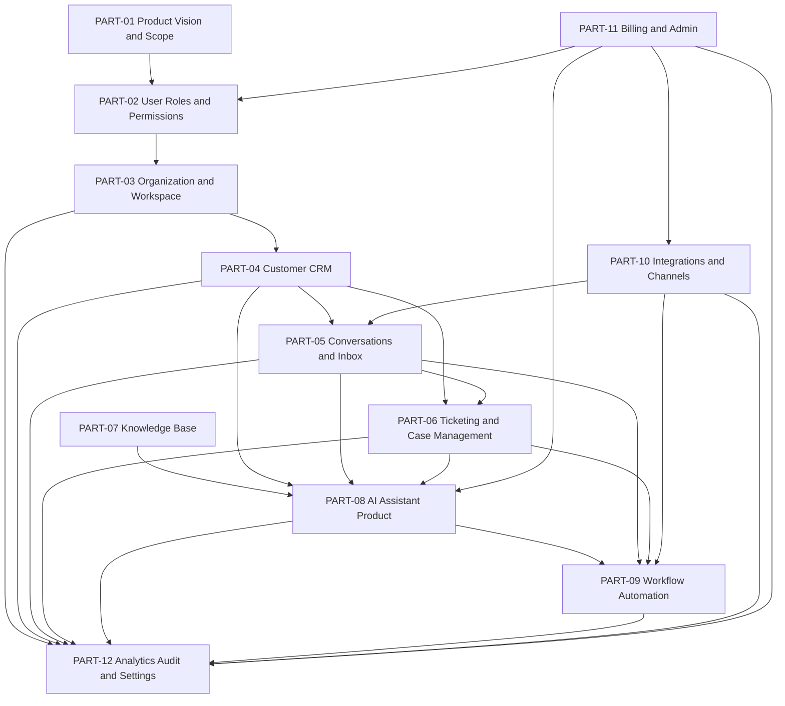

# BOOK IV — Domain Dependency Map

> *"Product domains should be implemented in dependency order, not excitement order."*

---

# Primary Dependency Graph



---

# Dependency Explanation

## Foundational Domains

These must be defined first:

```text
Product Vision and Scope
User Roles and Permissions
Organization and Workspace
```

Reason:

- Every product object needs ownership.
- Every action needs permissions.
- Every record needs tenant/workspace scope.

## Operational Domains

These make CLARA useful daily:

```text
Customer CRM
Conversations and Inbox
Ticketing and Case Management
Knowledge Base
```

Reason:

- Customer context supports conversations.
- Conversations create tickets.
- Tickets need knowledge to resolve.
- Knowledge helps agents and AI.

## Intelligence and Automation Domains

These make CLARA AI-native:

```text
AI Assistant Product
Workflow Automation
```

Reason:

- AI needs customer, conversation, ticket, and knowledge context.
- Automation needs permissions, events, actions, and audit.

## External and Governance Domains

These make CLARA production-ready:

```text
Integrations and Channels
Billing and Admin
Analytics, Audit, and Settings
```

Reason:

- Integrations connect the outside world.
- Billing/Admin controls access and entitlements.
- Analytics/Audit/Settings provide visibility and governance.

---

# Implementation Dependency Order

Recommended implementation order:

```text
1. Auth, roles, organization, workspace
2. Customer CRM
3. Conversations and Inbox
4. Basic Knowledge Base
5. AI Reply Drafting
6. Ticketing
7. Integrations baseline
8. Workflow Automation baseline
9. Admin/Billing/Entitlements
10. Analytics/Audit/Settings
```

---

# Risk Warning

Do not build AI, workflow automation, or integrations before access control and tenant boundaries are stable.

That creates high-risk failure modes:

- Cross-tenant data leakage.
- AI using unauthorized context.
- Automation executing unauthorized actions.
- Webhooks creating unsafe records.
- Analytics exposing sensitive data.

---

# Navigation

**Previous:** `BOOK-04-CHAPTER-MAP.md`

**Next:** `BOOK-04-MVP-SCOPE-MAP.md`
