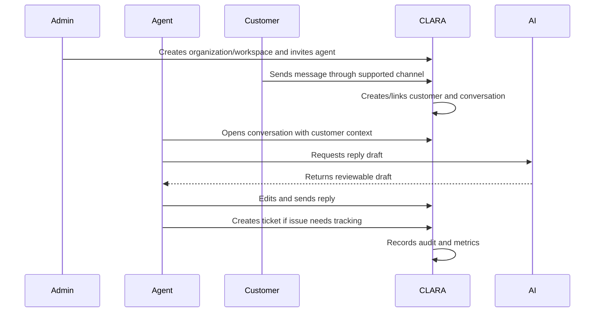

# BOOK IV — MVP Scope Map

> *"MVP means narrow, useful, secure, and production-oriented. Not random minimal code."*

---

# MVP Product Goal

The CLARA MVP should prove that a small team can:

```text
Manage customers
Receive and organize conversations
Use knowledge to answer faster
Generate safe AI reply drafts
Track issues through tickets
Use basic admin controls
See basic operational visibility
Trust permissions and audit logs
```

---

# MVP Module Baseline

| Domain | MVP Included | MVP Deferred |
|---|---|---|
| Product Vision | Product identity, scope, target users, MVP, non-goals | Large enterprise expansion |
| Roles & Permissions | Predefined roles, permission keys, workspace scope | Custom roles, ABAC |
| Organization & Workspace | Organization, workspace, membership, settings basics | Advanced governance, SSO |
| Customer CRM | Profile, contact points, notes, tags, timeline, search | Advanced segmentation, imports/exports |
| Conversations & Inbox | Conversation list/detail, messages, assignment, reply, internal notes | Many channels, advanced SLA/routing |
| Ticketing | Ticket list/detail, create, assign, status, priority, notes | Portal, custom workflows, full SLA |
| Knowledge Base | Internal articles, draft/published/archive, search | Public help center, localization |
| AI Assistant | AI reply draft, optional summary, human review, audit | Autonomous agents, tool execution |
| Workflow Automation | Simple low-risk automation rules | Full visual builder, high-risk automation |
| Integrations & Channels | One reliable channel, safe credential model, webhook validation | Marketplace, many social channels |
| Billing & Admin | Admin console basics, plan display, entitlements, settings | Full payment automation |
| Analytics/Audit/Settings | Basic dashboards, audit log, settings, restricted exports | Full BI/compliance platform |

---

# MVP Vertical Slice



---

# MVP Exit Criteria

CLARA MVP is ready when:

- [ ] Users can sign in and access an organization/workspace.
- [ ] Admins can invite users and assign predefined roles.
- [ ] Customers can be created and searched.
- [ ] Conversations can be received/viewed/replied to through at least one channel.
- [ ] Customer context appears inside conversation workflows.
- [ ] Tickets can be created and resolved.
- [ ] Knowledge articles can be searched and used.
- [ ] AI reply drafts are generated with human review.
- [ ] Sensitive actions are audited.
- [ ] Basic dashboards show operational state.
- [ ] Backend enforces organization/workspace permissions.
- [ ] No production secrets are hard-coded.
- [ ] AI does not bypass permissions or auto-send replies.

---

# MVP Non-Negotiables

These are required even in MVP:

```text
Tenant isolation
RBAC baseline
Input validation
Audit for sensitive actions
Safe secret handling
AI human review
No cross-workspace data leakage
Safe logging
Basic observability
Production-ready error handling
```

---

# Navigation

**Previous:** `BOOK-04-DOMAIN-DEPENDENCY-MAP.md`

**Next:** `BOOK-04-PERMISSION-MAP.md`
