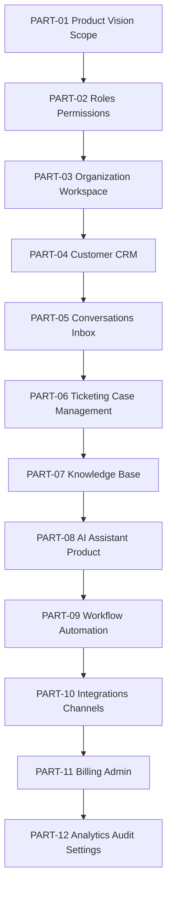

# BOOK IV — Part Map

> *"Book IV is the product-domain map of CLARA as an AI-native Business Operating System."*

---

# Part Overview

| Part | Title | Chapters | Primary Output |
|---|---|---:|---|
| PART-01 | Product Vision and Scope | 01–10 | Defines CLARA product identity, target users, MVP scope, non-goals, and product risks. |
| PART-02 | User Roles and Permissions | 11–25 | Defines users, roles, permissions, actor model, and access scope. |
| PART-03 | Organization and Workspace | 26–40 | Defines tenant model, workspace model, membership, settings, and visibility. |
| PART-04 | Customer CRM | 41–60 | Defines customer profile, contact points, timeline, notes, tags, privacy, and AI context. |
| PART-05 | Conversations and Inbox | 61–80 | Defines omnichannel conversations, messages, assignment, reply workflow, and AI drafts. |
| PART-06 | Ticketing and Case Management | 81–100 | Defines tickets, case lifecycle, assignment, SLA, collaboration, and AI assistance. |
| PART-07 | Knowledge Base | 101–120 | Defines articles, lifecycle, visibility, search, RAG grounding, and knowledge quality. |
| PART-08 | AI Assistant Product | 121–140 | Defines AI use cases, context policy, safety, human review, audit, and analytics. |
| PART-09 | Workflow Automation | 141–160 | Defines triggers, conditions, actions, approvals, execution logs, and automation governance. |
| PART-10 | Integrations and Channels | 161–180 | Defines connectors, channels, credentials, webhooks, sync, security, and observability. |
| PART-11 | Billing and Admin | 181–200 | Defines admin console, plans, subscriptions, entitlements, quotas, and governance controls. |
| PART-12 | Analytics, Audit, and Settings | 201–220 | Defines dashboards, metrics, audit logs, reports, settings, privacy, and Book IV closure. |

---

# Product Domain Layers



---

# Reading Strategy

## Product Founder / Product Manager

Read:

```text
PART-01
PART-04
PART-05
PART-08
PART-11
PART-12
```

## Backend Engineer

Read:

```text
PART-02
PART-03
PART-04
PART-05
PART-06
PART-09
PART-10
PART-12
```

## Frontend / UX Designer

Read:

```text
PART-01
PART-02
PART-03
PART-04
PART-05
PART-06
PART-11
PART-12
```

## AI Engineer

Read:

```text
PART-07
PART-08
PART-09
PART-12
```

## Security Reviewer

Read:

```text
PART-02
PART-03
PART-08
PART-09
PART-10
PART-11
PART-12
```

---

# Navigation

**Previous:** `README.md`

**Next:** `BOOK-04-CHAPTER-MAP.md`
