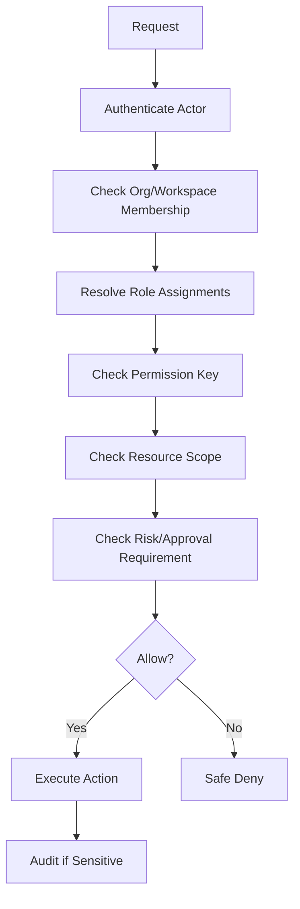

# BOOK IV — Permission Map

> *"Every meaningful product action must be protected by permission and scope."*

---

# Permission Principle

CLARA permissions must evaluate:

```text
actor
action
organization_id
workspace_id
resource_id
resource ownership
risk level
```

Frontend visibility is not authorization.

Backend enforcement is mandatory.

---

# Permission Groups

| Group | Example Permissions |
|---|---|
| Organization | `organization:read`, `organization:update`, `organization_settings:update` |
| Workspace | `workspace:read`, `workspace:create`, `workspace:update`, `workspace:archive` |
| Membership | `membership:read`, `membership:invite`, `membership:update`, `membership:remove` |
| Roles | `role:read`, `role:assign`, `permission:read` |
| Customer CRM | `customer:read`, `customer:create`, `customer:update`, `customer:archive` |
| Conversations | `conversation:read`, `conversation:reply`, `conversation:assign`, `conversation:resolve` |
| Tickets | `ticket:read`, `ticket:create`, `ticket:update`, `ticket:assign`, `ticket:resolve` |
| Knowledge | `knowledge:read`, `knowledge:create`, `knowledge:update`, `knowledge:publish`, `knowledge:archive` |
| AI | `ai:use`, `ai.reply_draft:create`, `ai.context:read`, `ai.audit:read` |
| Workflow | `workflow:read`, `workflow:create`, `workflow:update`, `workflow:execute` |
| Integrations | `integration:read`, `integration:create`, `credential:create`, `webhook:read` |
| Billing/Admin | `billing:read`, `billing:manage`, `admin:read`, `admin:update`, `entitlement:read` |
| Analytics/Audit | `analytics:read`, `audit:read`, `report_export:create` |
| Settings | `settings:read`, `settings:update`, `user_preference:update` |

---

# Role Baseline

| Role | General Capability |
|---|---|
| Organization Owner | Full business ownership, billing/admin/security authority |
| Admin | Operational administration without ultimate ownership by default |
| Manager | Team visibility, assignment, analytics, workflow supervision |
| Support Agent | Customer conversation, tickets, knowledge lookup, AI assistance |
| Sales Operator | Customer records, sales conversations, follow-up context |
| Knowledge Manager | Knowledge authoring, publishing, review, AI grounding quality |
| Developer/Integrator | Integrations, webhooks, developer settings, technical diagnostics |
| System/Service Actor | Scoped machine actions with audit and least privilege |

---

# Permission Evaluation Flow



---

# Security Rule

AI, automation, and integrations must never bypass the permission system.

They must inherit or explicitly define:

```text
service identity
actor identity where delegated
permission key
scope
audit event
```

---

# Navigation

**Previous:** `BOOK-04-MVP-SCOPE-MAP.md`

**Next:** `BOOK-04-AI-GOVERNANCE-MAP.md`
