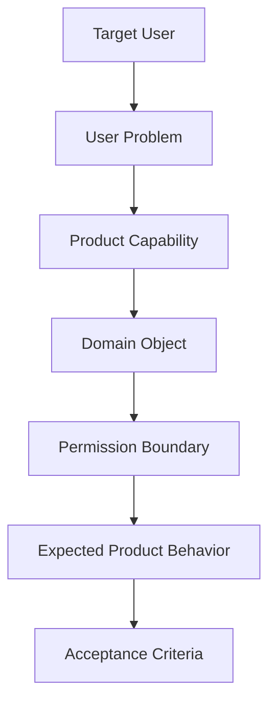

# Product Principles

> *"Defines product principles that guide UX, feature prioritization, automation, AI behavior, and trust boundaries."*

---

# Purpose

Defines product principles that guide UX, feature prioritization, automation, AI behavior, and trust boundaries.

---

# Product Problem

Product teams need principles to make consistent decisions when trade-offs appear between simplicity, power, automation, and safety.

---

# Product Decision

## Decision

Clara product design should prioritize clarity, trust, human control, automation with visibility, security by default, and operational usefulness.

## Status

Accepted.

## Reason

- Keeps Clara product behavior explicit.
- Reduces ambiguity before implementation.
- Helps convert product intent into PRD, UX flow, API spec, database spec, and backlog.
- Keeps AI coding assistants aligned with product behavior.
- Prevents architecture from drifting away from actual user needs.

## Product Trade-offs

| Direction | Benefit | Trade-off |
|---|---|---|
| Clear scope | Reduces confusion | Requires saying no to some features |
| User-focused modules | Better adoption | Requires stronger product research |
| Secure-by-default behavior | Higher trust | More deliberate UX design |
| AI-assisted workflows | Better productivity | Requires guardrails and evaluation |
| Production-grade MVP | Safer launch | Slower than throwaway prototype |

---

# Domain Objects Mentioned

- Product principle
- UX decision
- Automation boundary
- Human approval
- Trust signal

---

# Product Flow



---

# User Story Pattern

```text
As a <target user>,
I want to <perform an action>,
so that <business outcome>.
```

Example:

```text
As a support agent,
I want Clara to show the customer conversation context,
so that I can reply faster and avoid asking repeated questions.
```

---

# Product Requirements

## Functional Requirements

- The product behavior must be understandable by the target user.
- The feature must map to a named product capability.
- The capability must belong to a clear domain/module.
- The module must define the affected domain objects.
- Protected actions must map to permissions.
- Product behavior must be testable.
- MVP behavior must be separated from future behavior.

## Non-Functional Requirements

- Product behavior must be secure by default.
- Sensitive actions must be auditable.
- AI-assisted behavior must be explainable.
- User-facing errors must be clear and safe.
- Critical workflows must have observability in implementation.
- Product behavior must support production readiness.

---

# Security and Privacy Considerations

- Do not rely on frontend UI visibility as authorization.
- Enforce permissions server-side.
- Enforce Organization and Workspace boundaries.
- Minimize exposure of customer and user data.
- Audit sensitive actions.
- Treat AI output as untrusted until reviewed or validated.
- Make risky automation visible to users.
- Do not expose hidden system reasoning, internal prompts, or secrets.

---

# AI Product Considerations

AI-related product behavior must define:

- What AI is allowed to read.
- What AI is allowed to suggest.
- What AI is allowed to execute.
- Whether human approval is required.
- How users can review or reject AI output.
- What happens when AI confidence is low.
- What telemetry is needed to evaluate AI quality.

---

# Success Metrics

- Feature decisions cite principles
- AI actions remain explainable
- Users understand what happened and why

---

# Acceptance Criteria

- [ ] Product behavior is clearly stated.
- [ ] Target user is known.
- [ ] User problem is defined.
- [ ] Domain object is identified.
- [ ] Permission boundary is considered.
- [ ] MVP version is separated from future version.
- [ ] Security and privacy concerns are documented.
- [ ] AI behavior is constrained where relevant.
- [ ] Related implementation docs are linked.

---

# Anti-patterns

Avoid:

- Building a feature because it is technically interesting but not product-critical.
- Adding AI automation without user control.
- Designing product behavior that bypasses permissions.
- Hiding important workflow state from users.
- Treating MVP as disposable code.
- Mixing future enterprise assumptions into MVP.
- Adding product modules without ownership.
- Adding settings without clear defaults and governance.

---

# Related Book III References

- ../../BOOK-03-Implementation-Architecture/README.md
- ../../BOOK-03-Implementation-Architecture/PART-07-Security-Implementation/README.md
- ../../BOOK-03-Implementation-Architecture/PART-08-Testing-Quality-Architecture/README.md
- ../../BOOK-03-Implementation-Architecture/PART-11-Product-Implementation-Architecture/README.md

---

# Navigation

**Previous:** `05-Core-Use-Cases.md`

**Next:** `07-MVP-Scope.md`
