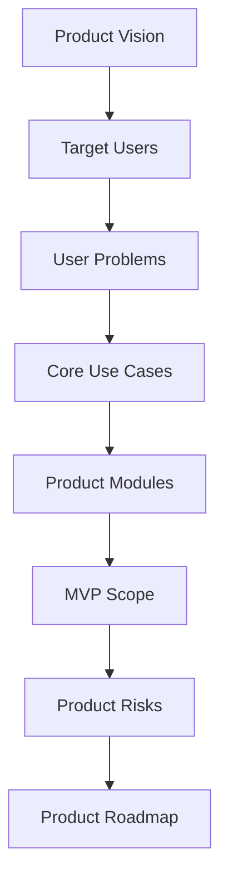

# PART-01 — Product Vision and Scope

> *"Before Clara becomes software, it must become a precise product."*

---

# Purpose

Part I defines the product foundation for Clara.

It clarifies:

- What Clara is.
- What Clara is not.
- Who Clara serves.
- What problems Clara solves.
- What use cases Clara must support.
- What product principles guide decisions.
- What is included in MVP.
- What is intentionally excluded.
- What product risks must be managed.

---

# Chapter Map

| Chapter | Title |
|---:|---|
| 01 | Book IV Overview |
| 02 | Clara Product Definition |
| 03 | Product Scope |
| 04 | Target Users |
| 05 | Core Use Cases |
| 06 | Product Principles |
| 07 | MVP Scope |
| 08 | Non Goals |
| 09 | Product Risks |
| 10 | Part 01 Summary |

---

# Product Scope Map



---

# Critical Rule

Part I should be used before designing any Clara feature.

Every feature must answer:

```text
Who is this for?
What problem does it solve?
What user action does it support?
What domain object does it affect?
What permission protects it?
What data does it touch?
What is the MVP version?
What is intentionally not included?
```

---

# Related Documents

- ../../BOOK-01-The-Foundation/README.md
- ../../BOOK-02-Master-Blueprint/README.md
- ../../BOOK-03-Implementation-Architecture/README.md

---

# Navigation

**Previous:** `../README.md`

**Next:** `01-Book-IV-Overview.md`
