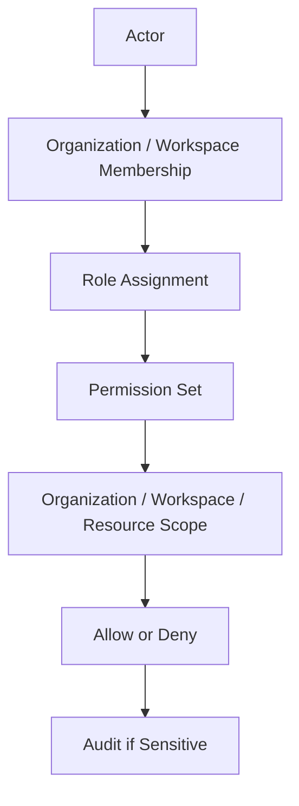
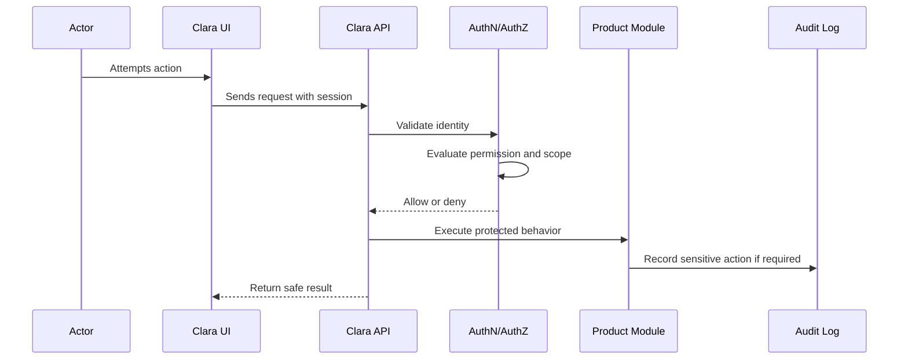

# Permission Catalog

> *"Defines the initial Clara permission catalog across product modules."*

---

# Purpose

Defines the initial Clara permission catalog across product modules.

---

# User / Product Problem

A vague permission model makes product behavior hard to secure, review, test, and explain.

---

# Product Decision

## Decision

Clara permissions should use stable, explicit, action-based keys grouped by product domain.

## Status

Accepted.

## Reason

- Keeps user access understandable.
- Prevents accidental privilege escalation.
- Protects customer and organization data.
- Makes product behavior easier to test.
- Gives frontend, backend, and AI assistant implementation a clear permission baseline.
- Supports enterprise readiness later without overcomplicating MVP.

## Product Trade-offs

| Direction | Benefit | Trade-off |
|---|---|---|
| Predefined roles first | Faster MVP and safer defaults | Less flexibility than custom roles |
| Explicit permission keys | Easier security review | More upfront modeling |
| Scoped permissions | Stronger tenant isolation | More implementation discipline |
| Role-based UX | Easier onboarding | Must avoid treating UI as security |
| Service actors defined | Better automation auditability | Requires service identity model |

---

# Primary Users / Actors

- Product Designer
- Backend Engineer
- Frontend Engineer
- Security Reviewer
- Admin

---

# Domain Objects

- Permission Key
- Permission Group
- Protected Action
- Resource

---

# Permission Baseline

| Permission | Meaning | Availability |
|---|---|---|
| `permission:read` | Product action permission | MVP/Future based on module |
| `permission:catalog.export` | Product action permission | MVP/Future based on module |

---

# Role / Permission Flow

---

# Access Evaluation Sequence

---

# MVP Behavior

MVP must define permission keys for organization, workspace, membership, customer, conversation, ticket, knowledge, AI, integration, analytics, audit, and settings.

---

# Future Behavior

Future versions may include custom permission groups, policy expressions, and permission usage analytics.

---

# Product Requirements

## Functional Requirements

- Role behavior must be understandable to an Admin.
- Permission behavior must be enforceable by backend services.
- UI must reflect allowed actions without becoming the final security layer.
- Role assignment must be auditable when sensitive.
- Permission denial must produce safe, understandable user feedback.
- System/service actors must be distinguishable from human users.

## Non-Functional Requirements

- Authorization checks must be deterministic.
- Permission keys must be stable.
- Access decisions must include Organization scope.
- Workspace-scoped actions must include Workspace scope.
- Sensitive access changes must be auditable.
- Permission evaluation must not depend on frontend-only state.

---

# UX Expectations

- Users should only see actions that are relevant to their role where practical.
- Denied actions should not expose sensitive resource details.
- Admin screens should explain what each role can do.
- Role assignment should clearly show scope.
- Dangerous role changes should require confirmation.
- AI-assisted actions must clearly show whether AI is suggesting or executing.

---

# Security and Privacy Considerations

- Backend must enforce all permissions.
- Frontend role checks are only usability helpers.
- Cross-tenant access must be denied by default.
- Service actors must have least privilege.
- Temporary/elevated access must expire in future enterprise model.
- Role changes should be logged.
- Permission failures should not leak whether protected resources exist.
- AI tools must inherit actor permission boundaries.

---

# Acceptance Criteria

- [ ] Target actor is defined.
- [ ] Role behavior is clear.
- [ ] Relevant permissions are named.
- [ ] Organization scope is considered.
- [ ] Workspace scope is considered where applicable.
- [ ] Sensitive actions are auditable.
- [ ] MVP behavior is separated from future behavior.
- [ ] UI expectation is documented.
- [ ] Backend enforcement is required.
- [ ] AI/tool behavior follows actor permissions.

---

# Anti-patterns

Avoid:

- Giving Admin the same power as Owner without reason.
- Treating frontend visibility as final authorization.
- Creating custom roles before predefined roles are stable.
- Using vague permissions like `manage_everything`.
- Allowing service actors to run with human owner privileges.
- Letting AI tools execute actions without checking user permission.
- Returning sensitive resource details in permission-denied errors.
- Mixing Organization-scope and Workspace-scope behavior without clarity.

---

# Related Book III References

- ../../BOOK-03-Implementation-Architecture/PART-07-Security-Implementation/README.md
- ../../BOOK-03-Implementation-Architecture/PART-11-Product-Implementation-Architecture/210-Role-Permission-Module.md
- ../../BOOK-03-Implementation-Architecture/APPENDIX/APPENDIX-C-Security-Checklist.md
- ../../BOOK-03-Implementation-Architecture/APPENDIX/APPENDIX-F-Code-Review-Checklist.md

---

# Navigation

**Previous:** `21-Role-Model.md`

**Next:** `23-Permission-Scope-Model.md`
