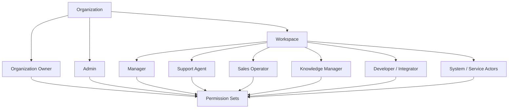

# PART-02 — User Roles and Permissions

> *"A product is only safe when it clearly knows who can do what, where, and why."*

---

# Purpose

Part II defines Clara's user roles, personas, permission model, access scope, and actor boundaries.

This part is the bridge between product behavior and secure implementation.

It defines:

- Target user personas.
- Default product roles.
- Human and system actors.
- Role responsibilities.
- Permission groups.
- Permission scope.
- Access review expectations.
- MVP access model.
- Future enterprise access model.

---

# Why This Part Matters

Before Clara can define Organization, Workspace, CRM, Inbox, AI Assistant, Integrations, Billing, Admin Console, and Analytics, Clara must first define access behavior.

Without this part:

- Product features may expose sensitive data.
- UI may accidentally imply security.
- Backend authorization may become inconsistent.
- AI tools may execute actions without correct user authority.
- Admin capabilities may become too broad.
- Enterprise readiness becomes difficult.

---

# Chapter Map

| Chapter | Title |
|---:|---|
| 11 | User Roles Permissions Overview |
| 12 | User Personas |
| 13 | Organization Owner Role |
| 14 | Admin Role |
| 15 | Manager Role |
| 16 | Support Agent Role |
| 17 | Sales Operator Role |
| 18 | Knowledge Manager Role |
| 19 | Developer Integrator Role |
| 20 | System Service Actors |
| 21 | Role Model |
| 22 | Permission Catalog |
| 23 | Permission Scope Model |
| 24 | Access Review and Delegation |
| 25 | Part 02 Summary |

---

# Role Model Map



---

# Permission Evaluation Rule

Every protected action must be evaluated with:

```text
Actor
Action / Permission key
Organization scope
Workspace scope when applicable
Resource scope when applicable
Context
```

Example:

```text
actor=user_123
permission=conversation:reply
organization_id=org_abc
workspace_id=ws_support
resource_id=conversation_456
```

---

# MVP Role Baseline

MVP should support these predefined roles:

```text
Organization Owner
Admin
Manager
Support Agent
Sales Operator
Knowledge Manager
Developer / Integrator
System / Service Actor
```

Custom roles are not required for MVP.

---

# Related Documents

- ../PART-01-Product-Vision-and-Scope/README.md
- ../../BOOK-03-Implementation-Architecture/PART-07-Security-Implementation/README.md
- ../../BOOK-03-Implementation-Architecture/PART-11-Product-Implementation-Architecture/README.md
- ../../BOOK-03-Implementation-Architecture/APPENDIX/APPENDIX-C-Security-Checklist.md

---

# Navigation

**Previous:** `../PART-01-Product-Vision-and-Scope/10-Part-01-Summary.md`

**Next:** `11-User-Roles-Permissions-Overview.md`
