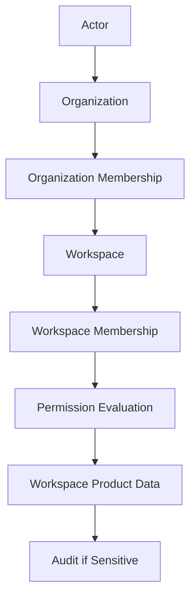
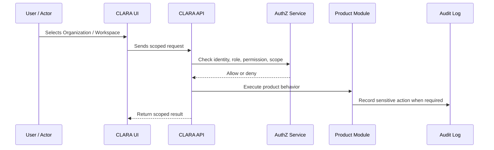

# Workspace Switching Navigation

> *"Defines how users switch between Workspaces and understand the current active scope."*

---

# Purpose

Defines how users switch between Workspaces and understand the current active scope.

---

# User / Product Problem

Users can accidentally work in the wrong workspace if scope is not visible, causing data entry mistakes and privacy issues.

---

# Product Decision

## Decision

CLARA UI should always make the active Organization and Workspace visible when product data is workspace-scoped.

## Status

Accepted.

## Reason

- Keeps CLARA tenant behavior explicit.
- Protects organization and workspace data boundaries.
- Gives product modules a clear ownership model.
- Makes permission evaluation easier to reason about.
- Helps AI assistant context stay properly scoped.
- Prevents accidental cross-workspace data exposure.

## Product Trade-offs

| Direction | Benefit | Trade-off |
|---|---|---|
| Organization as root tenant | Strong ownership boundary | Requires tenant scope everywhere |
| Workspace as operational boundary | Better team separation | Requires workspace-aware UX |
| Scoped permissions | Better security | More implementation discipline |
| Workspace-specific settings | More flexibility | More configuration complexity |
| Audit sensitive changes | Better accountability | More event/audit design |

---

# Primary Users / Actors

- Admin
- Manager
- Support Agent
- Sales Operator
- Knowledge Manager

---

# Domain Objects

- Active Organization
- Active Workspace
- Workspace Switcher
- Navigation Context

---

# Permission Baseline

| Permission | Meaning | Enforcement |
|---|---|---|
| `workspace:read` | Product action permission | Protected by backend authorization |
| `workspace:switch` | Product action permission | Protected by backend authorization |

---

# Product Flow

---

# Access Evaluation Sequence

---

# MVP Behavior

MVP must show active Workspace and allow switching only to Workspaces where the user is a member.

---

# Future Behavior

Future versions may support pinned workspaces, recent workspaces, workspace favorites, and cross-workspace search.

---

# Product Requirements

## Functional Requirements

- The active Organization must be known for protected product actions.
- The active Workspace must be known for workspace-scoped actions.
- Users may only access Workspaces where they have membership or explicit broader permission.
- Organization-level settings must not be mixed with Workspace-level settings.
- Sensitive Organization and Workspace changes must be auditable.
- Product modules must declare whether records are Organization-owned or Workspace-owned.
- UI must clearly show current workspace context where relevant.

## Non-Functional Requirements

- Tenant scope must be enforced server-side.
- Workspace scope must be enforced server-side.
- Permission evaluation must include actor, action, scope, and resource.
- Workspace switching must not bypass backend authorization.
- Audit logs must include Organization ID and Workspace ID where relevant.
- AI context must be limited to the actor's allowed Organization and Workspace scope.

---

# UX Expectations

- Users should clearly see their current Organization and Workspace.
- Workspace switcher should only show accessible Workspaces.
- Admins should understand which users belong to which Workspace.
- Dangerous changes such as archive, membership removal, and role changes should require confirmation.
- Denied access should be explained safely without leaking protected data.
- Workspace-specific settings should be visually separated from Organization settings.

---

# Security and Privacy Considerations

- Never trust workspace_id from the client without authorization.
- Never query tenant-owned data without organization_id.
- Never query workspace-owned data without workspace_id unless explicit cross-workspace permission exists.
- Cache keys must include Organization and Workspace scope where relevant.
- Search/vector retrieval must include tenant metadata filters.
- Audit logs must capture actor, action, Organization, Workspace, and affected resource.
- AI assistant context must not cross workspace boundaries without explicit permission.

---

# Acceptance Criteria

- [ ] Organization boundary is defined.
- [ ] Workspace boundary is defined.
- [ ] Membership behavior is defined.
- [ ] Permission scope is defined.
- [ ] MVP behavior is clear.
- [ ] Future behavior is separated from MVP.
- [ ] UX expectations are documented.
- [ ] Security requirements are documented.
- [ ] Audit behavior is considered.
- [ ] Related Book III references are linked.

---

# Anti-patterns

Avoid:

- Treating Workspace as only a UI filter.
- Allowing frontend-selected Workspace to act as final security.
- Storing customer/conversation data without Organization scope.
- Mixing Organization settings and Workspace settings.
- Giving all Admins unrestricted Owner-level access.
- Allowing AI context to retrieve cross-workspace data by default.
- Creating Workspaces without owner/admin governance.
- Archiving Workspaces without retention and access rules.

---

# Related Book III References

- ../../BOOK-03-Implementation-Architecture/PART-04-Data-Architecture/README.md
- ../../BOOK-03-Implementation-Architecture/PART-07-Security-Implementation/README.md
- ../../BOOK-03-Implementation-Architecture/PART-11-Product-Implementation-Architecture/207-Organization-Module.md
- ../../BOOK-03-Implementation-Architecture/PART-11-Product-Implementation-Architecture/208-Workspace-Module.md
- ../../BOOK-03-Implementation-Architecture/APPENDIX/APPENDIX-C-Security-Checklist.md

---

# Navigation

**Previous:** `33-Invitation-Onboarding.md`

**Next:** `35-Multi-Workspace-Data-Visibility.md`
