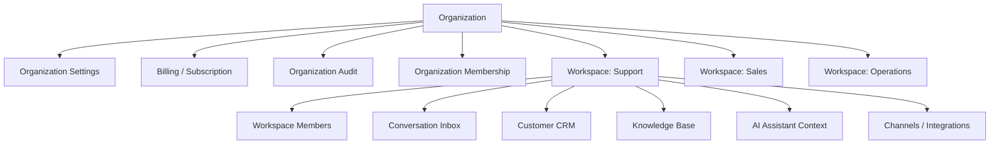

# PART-03 — Organization and Workspace

> *"Organization defines who owns the business. Workspace defines where the work happens."*

---

# Purpose

Part III defines CLARA's Organization and Workspace product specification.

It explains:

- Organization as the root tenant boundary.
- Workspace as the collaboration and operational boundary.
- Tenant model.
- Organization lifecycle.
- Workspace lifecycle.
- Organization settings.
- Workspace settings.
- Membership.
- Invitation and onboarding.
- Workspace switching.
- Multi-workspace data visibility.
- Audit behavior.
- Workspace governance.
- Permissions.
- MVP scope.

---

# Why This Part Matters

Before CLARA defines Customer CRM, Conversations, Tickets, Knowledge Base, AI Assistant, Integrations, Billing, Analytics, Audit, and Settings, CLARA must clearly define where data belongs and who can access it.

Organization and Workspace affect:

- Data ownership.
- Permission scope.
- Billing.
- Integrations.
- Customer records.
- Conversation inboxes.
- Knowledge base visibility.
- AI context boundaries.
- Analytics visibility.
- Audit evidence.

---

# Chapter Map

| Chapter | Title |
|---:|---|
| 26 | Organization Workspace Overview |
| 27 | Tenant Model |
| 28 | Organization Lifecycle |
| 29 | Workspace Lifecycle |
| 30 | Organization Settings |
| 31 | Workspace Settings |
| 32 | Membership Model |
| 33 | Invitation Onboarding |
| 34 | Workspace Switching Navigation |
| 35 | Multi Workspace Data Visibility |
| 36 | Organization Audit Behavior |
| 37 | Workspace Governance |
| 38 | Organization Workspace Permissions |
| 39 | MVP Organization Workspace Scope |
| 40 | Part 03 Summary |

---

# Organization and Workspace Map



---

# Scope Rule

Every tenant-owned product record must define its scope.

```text
Organization-owned:
- Organization settings
- Subscription
- Billing profile
- Organization audit
- Organization policy

Workspace-owned:
- Customer records
- Conversations
- Tickets
- Knowledge articles
- Workflow automations
- Channel connections
- Workspace settings
```

Some records may have both:

```text
organization_id
workspace_id
```

---

# Critical Security Rule

CLARA must never rely on active workspace selection in the frontend as the final security boundary.

Backend services must enforce:

```text
Actor identity
Organization membership
Workspace membership
Permission key
Resource scope
```

---

# Related Documents

- ../PART-01-Product-Vision-and-Scope/README.md
- ../PART-02-User-Roles-and-Permissions/README.md
- ../../BOOK-03-Implementation-Architecture/PART-07-Security-Implementation/README.md
- ../../BOOK-03-Implementation-Architecture/PART-11-Product-Implementation-Architecture/207-Organization-Module.md
- ../../BOOK-03-Implementation-Architecture/PART-11-Product-Implementation-Architecture/208-Workspace-Module.md

---

# Navigation

**Previous:** `../PART-02-User-Roles-and-Permissions/25-Part-02-Summary.md`

**Next:** `26-Organization-Workspace-Overview.md`
