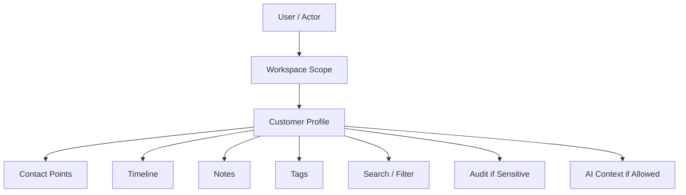
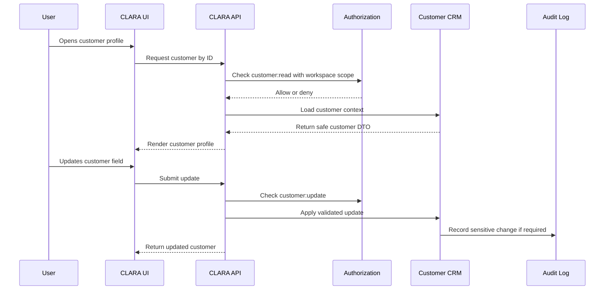

# Part 04 Summary

> *"Summarizes Customer CRM product specification and defines readiness to continue into Conversations and Inbox."*

---

# Purpose

Summarizes Customer CRM product specification and defines readiness to continue into Conversations and Inbox.

---

# User / Product Problem

Conversation inbox cannot correctly identify customers or show context unless Customer CRM behavior is clear.

---

# Product Decision

## Decision

CLARA should proceed to Conversations and Inbox only after customer identity, contact points, timeline, privacy, and workspace scope are defined.

## Status

Accepted.

## Reason

- Gives users a consistent customer context.
- Supports conversations, tickets, AI assistance, analytics, and automation.
- Keeps customer data scoped by Organization and Workspace.
- Makes privacy and audit behavior explicit.
- Prevents CRM scope from expanding too early.
- Supports MVP without blocking future advanced CRM capabilities.

## Product Trade-offs

| Direction | Benefit | Trade-off |
|---|---|---|
| Simple CRM first | Faster MVP and easier adoption | Less advanced than enterprise CRM |
| Workspace-scoped customers | Stronger data separation | Cross-workspace views need explicit design |
| Structured contact points | Better channel matching | More validation needed |
| Timeline-based history | Better customer context | Requires event consistency |
| Privacy-aware exports | Better trust | More admin friction |

---

# Primary Users / Actors

- Product Team
- Engineering Team
- Support Team
- AI Coding Assistant

---

# Domain Objects

- Customer Baseline
- Contact Baseline
- Timeline Baseline
- Privacy Baseline
- AI Context Baseline

---

# Permission Baseline

| Permission | Meaning | Enforcement |
|---|---|---|
| `customer:read` | Product action permission | Protected by backend authorization |
| `customer:create` | Product action permission | Protected by backend authorization |
| `customer:update` | Product action permission | Protected by backend authorization |

---

# Product Flow

---

# Customer Context Sequence

---

# MVP Behavior

Part 04 is complete when Customer CRM can support conversation matching, customer context display, and AI reply drafting context.

---

# Future Behavior

Future versions may refine CRM behavior with segmentation, analytics, imports, exports, and enterprise privacy workflows.

---

# Product Requirements

## Functional Requirements

- Customer records must belong to an Organization.
- Customer records must belong to a Workspace by default.
- Users must be able to view customer details if authorized.
- Users must be able to update customer details if authorized.
- Customer contact points must support conversation matching.
- Customer timeline must show important customer-related events.
- Customer notes must preserve author and timestamp.
- Customer search must be scoped and paginated.
- Sensitive customer actions must be auditable.
- AI customer context must respect permissions and scope.

## Non-Functional Requirements

- Customer list must support pagination.
- Search must not leak cross-workspace data.
- Customer data must be privacy-aware.
- Customer export/import must require elevated permissions.
- Duplicate merge must avoid destructive automatic behavior.
- Customer timeline must remain understandable to business users.
- AI context must minimize sensitive data exposure.

---

# UX Expectations

- Customer profile should be easy to understand at a glance.
- Important contact points should be visible.
- Recent timeline events should be visible.
- Notes should be clearly marked as internal.
- Tags should be easy to add and remove where authorized.
- Archived customers should be visually distinct.
- Users should understand when data is unavailable due to permission.
- AI-generated summaries should be labeled as AI-generated.

---

# Security and Privacy Considerations

- Do not expose customer records across workspaces by default.
- Do not expose sensitive fields without permission.
- Do not allow bulk export without elevated permission.
- Do not store unnecessary PII.
- Do not allow AI to access customer data outside actor scope.
- Do not log sensitive customer fields.
- Audit sensitive changes such as archive, export, merge, and privacy changes.
- Treat imported data as untrusted until validated.

---

# Acceptance Criteria

- [ ] Customer scope is defined.
- [ ] Primary users are defined.
- [ ] Domain objects are defined.
- [ ] Permissions are named.
- [ ] MVP behavior is clear.
- [ ] Future behavior is separated from MVP.
- [ ] Privacy concerns are documented.
- [ ] Audit behavior is considered.
- [ ] AI context behavior is constrained where relevant.
- [ ] Related Book III references are linked.

---

# Anti-patterns

Avoid:

- Treating CRM as an unscoped global address book.
- Storing customers without workspace scope.
- Allowing bulk export to normal users.
- Auto-merging customers without human review.
- Putting sensitive notes into AI context without controls.
- Treating imported data as trusted.
- Using free-form contact identifiers without provider scope.
- Building advanced CRM features before conversation context is stable.

---

# Related Book III References

- ../../BOOK-03-Implementation-Architecture/PART-04-Data-Architecture/README.md
- ../../BOOK-03-Implementation-Architecture/PART-07-Security-Implementation/README.md
- ../../BOOK-03-Implementation-Architecture/PART-11-Product-Implementation-Architecture/211-Customer-CRM-Module.md
- ../../BOOK-03-Implementation-Architecture/APPENDIX/APPENDIX-B-API-Checklist.md
- ../../BOOK-03-Implementation-Architecture/APPENDIX/APPENDIX-C-Security-Checklist.md

---

# Navigation

**Previous:** `59-MVP-Customer-CRM-Scope.md`

**Next:** `../PART-05-Conversations-and-Inbox/README.md`
